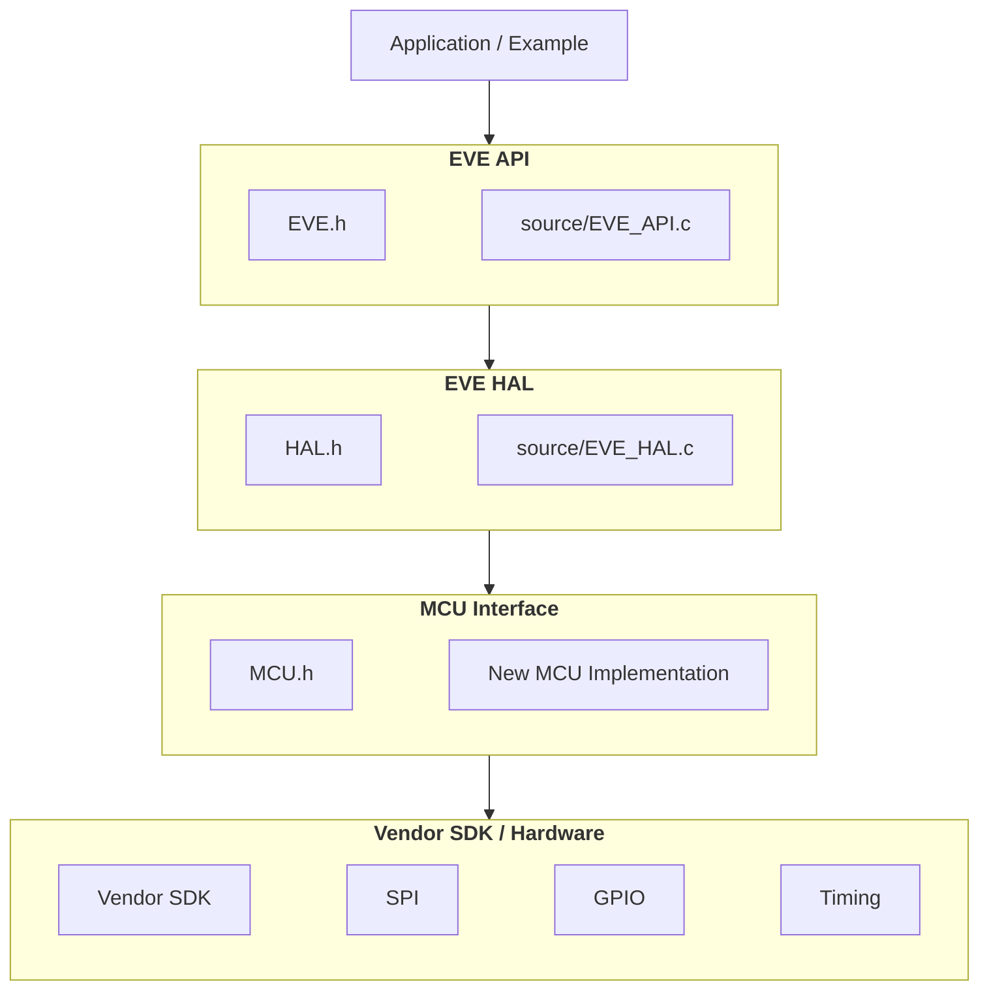

# EVE-MCU-Dev Porting Guide

This porting guide describes the steps required to add support for a new MCU or host platform to the `EVE-MCU-Dev` library.

## Introduction

The objective of an MCU port is to connect the common EVE-MCU-Dev library to the target platforms SPI, GPIO and timing facilities, while keeping EVE API commands and register handling in the existing library layers. The guide begins with a basic, blocking, single-SPI implementation and a known display configuration. Adding performance improvements and optional features where desired only after communication and display output have been verified.

This guide adapts the staged approach in [BRT_AN_062: Porting BRT_AN_025 to NXP MCU][an062]: namely establishing the development environment, testing the low-level interface, integration of the common EVE-MCU-Dev library, and running an example. Function names, source files and build instructions below are based on the current repository rather than the older version of the library utilised in BRT_AN_062.

**Note:** The [NXP Port][nxp-c] is available as a supported platform in EVE-MCU-Dev and can be referenced during the porting process.

### Scope

The instructions primarily cover MCU ports implementing [`include/MCU.h`][mcu-h] and using [`source/EVE_HAL.c`][hal-c]. Linux SPI-device based ports will utilise `Platform.h` and `EVE_HAL_Linux.c` instead and are not a drop-in variation of the MCU implementation described here in relation to function names, though the described porting process remains the same. See the [repository overview][readme] for the wider EVE-MCU-Dev library architecture.

This guide does not replace the target MCU's SDK documentation, the selected EVE device's documentation, or the display module's schematic. Adding an unsupported display panel, touch controller or EVE device is separate from adding MCU support to the library. The templates are starting points: SDK-specific code must be supplied and validated on the target hardware.

## Contents

* [Introduction](#introduction)
  * [Scope](#scope)
* [1. Establish the starting point](#1-establish-the-starting-point)
  * [Start with a clean checkout](#start-with-a-clean-checkout)
  * [Start from a working board project](#start-from-a-working-board-project)
* [2. Define the port and hardware interface](#2-define-the-port-and-hardware-interface)
  * [Keep the implementation boundaries clear](#keep-the-implementation-boundaries-clear)
  * [Establish the connections](#establish-the-connections)
  * [Independent chip-select control](#independent-chip-select-control)
* [3. Prove the MCU SPI and GPIO operations](#3-prove-the-mcu-spi-and-gpio-operations)
* [4. Implement the MCU interface](#4-implement-the-mcu-interface)
  * [Required function groups](#required-function-groups)
  * [Initialisation, setup and shutdown](#initialisation-setup-and-shutdown)
  * [Chip-select and power-down control](#chip-select-and-power-down-control)
  * [Blocking transfers and chip-select ownership](#blocking-transfers-and-chip-select-ownership)
  * [Scalar transfers and byte order](#scalar-transfers-and-byte-order)
  * [Timing](#timing)
  * [EVE Interrupt input](#eve-interrupt-input)
  * [Other implementation responsibilities](#other-implementation-responsibilities)
* [5. Select the EVE device and display configuration](#5-select-the-eve-device-and-display-configuration)
  * [Application-local configuration](#application-local-configuration)
  * [Quad SPI selection](#quad-spi-selection)
  * [Display timing selection](#display-timing-selection)
  * [BT82x platforms](#bt82x-platforms)
* [6. Integrate the source files and build configuration](#6-integrate-the-source-files-and-build-configuration)
  * [Vendor IDE or manually maintained build](#vendor-ide-or-manually-maintained-build)
  * [Reuse the current CMake structure](#reuse-the-current-cmake-structure)
* [7. Integrate the EVE startup sequence](#7-integrate-the-eve-startup-sequence)
  * [Preserve the library's initialisation sequence](#preserve-the-librarys-initialisation-sequence)
    * [LCD panel initialisation ordering](#lcd-panel-initialisation-ordering)
  * [Supply the calibration-storage hooks](#supply-the-calibration-storage-hooks)
  * [Make failures observable](#make-failures-observable)
* [8. Bring up the display in stages](#8-bring-up-the-display-in-stages)
  * [Stage A: Confirm EVE boot](#stage-a-confirm-eve-boot)
  * [Stage B: Display a message without touch or asset loading](#stage-b-display-a-message-without-touch-or-asset-loading)
  * [Stage C: Check memory transfers](#stage-c-check-memory-transfers)
  * [Stage D: Run the complete simple example](#stage-d-run-the-complete-simple-example)
* [9. Add optional features](#9-add-optional-features)
  * [Increase SPI speed, DMA and shared-bus operation](#increase-spi-speed-dma-and-shared-bus-operation)
    * [Increase SPI speed](#increase-spi-speed)
    * [DMA and queued transfers](#dma-and-queued-transfers)
    * [Shared SPI buses and RTOS operation](#shared-spi-buses-and-rtos-operation)
  * [Quad SPI](#quad-spi)
  * [Persistent calibration storage](#persistent-calibration-storage)
  * [BT82x transport parameters](#bt82x-transport-parameters)
  * [Custom touch support](#custom-touch-support)
  * [LCD panel initialisation](#lcd-panel-initialisation)
  * [INT# and interrupt-based co-processor completion](#int-and-interrupt-based-co-processor-completion)
  * [Advanced chip-select implementations](#advanced-chip-select-implementations)
* [10. Troubleshooting](#10-troubleshooting)
* [11. Validate and document the completed port](#11-validate-and-document-the-completed-port)
* [Source reference index](#source-reference-index)

## 1. Establish the starting point

### Start with a clean checkout

It is advised to work from the latest revision of the EVE-MCU-Dev library. **Do not** combine older revisions of the source files such as `MCU.h` with the current library source, BRT_AN_062 application-note source or HAL implementations.

```sh
git clone --branch main --recurse-submodules https://github.com/Bridgetek/Eve-MCU-Dev.git
cd Eve-MCU-Dev
git rev-parse HEAD
```

For an existing checkout, update its submodules to the revisions recorded by that checkout:

```sh
git submodule update --init --recursive
```

**Note:** EVE-MCU-Dev currently utilises submodules for USB based host implementations with external driver dependencies; [FT4222][4222-c], [MPSSE][mpsse-c]. A submodule is also utilised for the [EVE_Emulator][emulator-c] port to obtain the required dependencies.

It is recommended to record the repository commit, compiler, SDK, IDE or CMake versions being utilised, MCU developemt board revision and EVE display module. 

External dependencies are port-dependent; inspect the [ports documentation][ports-readme] rather than assuming every MCU needs the same host libraries.

### Start from a working board project

Install the IDE for the chosen MCU, connect the MCU development baord to the host PC, and create or import a vendor-supported project for the target board. Download, build, and run a simple LED or serial-output test before introducing EVE-MCU-Dev.
Confirm that the debugger, system clock, GPIO configuration and a usable time base work before attempting to integrate the library.

Retain any necessary startup code, linker scripts, clock configuration and SDK initialisation from the example project. Replacing a generated `main.c` with a donor example from one of the other supported ports can accidentally remove these prerequisites.

Choose an existing port with a similar SDK or peripheral interface as a reference. The [RP2040 implementation][rp2040-c] demonstrates a direct blocking SPI implementation; the [STM32 CUBE SPI implementation][stm32-spi-c] demonstrates another SDK integration. Copy the organisation and required interface, not the donor's pins, clock frequencies or flash addresses. The current [simple-example README][simple-readme] marks completed build environments, these can be referenced for a verified current build recipe.

**_Checkpoint:_** A standalone MCU development board project that runs reliably, and whose library revision is recorded.

## 2. Define the port and hardware interface

### Keep the implementation boundaries clear

The normal call path for a MCU specific ports is:



This is a runtime/interface overview, and does not constitue a header-include diagram, which can be found int eh [repository overview][readme].

The MCU implementation layer supplies transport and host operations. It is not responsible for generating display lists to render items on EVE based displays, interpret EVE registers, or call back into the EVE API to perform a transfer. `MCU.h` includes `EVE_settings.h` for derived build-time configurations which may be required for the port; an ordinary MCU transport implementation **does not need** access to the API or HAL layers through `EVE.h` or `HAL.h`.

**References:** [Software Layers][readme], [MCU interface][mcu-h].

A proposed layout for a new port within the library is:

```text
ports/
  eve_arch_newmcu/
    EVE_MCU_NEWMCU.c
    newmcu.cmake                 # Optional: CMake integration
    README.md
examples/
  simple/
    newmcu/
      CMakeLists.txt             # Or the vendor IDE project
      main/
        main.c
      board/
        board_support.c          # Illustrative board/SDK glue
        board_support.h
```

`newmcu`, `PLATFORM_NEWMCU` and `board_support.*` are placeholders introduced by this guide, not existing repository interfaces. Use a distinct platform macro consistently in the build and the new MCU port source file. **Do not** define another MCU's in a new port macro merely to make its code compile.

### Establish the connections

Create a pin-assignment table for the actual MCU development board/module before writing the port source code.

| EVE connection | MCU-side requirement |
| --- | --- |
| SCK | SPI master clock output. |
| MOSI / IO0 | SPI transmit connection; bidirectional data line. |
| MISO / IO1 | SPI receive connection; bidirectional data line. |
| IO2 and IO3 | Additional bidirectional data connections when Quad SPI is used. |
| CS# | Active-low chip select controlled independently of the SPI peripheral, normally using a separate GPIO output. **Do not use** automatic SPI peripheral/SDK chip-select control for the conventional blocking SPI implementation. |
| PD# | Active-low power-down/reset control, normally a GPIO output. |
| INT# | **Optional** input for interrupt-based completion or application EVE interrupt handling. **Do not** configure it as an MCU output. |
| Supply and ground | Correct module supply, adequate current capability for the application hardware and a common signal ground. |

Check the module's schematic and electrical limits. A module powered from **5V** does not necessarily accept **5V** on its SPI or control inputs. Generally EVE based display modules will utilise **3V3** signals on the SPI interface and GPIOS. 

Verify required pull-ups, level translation, power sequencing and the treatment of unused data pins against the selected hardware documentation. These are hardware-specific requirements, not values to copy from the BRT_AN_062 wiring diagram.

**Reference:** [Hardware approach in BRT_AN_062][an062].

For the new MCU port implementation, choose SPI master mode, SPI Mode 0, 8-bit transfers and MSB-first bit order. A conservative initial clock such as 1 MHz is a useful starting point, as demonstrated by the [RP2040 port][rp2040-c]. Do not assume that its later operating speed is suitable for another board or EVE device.

### Independent chip-select control

**Due to the library structure, CS# must be controlled independently of the SPI peripheral's automatic chip-select mechanism. For the MCU SPI port, assign CS# to a separate GPIO output and control it through `MCU_CSlow()` and `MCU_CShigh()`.**

The library defines EVE transaction boundaries separately from the SPI read and write operations. **Do not use** automatic chip-select assertion, deassertion and pulse generation in the SPI peripheral or its driver. A pin which also supports an SPI chip-select alternate function may still be used, provided it is configured as a software-controlled GPIO rather than the peripheral's automatically controlled chip-select output.

A single EVE API transaction can contain several successive SPI function calls. CS# must remain asserted across these calls until the library explicitly ends the transaction. Releasing CS# after each byte, word or buffer would split the intended transaction. For example, the EVE API 1-4 implementation of `HAL_HostCmdWrite()` sends its command, parameter and final zero byte through three separate `MCU_SPIWrite8()` calls under one CS# assertion.

**Reference:** [HAL_HostCmdWrite() implementation][hal-c].

Using a buffer-based SDK SPI API is acceptable; direct register access and byte-at-a-time SDK calls are not requirements. The important condition is that the SPI API does not take ownership of the GPIO-controlled CS# line. Peripherals which cannot provide this separation need the transaction-aware adaptation described under [Advanced chip-select implementations](#advanced-chip-select-implementations), not an unmodified per-call SPI wrapper.

**_Checkpoint:_** Every signal has a documented pin, direction, voltage and initial state, and CS# is independently controlled.

## 3. Prove the MCU SPI and GPIO operations

It is recommended to test the vendor SPI and GPIO routines before debugging the full EVE initialisation sequence in `EVE_HAL.c`. This preserves the useful separation between peripheral testing and library integration used in [BRT_AN_062][an062].

With EVE disconnected or kept deselected, transmit a recognisable test pattern and inspect SCK, MOSI and CS# pins with a logic analyser. Verify the selected pins, idle clock state, clock frequency, bit order and exact byte count.

A loopback test can check receive handling when the wiring and disconnected peripheral arrangement permit it; remove the loopback connection before connecting EVE to the SPI interface. **Do not** send arbitrary test patterns to a selected EVE device as though they were valid commands.

Next, verify the intended transaction boundary: assert CS# through its GPIO, make several successive SPI transfers, and deassert CS# only after the final bit has left the peripheral. Test both consecutive writes and a write followed by a read. CS# must not pulse high between phases simply because they use separate function calls or the SDK splits a buffer internally. For example a 32 bit read/write consisting of 4 x 8 bit read operations should be contained within a single CS# pulse.

Also check that a read generates the correct clock pulses, that unused received data from writes cannot accumulate into an RX overrun, and that the time functions work at the final MCU system-clock setting.

**_Checkpoint:_** The MCU can clock bytes in both directions while preserving a manually controlled transaction boundary.

## 4. Implement the MCU interface

Use the declarations in the library checkout's [`include/MCU.h`][mcu-h] as the interface checklist.

**Note:** The [BRT_AN_062][an062] application note's combined `MCU_SPIReadWrite8()` is not a replacement for the current public read and write functions and should not be implemented. 

The examples below describe a conventional, blocking, GPIO-controlled SPI port. Names beginning with `board_` and `BOARD_EVE_` are illustrative project-specific helpers and pin identifiers, not EVE-MCU-Dev interfaces. Declare and implement them in the board-support files using the target SDK (if required). Include `MCU.h` and the board-support header (if required) in the MCU implementation.

### Required function groups

| Group | Functions to implement | Responsibility |
| --- | --- | --- |
| Lifecycle | `int MCU_Init(void)`, `int MCU_Setup(void)`, `int MCU_Deinit(void)` | Configure, adjust and release the host interface. Return `0` on success and `-1` on failure. |
| Control pins | `MCU_CSlow()`, `MCU_CShigh()`, `MCU_PDlow()`, `MCU_PDhigh()` | Control CS# independently of the SPI peripheral and PD#. Apply the named physical levels. |
| Interrupt input | `int MCU_Int(void)` | Return `0` for EVE INT# pin assertion (logic low) and non-zero for deassertion (logic high). Explicitly reject unsupported EVE interrupt use; see [Section 9](#int-and-interrupt-based-co-processor-completion). |
| Block transfers | `MCU_SPIWrite(const uint8_t *, uint32_t)`, `MCU_SPIRead(uint8_t *, uint32_t)` | Transfer the requested bytes without changing CS# or adding protocol framing. |
| Scalar transfers | `MCU_SPIWrite8()`, `MCU_SPIWrite16()`, `MCU_SPIWrite24()`, `MCU_SPIWrite32()`, `MCU_SPIRead8()`, `MCU_SPIRead16()`, `MCU_SPIRead32()` | Supply the fixed-size SPI transfer operations used by the HAL. |
| Timing | `MCU_Delay_20ms()`, `MCU_Delay_500ms()`, `uint32_t MCU_Time_ms(void)` | Supply minimum delays fuctions and an advancing millisecond count. |
| Host to wire byte order | `MCU_htobe16()`, `MCU_htobe32()`, `MCU_htole16()`, `MCU_htole32()` | Convert host values to the specified byte order. |
| Wire to host byte order | `MCU_be16toh()`, `MCU_be32toh()`, `MCU_le16toh()`, `MCU_le32toh()` | Convert the specified byte order to host values. |
| Optional interface width | `int MCU_SetSPIMode(uint8_t mode)` | Configure the host SPI width when `EVE_QSPI_ENABLE` is defined. |

There is no active `MCU_SPIRead24()` requirement. Implement the baseline interface rather than relying on the first selected example to exercise every function. Keep function names, parameter types and return types consistent with the current `MCU.h` header. 

**Reference:** [MCU.h function declarations][mcu-h].

### Initialisation, setup and shutdown

| Function | Implementation requirements |
| --- | --- |
| `MCU_Init()` | Establish the SPI and GPIO resources needed for EVE communication. For initial single-SPI operation, configure SPI master mode 0, eight-bit transfers and MSB-first bit order. **Do not use** an automatic hardware CS#. Set CS# and PD# inactive (logic high), configure a connected INT# as an input (if desired), and select a conservative SPI frequency such as 1 MHz. |
| `MCU_Setup()` | Apply MCU-side interface settings appropriate after EVE has booted, such as increasing the SPI clock. Preserve independent GPIO control of CS#. Returning `0` without changing any settings is sufficient. |
| `MCU_Deinit()` | Complete outstanding activity, leave CS# inactive (logic high), apply the intended PD# shutdown state (logic low) and release resources owned by the port. Do not shut down or reset a shared SPI peripheral without accounting for its other users. |

These functions return `0` on success and `-1` on failure. The [RP2040 implementation][rp2040-c] provides examples of initial configuration, post-boot speed adjustment and shutdown; the [MCU interface][mcu-h] defines the lifecycle entry points.

Where the MCU permits it, preload inactive output levels before enabling the GPIO output drivers to avoid unwanted CS# or PD# pulses. Configure the connected INT# signal as an input (if required); **do not** drive it high from the MCU as though it were an output. Select any required input pull-up from the module schematic and electrical requirements.

Preserve the generated MCU development board setup. A vendor-generated project may already configure clocks, pin multiplexing, GPIOs or an SPI handle before the library starts. Define which setup belongs to the board project and which belongs to `MCU_Init()`; do not initialise the same resources twice without checking the SDK's requirements. For example, the [STM32 CUBE SPI implementation][stm32-spi-c] uses a handle supplied by the generated project.

Keep the MCU-side configuration separate from EVE configuration. **Do not** duplicate EVE host commands, reset timing, register programming or display setup in these functions. The normal library startup calls `MCU_Init()` and later `MCU_Setup()`; preserve that sequence. The optional LCD-panel extension is run before `MCU_Init()`, so its prerequisites may require earlier board setup, as described in [Section 7](#7-connect-the-application-entry-point).
    
**Reference:** [HAL startup sequence][hal-c].

Check any SDK return values when necessary, if initialisation fails leave the SPI interface in a safe state and release partially acquired resources where appropriate. **Do not** report successful initialisation after a failed peripheral configuration.

Place any source-level platform guard before vendor-specific includes:

```c
#if defined(PLATFORM_NEWMCU)

#include "MCU.h"
#include "board_support.h"  /* Project-specific SPI, GPIO and timing helpers. */

#if defined(EVE_QSPI_ENABLE)
#error "This initial port supports single SPI only."
#endif

/* Implement the MCU interface here. */

#endif /* defined(PLATFORM_NEWMCU) */
```

### Chip-select and power-down control

For the conventional GPIO-controlled implementation in the library, the control functions apply the named physical output levels:

| Function | Output action |
| --- | --- |
| `MCU_CSlow()` | Assert CS# by driving it low. |
| `MCU_CShigh()` | Deassert CS# by driving it high. |
| `MCU_PDlow()` | Assert PD# by driving it low. |
| `MCU_PDhigh()` | Release PD# by driving it high. |

The SPI transfer related functions must not call the chip-select functions themselves. The library determines when a transaction starts and ends in the HAL layer. Similarly to the chip-select funtions the power-down functions change the output level of the pin only; **do not** implement EVE reset sequencing or its delays in the new MCU port. 

**References:** [HAL sequencing][hal-c], [RP2040 GPIO-controlled reference port][rp2040-c].

```c
/* board_gpio_write() applies a physical level: 0 = low, 1 = high.
 * Define BOARD_EVE_CS_PIN and BOARD_EVE_PD_PIN for the actual board.
 */
void MCU_CSlow(void)
{
    board_gpio_write(BOARD_EVE_CS_PIN, 0);
}

void MCU_CShigh(void)
{
    /* The blocking SPI routines must have completed before this call. */
    board_gpio_write(BOARD_EVE_CS_PIN, 1);
}

void MCU_PDlow(void)
{
    board_gpio_write(BOARD_EVE_PD_PIN, 0);
}

void MCU_PDhigh(void)
{
    board_gpio_write(BOARD_EVE_PD_PIN, 1);
}
```

Establish the GPIO directions, pin multiplexing and initial levels during board/MCU initialisation or in `MCU_Init()`, not on every pin transition.

**Note:**  A SPI driver that only queues bytes or fills a transmit FIFO is not necessarily finished transmitting. Either make the SPI functions wait for actual completion, as assumed above, or provide the completion handling required by a deliberately designed advanced transport before CS# rises.

### Blocking transfers and chip-select ownership

The simplest implementation completes a SPI transfer before returning. Neither `MCU_SPIWrite()` nor `MCU_SPIRead()` should assert or deassert CS#. The HAL layer surrounds related transfer calls with the required control-pin operations.

**References:** [HAL transfer implementation][hal-c], [RP2040 transfers][rp2040-c].

| Function | Required behaviour for the basic blocking port |
| --- | --- |
| `MCU_SPIWrite(const uint8_t *data, uint32_t length)` | Transmit exactly `length` bytes in buffer order. Consume or discard received data as required by the peripheral. Do not change CS#, add an address or insert protocol bytes. |
| `MCU_SPIRead(uint8_t *data, uint32_t length)` | Generate the clocks needed to receive exactly `length` bytes. During ordinary single-SPI reads, transmit zero-valued bytes and store the received bytes in buffer order. Do not change CS# or add transaction framing. |

The MCU interface specifies zero-valued transmit data during reads and discarding received data during writes.

**Reference:** [SPI transfer declarations][mcu-h].

The following adapter assumes a project-specific `board_spi_exchange8()` which transmits one byte, consumes the received byte and waits for completion. The helper must leave CS# unchanged and expose SDK errors through the port's chosen fault-handling mechanism where required.

```c
void MCU_SPIWrite(const uint8_t *data, uint32_t length)
{
    while (length != 0u)
    {
        (void)board_spi_exchange8(*data++);
        --length;
    }
}

void MCU_SPIRead(uint8_t *data, uint32_t length)
{
    while (length != 0u)
    {
        *data++ = board_spi_exchange8(0u);
        --length;
    }
}
```

The bytes transmitted by `MCU_SPIRead()` generate receive clocks; they are not additional EVE protocol dummy bytes. The HAL layer supplies the applicable address and read-protocol handling. **Do not** prepend another address, discard an extra first received byte or insert another dummy-byte phase in the conventional MCU transport implementations. 

**Reference:** [HAL read-address and read-data handling][hal-c].

A blocking SDK buffer SPI transfer can replace the byte loop. If the SDK has a smaller count type or a maximum transfer size, split the request internally without changing CS# or truncating the `uint32_t` length. Zero-length requests perform no transfer; non-zero requests require a valid buffer of at least the requested size. It is recommended to handle write-side receive data so it cannot accumulate into an RX overrun.

**Do not** return from the blocking interface while the peripheral still depends on the caller's buffer. A DMA-complete indication may need an additional peripheral-busy check before the final bit has left the pin; follow the target SDK's documented completion semantics. Verify both source-buffer lifetime and on-wire completion rather than assuming they are the same event.

The transfer functions do not return an error status. Decide how SDK failures are exposed through diagnostics and the application's fault-handling policy. A failed transfer must not be silently treated as a valid read simply because the interface is `void`.

A peripheral that cannot expose independent CS# control is not a direct substitute for this implementation. See [Advanced chip-select implementations](#advanced-chip-select-implementations) for the additional obligations of a buffered or hardware-managed transport.

### Scalar transfers and byte order

The suffixes in `MCU_SPIWrite16()`, `MCU_SPIWrite24()` and `MCU_SPIWrite32()` describe the number of data bits transferred by the library operation. They do not require 16-, 24- or 32-bit hardware frames. Keep the initial SPI peripheral configuration at eight bits and implement these operations through the block-transfer functions.

**Note:** MSB-first SPI bit order is not the same as byte order within a multi-byte value. The HAL layer prepares the protocol representation; scalar helpers preserve the resulting object bytes rather than adding an unconditional swap.

**References:** [HAL address/data operations][hal-c], [RP2040 scalar helpers][rp2040-c].

```c
void MCU_SPIWrite8(uint8_t value)
{
    MCU_SPIWrite(&value, sizeof(value));
}

uint8_t MCU_SPIRead8(void)
{
    uint8_t value = 0u;
    MCU_SPIRead(&value, sizeof(value));
    return value;
}

void MCU_SPIWrite16(uint16_t value)
{
    MCU_SPIWrite((const uint8_t *)&value, sizeof(value));
}

uint16_t MCU_SPIRead16(void)
{
    uint16_t value = 0u;
    MCU_SPIRead((uint8_t *)&value, sizeof(value));
    return value;
}

void MCU_SPIWrite24(uint32_t value)
{
    /*
     * The HAL has already prepared the wire representation.
     * Send the first three bytes of the object, not an independently
     * reconstructed three-byte numeric value.
     */
    MCU_SPIWrite((const uint8_t *)&value, 3u);
}

void MCU_SPIWrite32(uint32_t value)
{
    MCU_SPIWrite((const uint8_t *)&value, sizeof(value));
}

uint32_t MCU_SPIRead32(void)
{
    uint32_t value = 0u;
    MCU_SPIRead((uint8_t *)&value, sizeof(value));
    return value;
}
```

`MCU_SPIWrite24()` must preserve the HAL's prepared three-byte address representation. **Do not** simply shift out the numeric low 24 bits or apply another byte swap.

Implement all eight conversion functions with the correct behaviour for the target platform:

| Host representation | Host <-> little-endian | Host <-> big-endian |
| --- | --- | --- |
| Little-endian MCU | Leave the value unchanged. | Swap its bytes. |
| Big-endian MCU | Swap its bytes. | Leave the value unchanged. |

Use the compiler or SDK's supported byte-swap operations, or a verified portable implementation. **Do not** assume a donor port's no-op conversions apply to a different architecture. Treat block SPI transfers as byte streams; do not reinterpret data or a command buffer as an array of values to swap.

The following mock-transport test vectors can be used to verify this byte-order convention. Capture the transmitted bytes using a test helper; the values shown are for validation only and should not be sent directly to an EVE device.

| Test operation | Expected transmitted bytes |
| --- | --- |
| `MCU_SPIWrite24(MCU_htobe32(0x81234500u))` | `81 23 45` |
| `MCU_SPIWrite32(MCU_htole32(0x12345678u))` | `78 56 34 12` |

Also test the read direction: receiving `78 56 34 12` into `MCU_SPIRead32()` and applying `MCU_le32toh()` should produce `0x12345678u` on either host byte order.

### Timing

Make `MCU_Delay_20ms()` and `MCU_Delay_500ms()` wait for at least their stated durations.

It is recommended to implement `MCU_Time_ms()` from a running time source, not a variable incremented only when the application calls a delay.

**Reference:** [Timing interface][mcu-h].

```c
/* Project-specific helpers:
 * board_delay_ms() waits for at least the requested duration.
 * board_time_ms() returns an advancing uint32_t millisecond counter.
 */
void MCU_Delay_20ms(void)
{
    board_delay_ms(20u);
}

void MCU_Delay_500ms(void)
{
    board_delay_ms(500u);
}

uint32_t MCU_Time_ms(void)
{
    return board_time_ms();
}
```

The millisecond counter should advance continuously, except for the natural wraparound of a `uint32_t`. Use unsigned subtraction when calculating elapsed time so that wraparound is handled correctly. If the time source is derived from an RTOS tick count, convert ticks to milliseconds using the correct tick frequency and a sufficiently wide intermediate type. Where the MCU cannot read the counter atomically, use the SDK's recommended method to obtain a consistent value.

It is recommended ensure that the time base is available during startup and remains correct after clock changes. An interrupt-driven SDK delay can stop progressing while interrupts are disabled, and a calibrated delay loop can become inaccurate after a frequency change. **Test these conditions rather than increasing arbitrary delay constants.** The [STM32 CUBE implementation][stm32-common-c] illustrates where timing functions can be kept separately from the SPI implementation.

### EVE Interrupt input

`MCU_Int()` should return the physical level of the MCU input connected to EVE INT#. Return `0` when INT# is asserted (logic low) and a non-zero value when it is deasserted (logic high). The function should only sample the input pin; it should not change CS#, perform SPI transfers, clear EVE interrupt flags, or wait for INT# to become active.

**Note:** The INT# pin implementation is optional and is only required when `EVE_COPRO_METHOD` is set to `EVE_COPRO_INT` in `EVE_config.h`.

**References:** [MCU input contract][mcu-h], [RP2040 GPIO input example][rp2040-c].

Examples for both a wired INT# input and an unsupported-input implementation are provided in [Section 9](#int-and-interrupt-based-co-processor-completion). Use the implementation appropriate to the target hardware, and verify the returned low and high pin levels before enabling interrupt-based co-processor completion.

### Other implementation responsibilities

In addition to the core MCU functionality, a new port may need to provide support for several optional or platform-specific features.

| Interface or feature  | Port responsibility   |
| --- |---- |
| `MCU_SetSPIMode(uint8_t mode)`  | When Quad SPI support is enabled with `EVE_QSPI_ENABLE`, configure the MCU-side interface for the requested SPI mode and return a failure for unsupported modes. EVE-side interface configuration remains the responsibility of the HAL. |
| `platform_calib_init()`, `platform_calib_read()`, `platform_calib_write()` | Provide application or platform-specific storage for touch calibration data when using the `touch.c` example snippet. These functions are not part of `MCU.h`; temporary implementations are provided in [Section 7](#7-connect-the-application-entry-point).  |
| Debug output  | Provide a suitable output mapping when library diagnostics are required. Support for a new MCU platform can be added to `EVE_debug.h`, or an independent platform-specific debug mechanism may be used. |
| LCD panel initialisation | Provide any board-specific GPIO, SPI or timing support required by the selected LCD panel extension. Some LCD panel drivers may require additional MCU GPIOs for signals such as a dedicated panel reset or chip-select. This is only required for LCD panels that need additional initialisation and is enabled through defining `EVE_LCD_INIT` in `EVE_config.h`. Any resources required before `MCU_Init()` must be available at the appropriate point in the startup sequence. |

Keep these responsibilities within their existing interfaces and support layers rather than adding platform-specific behaviour to the generic SPI transfer functions.

**References:** [MCU interface][mcu-h], [touch calibration callbacks][touch-h], [debug mappings][debug-h], [LCD panel initialisation][lcd-h].

***Checkpoint:*** All required MCU functions build without dependencies on a donor platform, and SPI transfers, GPIO levels and timing behaviour have been verified independently. CS# remains under the transaction control defined by the library rather than being controlled automatically by individual SPI driver calls.

## 5. Select the EVE device and display configuration

Begin with a supported EVE module or a known device and display configuration. Avoid introducing an unverified display timing configuration at the same time as a new MCU transport, as this makes bring-up faults more difficult to isolate.

The main configuration selections are `EVE_MODULE`, `EVE_DEVICE`, `EVE_PANEL`, `EVE_DISPLAY_RES` and `EVE_COPRO_METHOD`. [`EVE_settings.h`][settings-h] uses these values to derive the effective device, display and feature configuration.

Where a recognised `EVE_MODULE` is selected, its predefined device, panel and resolution settings take precedence over the corresponding individual selections. Similarly, a recognised `EVE_PANEL` selects the associated display resolution and may enable other panel-specific behaviour. **Do not** select a module solely because its display resolution matches the target hardware, as module definitions may also enable specific touch or LCD-panel initialisation requirements.

For initial bring-up without a predefined module or panel, a configuration may take the following form:

```c
/* Illustrative BT817/WVGA bring-up configuration. */
#define EVE_MODULE       EVE_NO_MODULE
#define EVE_DEVICE       EVE_BT817
#define EVE_PANEL        EVE_NO_PANEL
#define EVE_DISPLAY_RES  EVE_WVGA
#define EVE_COPRO_METHOD EVE_COPRO_CMD_WRITE

/* Leave EVE_QSPI_ENABLE undefined for initial single-SPI operation. */
```

These values are illustrative only and must be replaced with selections appropriate to the target hardware. The example uses command-FIFO polling so that initial bring-up does not depend on the EVE INT# signal. Other co-processor completion methods can be enabled once the basic interface is working.

Do not manually define derived API or device-selection macros to force an unsupported configuration. Use the selections provided by `EVE_defs.h` and select these in `EVE_config.h`, allowing `EVE_settings.h` to derive the corresponding library configuration.

**References:** [configuration options][config-h], [configuration definitions][defs-h], [derived configuration][settings-h].

### Application-local configuration

Where an example requires its own EVE configuration, copy the **current** `include/EVE_config.h` and `include/EVE_defs.h` from the same library revision into the example platform directory. Modify the required selections in the local `EVE_config.h` while keeping `EVE_defs.h` consistent with that revision.

Ensure that the local configuration directory appears before the repository `include/` directory for all library and application translation units. This ensures that the same configuration is used throughout the build rather than only by `main.c`.

**Note:** Avoid adding a second set of conflicting configuration definitions elsewhere in the project.

**Reference:** [configuration override mechanism][config-h].

### Quad SPI selection

`EVE_QSPI_ENABLE` is a presence-based preprocessor option. Defining it as zero still satisfies code guarded by `defined(EVE_QSPI_ENABLE)`:

```c
#define EVE_QSPI_ENABLE 0
```

Therefore, leave `EVE_QSPI_ENABLE` undefined during single-SPI bring-up. This differs from the shared CMake option `-DEVE_QSPI_ENABLE=OFF`, where the build system omits the corresponding C preprocessor definition.

Enable Quad SPI only after the basic single-SPI port is working and the required MCU-side support described in [Section 9](#quad-spi) has been implemented.

**References:** [configuration header][config-h], [shared CMake options][examples-cmake].

### Display timing selection

The display timing values used by the library are derived from the selected panel or display resolution through `EVE_settings.h`. A genuinely new panel timing therefore requires deliberate configuration support rather than assuming that independently defining `EVE_DISP_*` values will override the existing selection logic.

Where possible, begin port validation with a known supported panel or resolution before adding a new display timing configuration.

**Reference:** [derived configuration][settings-h].

### BT82x platforms

A new platform macro is not automatically included in the existing BT82x transport defaults. When targeting a BT82x device, add and validate the platform-specific transport parameters described under [BT82x transport parameters](#bt82x-transport-parameters) before completing the port.

***Checkpoint:*** All translation units use the same EVE device, module, panel, resolution, co-processor method and optional feature configuration.

## 6. Integrate the source files and build configuration

### Vendor IDE or manually maintained build

For an MCU-based build, add the common EVE-MCU-Dev implementation files together with the source file or files for the new MCU port:

```text
source/EVE_API.c
source/EVE_HAL.c
source/extensions/bt82x_patch.c         # Only applicable to BT82x
source/extensions/custom_touch_fw.c     # Only applicable where custom touch support is required
source/extensions/lcd_panel_init.c      # Only applicable to LCD panels requiring driver initialisation
ports/eve_arch_newmcu/EVE_MCU_NEWMCU.c
```

The extension sources `bt82x_patch.c`, `custom_touch_fw.c`, and `lcd_panel_init.c`  contain their own conditional implementations. In the shared CMake build, these extension sources are included as part of `eve_library`.

**Reference:** [common library source list][examples-cmake].

To build the example, also include:

```text
examples/simple/common/eve_example.c
examples/simple/common/eve_fonts.c
examples/simple/common/eve_images.c
examples/snippets/touch.c
examples/simple/newmcu/main/main.c
```

These files provide the common simple-example application. Add the target-specific board-support sources, vendor SDK files or libraries, startup code, linker configuration and any other MCU-specific dependencies separately.

**Reference:** [simple-example source list][simple-cmake].

Add the required include paths for the common library, example code and target-specific support files. For example:

```text
examples/simple/newmcu/
include/
examples/simple/common/
examples/snippets/
examples/simple/newmcu/board/
<vendor SDK and generated board include directories>
```

Define `PLATFORM_NEWMCU` consistently for all relevant targets and build configurations so that the correct MCU implementation is selected. Do not compile a donor MCU implementation alongside the new port. For a manually assembled MCU project, use `EVE_HAL.c` rather than the Linux SPI-device HAL, and leave `USE_LINUX_SPI_DEV` undefined.

Some existing ports divide the MCU interface across several source files. For example, the STM32 CUBE port uses [`EVE_MCU_STM32CUBE_SPI.c`][stm32-spi-c] for the conventional SPI transport and [`EVE_MCU_STM32CUBE.c`][stm32-common-c] for timing, PD#, INT# and byte-order support. When using an existing port as a reference, make sure all source files required to implement the complete MCU interface are included.

**Note:** Where a port provides alternative transport implementations, include only the variant required by the target. For example, do not link both the conventional SPI and Quad SPI implementations if they provide competing definitions of the same MCU interface functions.

### Reuse the current CMake structure

The current library example structure separates three concerns:

| File | Current responsibility |
| --- | --- |
| [`examples/examples.cmake`][examples-cmake] | Derives the project name and repository paths, processes supported EVE options, calls `project()` and creates `eve_library`. |
| [`examples/simple/common.cmake`][simple-cmake] | Creates the example executable and the `eve_example` library containing the common simple-example sources. |
| Platform `CMakeLists.txt` and port `.cmake` file | Integrate the toolchain/SDK, add the selected MCU implementation and application entry point, and supply target-specific linking/output settings. |

Do not add another `add_library(eve_library ...)` or another executable with the generated name. Unlike the manual MCU-only source list, the shared recipe lists both HAL source files; their platform guards select the applicable implementation. The existing [Pico top-level file][pico-cmake] and [Pico port recipe][pico-port-cmake] show this arrangement.

The following is an integration template, not a complete vendor SDK project:

```cmake
# examples/simple/newmcu/CMakeLists.txt
cmake_minimum_required(VERSION 3.13)

# Supply the cross-compilation toolchain and any required pre-project SDK
# import before this include. examples.cmake itself calls project().
include(${CMAKE_CURRENT_SOURCE_DIR}/../../examples.cmake)

# Retain an explicit top-level project() call, as in the existing example.
project(${EXAMPLE_PROJECT_NAME} C CXX)

# Perform any SDK initialisation required after compiler detection here.

include(${CMAKE_CURRENT_SOURCE_DIR}/../common.cmake)
include(${CMAKE_CURRENT_SOURCE_DIR}/../../../ports/eve_arch_newmcu/newmcu.cmake)

target_sources(${EXAMPLE_PROJECT_NAME} PRIVATE
    ${CMAKE_CURRENT_SOURCE_DIR}/main/main.c
    ${CMAKE_CURRENT_SOURCE_DIR}/board/board_support.c
)

target_link_libraries(${EXAMPLE_PROJECT_NAME}
    eve_example
    eve_library
)

# Add vendor startup objects, SDK dependencies, the linker script and
# binary/flash output rules required by this specific MCU toolchain.
```

```cmake
# ports/eve_arch_newmcu/newmcu.cmake
add_compile_definitions(PLATFORM_NEWMCU)

target_sources(eve_library PRIVATE
    ${API_DIRECTORY}/ports/eve_arch_newmcu/EVE_MCU_NEWMCU.c
)

target_include_directories(eve_library PUBLIC
    ${CMAKE_CURRENT_SOURCE_DIR}/board
)

# Add the SDK include directories and dependencies needed to compile
# the MCU implementation. Match the vendor SDK's target model.
```

The directory layout is important because the shared CMake recipe derives several paths from the example platform directory. Preserve the expected structure when reusing the shared build files, and follow the target SDK's required initialisation sequence. In particular, ensure that the toolchain is configured before the first `project()` call selects the compiler.

**References:** [shared recipe][examples-cmake], [Pico integration][pico-cmake], [CMake source addition][cmake-target-sources].

A port does not have to use the shared multi-file CMake structure. Where appropriate, the complete example build can instead be defined in a single `CMakeLists.txt`, as demonstrated by the [FT900 simple example][ft900-cmake].


After supplying the MCU-specific SDK integration, an illustrative command-line build is:

```sh
cmake -S examples/simple/newmcu -B build/simple-newmcu \
  -DCMAKE_TOOLCHAIN_FILE=/absolute/path/to/toolchain.cmake \
  -DEVE_DEVICE=EVE_BT817 \
  -DEVE_DISPLAY_RES=EVE_WVGA \
  -DEVE_COPRO_METHOD=EVE_COPRO_CMD_WRITE

cmake --build build/simple-newmcu
```

Replace the illustrative toolchain and display options with values appropriate to the target hardware. For a predefined module configuration, select the required `EVE_MODULE` rather than supplying separate `EVE_DEVICE`, `EVE_PANEL` and `EVE_DISPLAY_RES` values.

**CMake configuration note:** At the library level, `EVE_MODULE` may be set to `EVE_NO_MODULE`. In this case, `EVE_settings.h` does not apply a predefined module configuration, and the separate `EVE_DEVICE`, `EVE_PANEL` and `EVE_DISPLAY_RES` selections remain effective.

When using the shared `examples.cmake` command-line options, however, avoid passing `-DEVE_MODULE=EVE_NO_MODULE` alongside separate device, panel or resolution options. The current CMake logic treats any supplied `EVE_MODULE` value as a module selection and therefore does not forward the separate selections. Omit the `EVE_MODULE` CMake argument when selecting the device, panel or resolution individually.

**Reference:** [Option forwarding][examples-cmake].

**_Checkpoint:_** The new target links with exactly one MCU implementation and the intended effective configuration.

## 7. Integrate the EVE startup sequence

### Preserve the library's initialisation sequence

The current simple example enters the EVE-MCU-Dev startup sequence through `EVE_Init()`. A typical application flow is:

```text
main / vendor application task
  -> board clocks, time base and other required early SDK setup
  -> eve_example()
       -> EVE_Init()
            -> HAL_EVE_Init()
                 -> lcd_driver_init()       [when EVE_LCD_INIT is enabled]
                 -> MCU_Init()
                 -> EVE reset and device-specific boot sequence
                 -> MCU_Setup()
                 -> SPI-width / EVE INT# configuration, when enabled
            -> remaining EVE display, touch and extension configuration
       -> eve_calibrate()
       -> eve_init_fonts()
       -> eve_load_images()
       -> eve_display()
```

The application should preserve this sequence rather than duplicating MCU or EVE initialisation in `main()`. In the normal startup path, `EVE_Init()` ultimately calls `MCU_Init()` and later `MCU_Setup()`, so an additional unconditional call to `MCU_Init()` is not required.

**References:** [simple example][simple-c], [EVE initialisation implementation][api-c], [HAL initialisation][hal-c].

#### LCD panel initialisation ordering

When `EVE_LCD_INIT` is enabled, `HAL_EVE_Init()` calls `lcd_driver_init()` **before** `MCU_Init()`. The implementation is provided by `lcd_panel_init.c`.

Any clocks, GPIO access, SPI resources or timing facilities required by the LCD panel driver must therefore be available before `MCU_Init()` is reached. These prerequisites should be established by the application's early board setup or, where appropriate, by the panel-driver implementation itself.

**References:** [LCD extension declaration][lcd-h], [HAL startup][hal-c].

A minimal bare-metal application entry point may therefore take the following form:

```c
#include <stdint.h>
#include "board_support.h"
#include "eve_example.h"  /* Common example interface and related declarations. */

int main(void)
{
    /*
     * Perform the early board and SDK setup required before EVE_Init().
     * EVE interface initialisation itself remains within MCU_Init().
     */
    if (board_initialise() != 0)
    {
        for (;;)
        {
            /* Report or retain the board-initialisation fault. */
        }
    }

    eve_example();

    /*The normal demo runs continuously. Reaching here should be diagnosed. */
    for (;;)
    {
    }
}
```

`board_initialise()` is an illustrative project-specific helper, not an EVE-MCU-Dev API. Adapt the entry point to the MCU vendor's required startup model, RTOS task structure or generated project framework. Ensure that the application contains only one active `main()` implementation.


### Supply the calibration-storage hooks

The simple example uses the touch-calibration support in [`examples/snippets/touch.c`][touch-c]. The associated storage callbacks are declared in [`touch.h`][touch-h].

These callbacks are application or platform support functions rather than part of the `MCU.h` interface, similarly they are also unrelated to the Linux `Platform.h` transport layer.

For initial bring-up, persistent calibration storage is not required. The following temporary implementations can be placed in `main.c` or in a separate application-support source file that includes `touch.h`:

```c
int8_t platform_calib_init(void)
{
    /* Persistent calibration storage is not implemented. */
    return 1;
}

int8_t platform_calib_read(struct touchscreen_calibration *calib)
{
    (void)calib;
    return -1;
}

int8_t platform_calib_write(struct touchscreen_calibration *calib)
{
    (void)calib;
    return -1;
}
```

Provide all three callbacks even when persistent storage is not implemented. In the generic calibration flow, the write callback may still be called after an interactive calibration has completed, so omitting it can result in unresolved symbols or incomplete application support.

These temporary callbacks allow the example to perform interactive calibration without reporting uninitialised storage as valid calibration data. Where a selected module or panel provides predefined touch-transform values, the interactive calibration stage may be bypassed.

Persistent calibration storage can be added later using storage appropriate to the target MCU, as described in [Section 9](#persistent-calibration-storage).

**References:** [callback declarations][touch-h], [calibration control flow][touch-c].

### Make failures observable

Before relying on EVE-MCU-Dev debug output, make sure the target already has at least one reliable way to indicate progress or failure. This may be a debugger, GPIO milestone, LED indication or a working serial output channel.

`EVE_DEBUG_LEVEL` controls the amount of library debug output, but it only has an effect where a suitable output mapping is available. The current [`EVE_debug.h`][debug-h] does not automatically provide a debug backend for a new platform macro.

Where library diagnostics are required, add an appropriate debug-output mapping for the new platform or continue using the board's own diagnostic mechanism during bring-up. Do not define an unrelated platform macro simply to reuse its debug implementation.

***Checkpoint:*** The application reaches the EVE startup path once, and any failure can be located using a debugger or diagnostic output rather than inferred from a blank display.

## 8. Bring up the display in stages

### Stage A: Confirm EVE boot

It is recommended to use breakpoints, GPIO milestones or other diagnostics around `MCU_Init()`, the HAL's device-identification checks and `MCU_Setup()` to confirm how far the startup sequence progresses.

If `MCU_Init()` completes but execution never reaches `MCU_Setup()`, concentrate on the early hardware interface and EVE boot sequence. Check power, PD# behaviour, SPI mode and framing, CS# timing, pin assignments and the selected EVE device before changing display-list or application code.

During startup, the HAL reads `REG_ID` and expects the EVE identification value `0x7C`. The exact register definitions and boot/read sequence depend on the selected EVE generation, with different handling for EVE API 1-4 and EVE API 5.

Keep this device-specific handling in the HAL. The MCU port should provide the required SPI and GPIO operations, but should not hard-code EVE register addresses, identification logic or generation-specific read framing.

**Reference:** [generation-specific boot implementation][hal-c].

### Stage B: Display a message without touch or asset loading

Once EVE boot has been confirmed, test the display using a minimal display list before enabling touch calibration, image loading or custom fonts. Temporarily call a simple diagnostic function instead of `eve_example()` so that these additional features are excluded from the test.

Call only one initialisation path after the required early board setup; do not run the diagnostic function and `eve_example()` in succession.

```c
#include <EVE.h>

int eve_bringup_display(void)
{
    if (EVE_Init() != 0)
    {
        return -1;
    }

    EVE_LIB_BeginCoProList();

    EVE_CMD_DLSTART();
    EVE_CLEAR_COLOR_RGB(0, 0, 0);
    EVE_CLEAR(1, 1, 1);
    EVE_COLOR_RGB(255, 255, 255);
    EVE_CMD_TEXT(EVE_DISP_WIDTH / 2, EVE_DISP_HEIGHT / 2,
                 28, EVE_OPT_CENTERX | EVE_OPT_CENTERY,
                 "EVE interface OK");
    EVE_DISPLAY();
    EVE_CMD_SWAP();

    EVE_LIB_EndCoProList();

    /* Limit command-completion waiting; this does not time out EVE_Init(). */
    return EVE_LIB_AwaitCoProEmptyTimeout(1000u);
}
```

This follows the current public API and the same co-processor list submission sequence used by the simple example. `EVE_LIB_EndCoProList()` completes submission of the list, after which the application explicitly waits for the co-processor to finish processing it.

For bring-up, use `EVE_LIB_AwaitCoProEmptyTimeout()` rather than the unbounded `EVE_LIB_AwaitCoProEmpty()` call. A non-zero timeout provides a useful diagnostic if command processing does not complete, while a timeout value of zero selects an unbounded wait.

Do not rely on `EVE_LIB_BeginCoProList()` to wait for completion of a previously submitted list; perform any required completion wait explicitly.

**References:** [public API][eve-h], [co-processor list implementations][api-c], [simple example][simple-c].

Successfully displaying the diagnostic message confirms that the port can initialise EVE, access its registers, submit co-processor commands and produce visible display output. It does not yet validate touch operation, persistent calibration storage, asset loading, large transfers or operation at the final SPI frequency.

### Stage C: Check memory transfers

Once basic display output is working, verify direct memory transfers to and from `RAM_G`.

Select a confirmed unused and suitably aligned region of `RAM_G`, then perform a small write/read-back test outside an active co-processor list. Avoid using address zero or a fixed offset copied from another example, as fonts, images or other assets may already occupy that region.

The functions `EVE_LIB_WriteDataToRAMG()` and `EVE_LIB_ReadDataFromRAMG()` can be used directly for this test and do not need to be enclosed within a co-processor command sequence such as:

```c
EVE_LIB_BeginCoProList();
/* Co-processor commands */
EVE_LIB_EndCoProList();
EVE_LIB_AwaitCoProEmpty();
```

It is recommended to use distinctive test patterns so that missing, repeated or byte-swapped data can be identified easily. Begin with short transfers, then increase the length to exercise any internal MCU, SDK or HAL transfer boundaries.

**Note:** Use memory accesses appropriate to the selected EVE device generation.

**Reference:** [HAL memory operations][hal-c].

Treat the RAM_G test as a temporary diagnostic rather than part of the application's normal memory layout, restore or discard any test data before continuing with asset loading.

### Stage D: Run the complete simple example

After boot, display output and RAM_G transfers have been verified, restore the normal call to `eve_example()`.

Complete the touch calibration, then verify the full example behaviour, including the displayed logo, fonts and images, and the touch-controlled counter.

The current example updates the counter only when the expected touch tag is detected. A counter that remains unchanged without valid touch input is therefore not, by itself, evidence of a failed SPI transfer or MCU port.

**Reference:** [current example loop][simple-c].

If the minimal diagnostic display works but the complete example does not, concentrate on the functionality introduced at this stage, such as touch calibration, asset loading, larger memory transfers, and co-processor completion. Avoid changing the already verified boot or basic SPI implementation unless the new evidence points back to it.

***Checkpoint:*** Cold boot, visible display output, RAM_G read/write transfers and the complete simple example all operate reliably at the conservative bring-up SPI frequency.

## 9. Add optional features

Once the basic port has been verified, optional features and performance improvements can be introduced as required by the target hardware and application. Add one feature at a time and repeat the relevant bring-up and validation tests after each change so that any regression can be isolated easily.

### Increase SPI speed, DMA and shared-bus operation

After the basic blocking SPI implementation is working reliably, the transport can be further optimised or adapted to suit the target platform. This may include increasing the SPI clock, introducing DMA or queued transfers, or sharing the SPI peripheral with other devices or execution contexts.

These changes should preserve the transaction ordering, timing and buffer-lifetime behaviour expected by the existing `MCU_*` interface.

#### Increase SPI speed

Use a conservative SPI clock during initial bring-up. Once EVE communication, display initialisation and memory transfers are working reliably, `MCU_Setup()` can be used to increase the SPI frequency to the intended operating rate.

When increasing the SPI speed, verify:

* the maximum SPI frequency supported by the selected EVE device;
* the operating limits of the MCU SPI peripheral;
* the electrical characteristics of the PCB, cabling and display connection;
* reliable read and write operation;
* long and repeated transfers without corruption; and
* repeated cold starts and EVE initialisation at the selected frequency.

Increase the clock in stages rather than moving directly to the maximum value. If failures appear only at higher speeds, reduce the frequency and investigate signal integrity, timing and peripheral configuration before changing the higher-level EVE code.

**Do not** select the operating frequency solely from the maximum value accepted by the MCU SDK or SPI peripheral. The final rate must be reliable across the complete MCU-to-EVE interface and confrom to EVE device generation limits.

#### DMA and queued transfers

DMA or queued SPI transfers can be used to improve throughput, but they must preserve the behaviour expected by the `MCU_*` interface.

Transfer ordering must remain unchanged, and any source or destination buffer must remain valid until the associated transfer has completed. This is especially important for the scalar MCU helpers, which may pass the address of a local variable to the block-transfer functions. An asynchronous implementation must not continue using that pointer after the calling function has returned.

Where DMA or queued transfers are used, either:

* complete the transfer before returning from the `MCU_*` function; or
* copy the required data into storage owned by the MCU port and retain it until the transfer has completed.

The same principle applies to receive buffers: data required by the caller must be valid before the corresponding MCU read function returns.

Also account for any MCU-specific DMA requirements, including cache maintenance, buffer alignment, accessible memory regions, transfer-size limits and any distinction between DMA completion and completion of the final SPI bit on the wire.

#### Shared SPI buses and RTOS operation

When EVE shares an SPI peripheral with another device, or when multiple execution contexts may access the EVE interface, bus access must be protected for the **entire EVE transaction**.

The protected region should include:

* CS# assertion;
* address or command transfers;
* all associated read and write data transfers; and
* CS# deassertion.

Protecting individual `MCU_SPIRead()` or `MCU_SPIWrite()` calls is not sufficient, as another task or device could otherwise access the shared peripheral before the current EVE transaction has completed.

For initial port development, use a single task or execution context as the owner of the EVE API wherever possible. Concurrent access from multiple tasks, re-entrant EVE calls or EVE operations initiated from interrupt service routines require additional application-level synchronisation beyond the basic MCU port.

Where an RTOS or shared SPI bus is introduced, verify that the locking mechanism protects the complete transaction without altering the CS# boundaries or transfer ordering expected by the library.

Add shared-bus or concurrency support only after the basic blocking SPI implementation is working reliably, so that any new timing or synchronisation issues can be isolated from the original porting work.

### Quad SPI

Quad SPI support should be added only after the basic single-SPI port has been verified. In addition to the required hardware connections, the MCU port must support switching the host-side interface between the modes requested by the library.

Enable `EVE_QSPI_ENABLE` in `EVE_config.h` only when the selected EVE device supports Quad SPI and the MCU implementation provides the required multi-line transfer support. When this option is enabled, the port must implement `MCU_SetSPIMode(uint8_t mode)` behind the same feature guard.

`MCU_SetSPIMode()` is responsible for configuring the MCU-side interface to match the mode requested by the HAL. Depending on the target MCU, this may involve reconfiguring the SPI peripheral, changing pin functions or directions, and switching between single- and quad-line operation.

The HAL remains responsible for configuring the EVE device itself. `MCU_SetSPIMode()` should therefore only modify the MCU peripheral and associated pins; it should not write EVE registers or call back into the HAL to change the EVE interface mode.

When adding Quad SPI support, verify that:

* the selected MCU peripheral supports the required single- and quad-line modes;
* IO0 to IO3 are connected correctly and can be configured for the required directions;
* `MCU_SetSPIMode()` handles every interface mode requested by the library;
* read and write operations use the correct number and direction of data lines;
* CS# continues to follow the transaction boundaries defined by the library; and
* changing interface width does not introduce unintended CS# transitions or corrupt an active transaction.

If the MCU peripheral cannot support a requested mode, `MCU_SetSPIMode()` should return a failure rather than continue with an incorrect configuration.

Do not assume that an MCU peripheral or SDK designed for serial flash devices will automatically meet EVE's Quad SPI requirements. Verify the resulting transfer framing, data-line direction and transaction behaviour against the selected EVE device and the requirements of the library.

After enabling Quad SPI, repeat the earlier display and memory-transfer tests so that any failures introduced by interface-width switching can be isolated from the already verified single-SPI implementation.

**References:** [host-width interface][mcu-h], [HAL mode sequencing][hal-c], [FT9XX Quad SPI implementation][ft9xx-c].

### Persistent calibration storage

Once touch operation and interactive calibration are working reliably, the temporary calibration callbacks can be replaced with a persistent storage implementation appropriate to the target MCU.

The calibration data structure, `struct touchscreen_calibration`, is declared in `touch.h`. Store and retrieve this structure using the platform's available non-volatile memory. The common touch code manages the calibration marker and transform values, so the platform implementation should preserve the complete structure and report a failure when no valid stored record is available.

The [RP2040 implementation][rp2040-c] provides an example of how persistent calibration storage can be integrated into a supported MCU port.

**References:** [stored record and callback declarations][touch-h], [calibration ownership][touch-c].

Reserve the required storage through the target's memory or linker configuration rather than copying a flash address from another MCU port. When implementing the storage backend, consider the target device's erase and program granularity, alignment requirements, endurance, power-loss behaviour and any restrictions on executing code from flash while programming or erasing it.

Keep calibration storage within the application or platform support layer. Avoid introducing MCU-specific flash assumptions into the common EVE library.

### BT82x transport parameters

BT82x devices require additional transport parameters beyond the basic MCU SPI interface. The current `MCU.h` provides defaults for recognised platform macros, so a new `PLATFORM_NEWMCU` must supply appropriate values for `EVE_SPI_MAX_TRANSFER` and `EVE_SPI_TIMEOUT`.

These definitions must be visible wherever the HAL and MCU interface headers are compiled; defining them only inside the new MCU `.c` file is therefore insufficient.

For an initial **1 MHz single-SPI** implementation, the following values may be used as a starting point:

```c
#define EVE_SPI_MAX_TRANSFER 4
#define EVE_SPI_TIMEOUT      8
```

These values are illustrative and should be reviewed when the SPI frequency or interface width changes.

`EVE_SPI_TIMEOUT` represents a **byte count used by the BT82x read protocol**, not a time in milliseconds. Validate this value against the actual SPI frequency and interface width, including any higher operating speed selected later by `MCU_Setup()`.

`EVE_SPI_MAX_TRANSFER` controls the relevant HAL read chunking, but it does not guarantee that every transfer passed to the MCU implementation will be limited to that size. For example, the BT82x boot sequence may still request a larger block transfer.

Keep these settings separate from `EVE_HAL_CHUNK_SIZE` in `HAL.h`, which controls general HAL-level chunking. When choosing suitable values, also consider the MCU SDK's transfer limits, available stack or buffer space, and any restrictions imposed by DMA or queued transfers.

For a BT82x port, also verify the associated device and memory configuration, including `EVE_RAM_G_CONFIG_SIZE`, and ensure that the required BT82x patch extension remains part of the build. Keep BT82x-specific boot and read-protocol handling within the current HAL and extension layers.

**References:** [BT82x defaults and parameter definitions][mcu-h], [BT82x read and boot operations][hal-c], [HAL configuration][hal-h], [device configuration][config-h], [BT82x extension][bt82x-c].

### Custom touch support

Custom touch support does not normally require any additional MCU SPI functionality. The firmware is loaded through the existing EVE HAL and `MCU_*` transport functions, so a verified implementation of the standard MCU interface should already provide the required communication.

When adding custom touch support, ensure that:

* `custom_touch_fw.c` is included in the build;
* the required firmware image is available for the selected touch controller; and
* basic EVE communication and display output have already been verified before testing firmware loading.

`EVE_CUSTOM_TOUCH` may be enabled explicitly in `EVE_config.h` or selected automatically by the module or panel configuration derived in `EVE_settings.h`. The resulting configuration should match the actual display module and touch controller fitted to the hardware.

If a new module or panel requires custom touch firmware that is not already supported, additional configuration and firmware data may need to be added to the custom touch extension. Where required, the firmware image can be generated using the [EVE Asset Builder][eab] utility.

Keep this support within the custom touch and configuration layers rather than adding touch-specific behaviour to the MCU SPI implementation.

Add and test custom touch support only after the underlying EVE interface is working reliably. This makes it easier to distinguish transport problems from touch-controller configuration or firmware-loading failures.

Do not disable custom touch support simply to obtain a successful build where the selected module or panel requires it. EVE and the display may initialise correctly while the touch interface remains unavailable.

**References:** [configuration][config-h], [derived module settings][settings-h].

### LCD panel initialisation

Some EVE-based modules require an external LCD panel controller to be configured in addition to the normal EVE initialisation sequence. When supporting such a module on a new port, the MCU must provide any GPIO, SPI and timing functionality required by the panel initialisation routine. Some LCD panel controllers also require dedicated control signals, such as a hardware reset or chip-select, which may require additional GPIOs from the host MCU beyond those used for the normal EVE interface.

When `EVE_LCD_INIT` is enabled in `EVE_config.h` or selected automatically by the module or panel configuration derived in `EVE_settings.h`, the `lcd_panel_init.c` extension performs this step through `lcd_driver_init()`. The supplied implementation targets a specific supported panel controller and should not be treated as a generic driver for arbitrary LCD controllers.

When adding LCD panel initialisation support, verify that:

* the selected module or panel configuration enables `EVE_LCD_INIT` where required;
* `lcd_panel_init.c` is included in the build;
* the MCU provides the GPIO, SPI and delay functionality required by the panel driver;
* any panel-specific reset, chip-select and control pins are configured correctly;
* the initialisation command sequence matches the LCD controller fitted to the module; and
* any shared SPI peripheral is restored to the configuration required by EVE before normal EVE communication begins.

The panel controller may share the same SPI peripheral as EVE provided that it uses a separate chip-select signal and both devices can be controlled independently. Alternatively, the panel may use a separate SPI peripheral or a GPIO bit-banged interface.

When sharing an SPI peripheral, keep both devices deselected while changing the peripheral configuration, then restore the settings required by EVE before accessing it again. The panel chip select must remain independent of the EVE CS# signal.

The initialisation order is important. When `EVE_LCD_INIT` is enabled, `lcd_driver_init()` is called **before** `MCU_Init()`. Any clocks, GPIO access, timing services or other resources required by the panel driver must therefore already be available, either through earlier board initialisation or within the panel-driver implementation itself.

If a new module uses a different LCD controller, additional panel-specific command data and, where necessary, MCU-specific support may need to be added to the extension. Keep these changes within the LCD panel initialisation path rather than introducing panel-specific behaviour into the generic EVE transport layer.

Test LCD panel initialisation independently before enabling further optional features. This helps separate panel-controller configuration problems from EVE communication or display-timing issues.

**References:** [LCD extension][lcd-c], [LCD extension declaration][lcd-h].

### INT# and interrupt-based co-processor completion

To use the EVE INT# signal for co-processor completion, connect INT# to an MCU input and set `EVE_COPRO_METHOD` to `EVE_COPRO_INT` in `EVE_config.h`. The derived configuration then enables the library's interrupt-based completion path.

An MCU interrupt service routine is not required for this functionality. The current HAL layer polls the physical INT# pin level through `MCU_Int()` while waiting for the co-processor to complete.

**References:** [method selection][settings-h], [HAL completion wait][hal-c].

`MCU_Int()` reports the **physical level of the active-low INT# input**, not a Boolean "interrupt pending" value. For a supported input, use the following return values:

| INT# pin level | Interrupt state | `MCU_Int()` return value |
| --- | --- | --- |
| Low | Asserted | `0` |
| High | Deasserted | Non-zero, normally `1` |

This contract is documented in [`MCU.h`][mcu-h] and [`HAL.h`][hal-h]. `HAL_WaitCmdFifoEmpty()` waits while `MCU_Int()` is non-zero, then checks the interrupt flags for `EVE_INT_CMDEMPTY`.

**Reference:** [HAL completion logic][hal-c].

For a port with a connected INT# signal, `MCU_Int()` should return the physical level of the corresponding MCU input. For example, if the target SDK provides a GPIO read function that returns `0` for a low input and `1` for a high input:

```c
int MCU_Int(void)
{
    /* INT# is active low: 0 = asserted, 1 = deasserted. */
    return gpio_read(int_pin);
}
```

`gpio_read()` is an illustrative placeholder for the GPIO input function provided by the target MCU SDK. Replace it with the appropriate platform-specific operation while preserving the physical INT# level expected by `MCU_Int()`.

Do not invert a raw GPIO reading. If the SDK instead reports a logical "interrupt asserted" state, convert that result so that `MCU_Int()` still returns `0` when INT# is low and a non-zero value when it is high.

If the port does not provide a usable INT# input, return the documented unsupported value and prevent the interrupt-based co-processor method from being selected:

```c
#if !defined(EVE_USE_CMDB_METHOD) && defined(EVE_USE_INTERRUPT_METHOD)
#error "EVE_USE_INTERRUPT_METHOD (EVE INT# pin) is not supported on this port."
#endif

int MCU_Int(void)
{
    return -1; /* INT# input is not supported by this port. */
}
```

The public interrupt-input API uses `-1` to indicate that the input is unsupported. This is not a valid sampled pin level and does not provide an automatic fallback to another completion method.

Retain the build-time rejection when using this stub. The HAL treats any non-zero return value as a deasserted INT# level, so allowing the interrupt method to run with the unsupported stub could cause it to wait until a configured timeout expires, or indefinitely where no timeout is used.

**References:** [public interrupt API][eve-h], [HAL completion logic][hal-c].

For a wired implementation, use the GPIO-based version instead of the unsupported stub. Before enabling interrupt-based co-processor completion, verify both the idle and asserted INT# levels on the target hardware and confirm that `MCU_Int()` returns the corresponding values.

Then repeat a co-processor completion test using a finite diagnostic timeout, for example:

```c
EVE_LIB_AwaitCoProEmptyTimeout(1000u);
```

`MCU_Int()` should do no more than sample the host input. It should not change CS#, perform EVE SPI transactions, clear interrupt flags or wait for INT# to become asserted.

Close the submitted co-processor list before waiting for completion. When EVE interrupt management is enabled, also avoid arbitrary diagnostic reads of clear-on-read interrupt registers, as these may consume pending events before the library handles them.

**References:** [HAL completion logic][hal-c], [public interrupt-management contract][eve-h].

### Advanced chip-select implementations

The standard `EVE-MCU-Dev` MCU interface assumes that CS# is controlled independently of the SPI peripheral. For a conventional MCU port, CS# should therefore be assigned to a GPIO output and controlled explicitly through `MCU_CSlow()` and `MCU_CShigh()`.

A single EVE transaction may contain several calls to `MCU_SPIWrite()`, `MCU_SPIRead()` or the scalar SPI helper functions. CS# must remain asserted across these calls until the library ends the transaction.

A peripheral or SDK that automatically deasserts CS# after each byte, word or buffer transfer therefore cannot be mapped directly onto the standard MCU SPI functions, as this would divide one EVE transaction into several hardware transactions.

Hardware-managed chip select may still be used in an advanced port, provided that the implementation preserves the transaction boundaries defined by the library. The MCU layer must treat the sequence between `MCU_CSlow()` and `MCU_CShigh()` as one logical transaction and maintain the required CS# state across all address and data phases.

For write-only transactions, this may require individual SPI operations to be buffered or deferred until the complete transaction can be issued. A buffered implementation may delay physical CS# assertion until transmission begins, but it must still preserve the ordering and boundaries defined by the library.

**Reads cannot simply be deferred until `MCU_CShigh()`.** A read function must return valid data before it completes because the caller may use that data immediately. Any queued write or address phase must therefore be issued in the correct order before the requested read, and the read itself must complete before the MCU read function returns.

**References:** [read interface][mcu-h], [HAL memory reads][hal-c].

An advanced implementation must preserve:

* the transaction boundaries defined by `MCU_CSlow()` and `MCU_CShigh()`;
* the ordering of all SPI write and read operations, including write-to-read transitions;
* the exact byte stream and transfer length required by each transaction;
* the lifetime of deferred write buffers, copying data into port-owned storage where necessary;
* valid read data before the corresponding read function returns; and
* completion of all remaining transfers before physical CS# deassertion and before `MCU_CShigh()` returns.

Buffer limits must also be handled without breaking the active transaction. Do not flush a full buffer as an independent hardware transaction if doing so would introduce an unintended CS# transition or lose the current address context.

The [STM32 CUBE Quad SPI implementation][stm32-qspi-c] provides an example of a more specialised design. It buffers write data, flushes pending writes from `MCU_CShigh()`, and handles reads through a separate receive path. Treat it as an architectural reference rather than a directly reusable implementation, as the required behaviour depends on the target MCU peripheral and SDK.

**Hardware-managed CS# is considerably more complex than the conventional GPIO-controlled approach and should only be used where the MCU peripheral or driver architecture requires it.**
For a new port, independently controlled GPIO chip select remains the recommended starting point.

## 10. Troubleshooting

Use the last successful checkpoint or known working stage to narrow the investigation. Avoid changing several parts of the port at once, as this can make the original fault more difficult to identify. The checks below are diagnostic suggestions; several different faults can produce the same visible symptom.

| Symptom | Checks  |
| --- | --- |
| Missing `MCU_*` symbols  | Confirm that all source files required by the selected port are compiled, including any common timing, GPIO or byte-order implementation files. Check that the platform macro matches the source guard and that the function signatures match the current `MCU.h`. |
| Duplicate symbols  | Check for multiple MCU implementations being linked, more than one `main()` function, or common sources being added both directly and through an existing library target. |
| Wrong EVE configuration appears to be used | Confirm that all translation units see the intended `EVE_config.h`, `EVE_defs.h` and derived settings. Check include-directory ordering, module or panel selections that may override individual settings, and stale build or CMake cache data. |
| Missing calibration callbacks | Provide all three `platform_calib_*` functions declared in `touch.h`, either as the temporary bring-up implementations or using the target's persistent calibration storage. |
| `EVE_Init()` does not progress to `MCU_Setup()` | If `EVE_LCD_INIT` is enabled, first confirm that `lcd_driver_init()` succeeds. Then verify that `MCU_Init()` succeeds and check EVE power, PD#, SPI mode and clock, physical pin mapping, CS# framing and the selected EVE device. `MCU_Setup()` is not reached until the EVE boot sequence has completed successfully. |
| EVE identification does not reach the expected `REG_ID` value  | Check read framing, MISO direction and continuity, SPI mode, CS# timing and the selected EVE device configuration. Verify the signals with a logic analyser before modifying higher-level EVE code. |
| Reads are consistently all zeros or all ones  | Check MISO pin configuration and continuity, EVE power and reset state, generated read clocks and CS# assertion. Verify the applicable EVE read protocol rather than adding arbitrary dummy bytes in the MCU layer. |
| CS# pulses between address and data, or after every byte or buffer | Configure CS# as an independent GPIO and disable automatic peripheral or SDK chip-select control. For a conventional port, `MCU_CSlow()` and `MCU_CShigh()` define the EVE transaction boundary. |
| Data is shifted or corrupted  | Check for unintended CS# transitions, extra or missing protocol bytes, incorrect scalar byte order, RX overrun, transfer-length truncation or an incorrect SPI frame width. Run the mock-transport byte-order tests described earlier in this guide. |
| Final bytes are missing or unreliable  | Confirm that transmission has completed on the physical SPI interface before `MCU_CShigh()` raises CS#. An empty software queue, FIFO write completion or DMA-complete indication does not necessarily mean that the final SPI bit has left the peripheral. |
| Communication works at the initial SPI speed but fails after `MCU_Setup()` | Reduce the SPI frequency and verify the actual clock with test equipment. Check EVE device limits, MCU peripheral timing, wiring and signal integrity. For BT82x, also verify any speed-dependent `EVE_SPI_TIMEOUT` setting. |
| Small transfers work but image or font loading fails | Test transfer lengths around MCU or SDK limits. Check internal buffer splitting, count-type truncation, pointer lifetime, stack or buffer use, DMA restrictions and whether CS# remains asserted when a transfer is divided internally. |
| First initialisation works but subsequent shutdown or re-initialisation fails | Where the de-initialisation path is used, check the states left by `MCU_Deinit()`, including CS#, PD# and the SPI peripheral. Also verify whether the MCU SDK permits the relevant SPI and GPIO resources to be initialised repeatedly. |
| Registers respond but the screen remains blank | Verify the selected module, panel and display timing configuration, panel power and backlight control, and any required external LCD-controller initialisation. Confirm that the configuration matches the actual display hardware. |
| Display works but touch does not respond | Check the selected module or panel touch configuration, touch-controller wiring, required custom touch firmware and calibration path. Confirm that required custom touch support has not been disabled. |
| Touch calibration appears to hang | Verify that valid touch coordinates are being reported, that the touch controller is correctly configured and that the display orientation matches the calibration configuration. Confirm basic display operation before debugging touch-dependent behaviour. |
| Counter in the simple example does not change | The example increments the counter only when the expected touch tag is detected. Confirm that touch input and tag reporting work before treating a static counter as an SPI transport failure. |
| Single SPI works but Quad SPI fails | Check IO0-IO3 wiring and direction, `MCU_SetSPIMode()` behaviour and the point at which the interface width changes. Confirm that the MCU and EVE use the same interface mode and that changing width does not alter the required CS# transaction boundaries. |
| Polling works but INT# completion hangs  | Check INT# wiring, GPIO direction and the selected `EVE_COPRO_METHOD`. Verify that `MCU_Int()` returns `0` for asserted/low and non-zero for deasserted/high, and ensure that an unsupported-input implementation is not being used with `EVE_COPRO_INT`. |
| LCD panel initialisation fails while normal EVE SPI works | Check that the GPIO, timing and SPI resources required by `lcd_driver_init()` are available before `MCU_Init()`. If the panel and EVE share an SPI peripheral, verify that they use independent chip-select signals and that the EVE SPI configuration is restored before EVE communication begins. |
| BT82x build lacks transport parameters, or reads fail after changing SPI speed | Define suitable `EVE_SPI_MAX_TRANSFER` and `EVE_SPI_TIMEOUT` values for the new platform. Validate them against the actual SPI frequency and interface width, and keep them distinct from the general `EVE_HAL_CHUNK_SIZE` setting. |
| DMA or RTOS operation introduces intermittent corruption | Check transfer completion, cache maintenance, buffer alignment and lifetime. Ensure that synchronisation protects the complete EVE transaction, from CS# assertion through CS# deassertion, rather than only individual `MCU_SPIRead()` or `MCU_SPIWrite()` calls. |
| No EVE debug output | Verify the MCU's serial or debug output independently and confirm that `EVE_DEBUG_LEVEL` is set to the intended level. Check that `EVE_debug.h` provides an output mapping for the new platform; on an unsupported platform the debug macros resolve to no-op expressions. |

Implementation references for these checks include the [MCU interface][mcu-h], [HAL implementation][hal-c], [simple example][simple-c], [touch snippet implementation][touch-c] and [debug interface][debug-h].

**When debugging a new port, return to the lowest-level failing test first. If the underlying SPI, GPIO or timing behaviour is incorrect, changing display lists, touch configuration or application code is unlikely to resolve the fault.**

## 11. Validate and document the completed port

Before treating a new port as complete, verify the following on the actual target hardware.

### Build and configuration

* [ ] Debug and release builds complete using the intended platform configuration and exactly one MCU implementation.
* [ ] All translation units use the intended `EVE_config.h`, `EVE_defs.h` and derived EVE configuration.
* [ ] No donor-platform definitions, source files, pin assignments or assumptions remain in the new port.
* [ ] The selected `EVE_DEVICE`, `EVE_MODULE`, `EVE_PANEL`, `EVE_DISPLAY_RES` and optional feature settings match the hardware being tested.
* [ ] Any required external SDK, startup, linker or board-support dependencies are included and documented.

### MCU and hardware interface

* [ ] Cold power-up and MCU reset produce predictable CS#, PD# and SPI pin states.
* [ ] `MCU_Init()`, `MCU_Setup()` and `MCU_Deinit()` perform their intended operations and report failure correctly where applicable.
* [ ] PD# produces the expected EVE reset/power-down behaviour.
* [ ] When INT# is used, it is configured as an input and its asserted and deasserted levels have been verified on the hardware.
* [ ] Repeated initialisation or shutdown/reinitialisation works correctly where the application requires it.

### SPI transport

* [ ] For a conventional SPI port, CS# is configured as an independently controlled GPIO and is not automatically toggled by the SPI peripheral or SDK.
* [ ] CS# remains asserted across separate address, data and write-to-read operations that form one EVE transaction.
* [ ] CS# is not deasserted until the final SPI bit has completed.
* [ ] SDK buffer splitting or internal transfer limits do not introduce additional CS# transitions.
* [ ] `MCU_SPIWrite()` and `MCU_SPIRead()` transfer the requested number of bytes without adding protocol framing.
* [ ] Zero-length transfers are harmless.
* [ ] Scalar transfer and byte-order tests, including the three-byte address representation, produce the expected byte streams.
* [ ] Read and write transfers work correctly over a range of sizes, including lengths around any MCU or SDK transfer limits.
* [ ] The basic display, RAM_G read-back tests and complete simple example operate at both the initial and selected final SPI frequencies.

### Timing and stability

* [ ] `MCU_Delay_20ms()` and `MCU_Delay_500ms()` provide at least the required delays.
* [ ] `MCU_Time_ms()` advances correctly and remains valid after any MCU clock-frequency changes.
* [ ] Repeated cold starts and extended operation do not introduce intermittent SPI or display failures.
* [ ] Operation remains reliable at the selected final SPI frequency rather than only at the initial conservative frequency.
* [ ] Error or timeout behaviour can be observed and does not falsely report successful communication when EVE is disconnected or unresponsive.

### Optional features

Only validate features which are supported by the new port, but each enabled feature should be tested on hardware rather than merely compiled.

* [ ] Persistent touch calibration can be written, read back and rejected correctly when invalid.
* [ ] Custom touch firmware loads successfully where required by the selected module or panel.
* [ ] Quad SPI correctly switches between the interface modes requested by the HAL and transfers data reliably.
* [ ] INT# co-processor completion works using the documented `MCU_Int()` return convention.
* [ ] LCD panel initialisation completes correctly and leaves the EVE SPI interface in the expected state.
* [ ] BT82x-specific transport parameters have been validated at the selected SPI frequency and interface width.
* [ ] Shared-bus or RTOS access cannot interleave separate EVE transactions.
* [ ] Any DMA or queued implementation preserves transfer ordering, buffer lifetime and transaction completion.
* [ ] For an advanced hardware-managed chip-select implementation, reads return valid data before the MCU read function returns, queued writes complete at the required transaction boundary, and buffer-boundary conditions do not alter the intended EVE transaction.

### Port documentation

The port README should document:

* the supported MCU, development board and SDK/toolchain versions;
* the EVE devices or modules used during validation;
* SCK, MOSI, MISO, CS#, PD# and INT# pin assignments;
* the independent CS# GPIO assignment, or details of a validated advanced chip-select implementation;
* initial and final SPI frequencies;
* build, programming and debugging instructions;
* required SDK or external dependencies;
* any board setup which must occur before `EVE_Init()`;
* supported optional features such as Quad SPI, INT#, persistent calibration or LCD-panel initialisation;
* known limitations or unsupported features; and
* the EVE-MCU-Dev revision or commit used during validation.

A useful completion criterion is:

**Another developer should be able to build the example, connect the documented hardware and reproduce the basic display and touch tests without modifying the common EVE API or HAL to compensate for MCU-specific transport behaviour.**

Any change required in the common EVE API, HAL or configuration framework should be identified separately from the MCU port itself and validated across the existing supported platforms where applicable.


## Source reference index

The primary references for this guide are [BRT_AN_062][an062], which provides the staged porting workflow, and the current [EVE-MCU-Dev source][source], which defines the interfaces and behaviour described here. When validating the guide against a newer library revision, begin with [MCU.h][mcu-h], [EVE_HAL.c][hal-c], [EVE_API.c][api-c], [EVE_config.h][config-h] and [EVE_settings.h][settings-h].

For MCU implementation examples, refer to the [RP2040 port][rp2040-c] or the [STM32 CUBE SPI implementation][stm32-spi-c] together with its [common helpers][stm32-common-c]. The [STM32 CUBE Quad SPI implementation][stm32-qspi-c] provides an example of a more specialised buffered transport rather than the conventional GPIO-controlled SPI approach.

For build integration, refer to [examples/examples.cmake][examples-cmake], [simple/common.cmake][simple-cmake] and the [Pico platform example][pico-cmake]. For application startup and calibration storage, see [simple/common/eve_example.c][simple-c], [touch.h][touch-h] and [touch.c][touch-c].

Additional source-specific references are provided alongside the relevant sections throughout this guide.


[source]: ./
[an062]: https://brtchip.com/wp-content/uploads/2024/04/BRT_AN_062_Porting_BRT_AN_025_to_NXP_MCU.pdf

[readme]: README.md
[ports-readme]: ports/README.md
[simple-readme]: examples/simple/README.md

[mcu-h]: include/MCU.h
[hal-h]: include/HAL.h
[hal-c]: source/EVE_HAL.c
[eve-h]: include/EVE.h
[api-c]: source/EVE_API.c

[config-h]: include/EVE_config.h
[defs-h]: include/EVE_defs.h
[settings-h]: include/EVE_settings.h
[debug-h]: include/EVE_debug.h

[rp2040-c]: ports/eve_arch_rpi/EVE_MCU_RP2040.c
[stm32-spi-c]: ports/eve_arch_stm32/EVE_MCU_STM32CUBE_SPI.c
[stm32-qspi-c]: ports/eve_arch_stm32/EVE_MCU_STM32CUBE_QUADSPI.c
[stm32-common-c]: ports/eve_arch_stm32/EVE_MCU_STM32CUBE.c
[ft9xx-c]: ports/eve_arch_ft9xx/EVE_MCU_FT9XX.c
[nxp-c]: ports/eve_arch_nxpk64/EVE_MCU_NXP.c
[4222-c]: ports/eve_libft4222/EVE_libft4222.c
[mpsse-c]: ports/eve_libmpsse/EVE_libmpsse.c
[emulator-c]: ports/eve_emulator/EVE_emulator.c

[examples-cmake]: examples/examples.cmake
[simple-cmake]: examples/simple/common.cmake
[pico-cmake]: examples/simple/pico/CMakeLists.txt
[pico-port-cmake]: ports/eve_arch_rpi/pico.cmake
[ft900-cmake]: examples/simple/ft900/CMakeLists.txt

[simple-c]: examples/simple/common/eve_example.c
[touch-h]: examples/snippets/touch.h
[touch-c]: examples/snippets/touch.c

[lcd-h]: include/extensions/lcd_panel_init.h
[lcd-c]: source/extensions/lcd_panel_init.c
[bt82x-c]: source/extensions/bt82x_patch.c

[cmake-target-sources]: https://cmake.org/cmake/help/latest/command/target_sources.html

[eab]: https://brtchip.com/eab/
