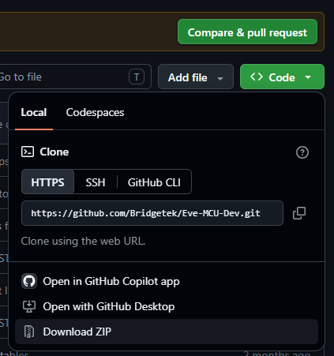
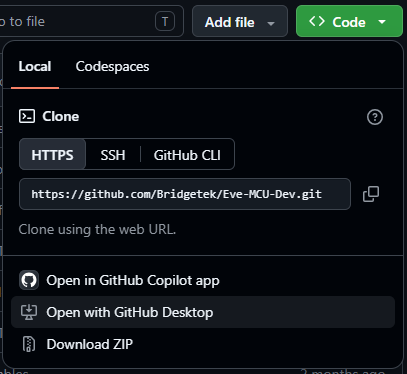

# EVE-MCU-Dev Quick Start Guide

The following instructions show how to use the [EVE Emulator](https://github.com/Bridgetek/EVE_Emulator) to start developing with the Bridgetek EVE and the EVE-MCU-Dev library.

### Scope

This discussion shows the steps required to run the "simple" example from the library.

### Prerequisites

To begin the following are required:

- A Windows PC (the EVE Emulator is not supported on Linux or Apple devices).
- Access to the EVE-MCU-Dev repository on GitHub and the EVE-Emulator repository. 
  - (Optional) [GitHub Desktop](https://github.com/apps/desktop) or [git command line tools](https://git-scm.com/install/windows).
- C/C++ development tools for compiling the library and examples. **One** of the following:
  - [MinGW64](https://www.mingw-w64.org/) development tools provide a GCC (GNU C/C++ Compiler) environment on Windows. This can be installed as part of [MSYS2](https://www.msys2.org/). 
  - [Microsoft C/C++ (MSVC) Build Tools](https://learn.microsoft.com/en-us/cpp/overview/acquire-msvc?view=msvc-170). Command line compiler collection for Windows.
  - [Microsoft Visual Studio ](https://visualstudio.microsoft.com/)integrated development environment for Windows.
- Command line build tool [CMake](https://cmake.org/) to build the examples. This is not required if using Microsoft Visual Studio environment.

## Library Installation

The library may be downloaded as a ZIP file or cloned from GitHub.

### Downloading Library ZIP file

To download the ZIP file of the library click on the green **"<> Code"** button on the repository [Home/Code page](https://github.com/Bridgetek/Eve-MCU-Dev). Then on the "Download ZIP" button.



The ZIP file can be expanded into the desired development directory.

**NOTE:** Different branches can be selected before downloading the ZIP file.

This process **MUST** be repeated with the EVE Emulator. Download the ZIP file for the EVE Emulator from the [EVE Emulator Home/Code page](https://github.com/Bridgetek/EVE_Emulator) and expand it into the following directory in the EVE-MCU-Dev development directory: `ports\eve_emulator`. There may be an empty directory with that name, the files from the EVE Emulator must expand to that empty directory. When a directory listing is taken then the following shoule be present assuming the library was expanded into the `C:\development\EVE-MCU-Dev` directory:

```console
>dir ports\eve_emulator\EVE_Emulator
 Volume in drive C is OS
 Volume Serial Number is F41F-6475

 Directory of C:\development\EVE-MCU-Dev\ports\eve_emulator\EVE_Emulator

18/08/2026  16:52    <DIR>          .
14/09/2026  16:41    <DIR>          ..
18/08/2026  16:52               125 .gitignore
18/08/2026  16:52    <DIR>          bin
18/08/2026  16:52    <DIR>          examples
18/08/2026  16:52    <DIR>          include
18/08/2026  16:52    <DIR>          lib
18/08/2026  16:52             1,984 LICENSE.md
18/08/2026  16:52            14,780 README.md
               3 File(s)         16,889 bytes
               6 Dir(s)  10,115,543,040 bytes free
```

### Cloning the Library

The EVE-MCU-Dev repository can be cloned from GitHub by using `git` command from the command prompt or GitHub Desktop.

#### Cloning from the Command Prompt

If using the command prompt then the following commands are used in the development directory:

```console
git clone https://github.com/Bridgetek/Eve-MCU-Dev
```

Then get the submodules to include the EVE Emulator repository:

```console
git submodule update --init
```

#### Using GitHub Desktop

To open the repository in GitHub Desktop click on the green **"<> Code"** button on the repository [Home/Code page](https://github.com/Bridgetek/Eve-MCU-Dev). Then on the "Open with GitHub Desktop" button.



The repository will be cloned with submodules to the development directory specified.

## Building

The examples provided in the library always supply a CMake file and may include a Visual Studio project as well.

All examples which support the EVE Emulator will have a directory called `emulator`. In this document we will build the "simple" example. The path to the simple example is `examples\simple`. The following directories are included in the simple example:

```console
>dir examples\simple
 Volume in drive C is OS
 Volume Serial Number is F41F-6475

 Directory of C:\development\GitHub\EVE-MCU-Dev\examples\simple

14/09/2026  16:41    <DIR>          .
24/08/2026  11:54    <DIR>          ..
08/09/2026  10:29    <DIR>          arduino
14/09/2026  16:41    <DIR>          BeagleBone
14/09/2026  16:41    <DIR>          common
16/06/2025  12:38    <DIR>          docs
08/09/2026  10:54    <DIR>          emulator
24/08/2026  16:58    <DIR>          ESP32
07/09/2026  16:26    <DIR>          ft900
14/09/2026  12:31    <DIR>          libft4222
14/09/2026  17:06    <DIR>          libmpsse
01/09/2026  17:10    <DIR>          MSP430
17/08/2026  14:19    <DIR>          MSPM0
17/09/2025  16:00    <DIR>          NXP_K64
24/08/2026  16:58    <DIR>          PIC18F
14/09/2026  16:41    <DIR>          pico
07/09/2026  16:26    <DIR>          raspberry_pi
14/09/2026  16:41            11,729 README.md
08/09/2026  10:29    <DIR>          STM32
07/09/2026  16:26    <DIR>          STM32CUBE_CMake_MiniSTM32H7xx
03/09/2026  14:29    <DIR>          STM32CUBE_MiniSTM32H7xx
03/09/2026  14:29    <DIR>          STM32CUBE_STM32F0308DISCO
03/09/2026  14:22    <DIR>          STM32CUBE_STM32F0DISCOVERY
               1 File(s)         11,729 bytes
              22 Dir(s)  10,199,109,632 bytes free
```

The `examples\simple\README.md` file explains the example and lists supported options.

To set the EVE device and display panel resolution the file `include\EVE_config.h` is modified to set the configuration as required. The EVE Emulator is able to change the EVE device type and display type automatically but for real hardware this has to be set at compile time.

If the default configuration needs to be modified then the EVE_config.h file can be edited directly; the EVE_config.h file can be copied locally and compiled; or configuration parameters set when building the examples.

### Building with CMake

Within the simple example the `examples\simple\emulator` directory contains the build file for CMake. This is called `examples\simple\emulator\CMakeLists.txt` .

To build the example use CMake to firstly make a build directory and configuration:

```console
cmake -B build -S .
```

This will create a directory called `build` containing all the CMake files. This is a one-time step and does not needsto be performed when modifying and recompiling the example.

If an MSVC compiler is not the default compiler on your platform then choose a suitable Visual Studio compiler explicitly:

```console
cmake -B build -S . -G "Visual Studio 17 2022"
```

To compile the project use the MinGW C compiler:

```console
cmake -B build -S . -G "MinGW Makefiles"
```

Once the CMake configuration is complete the example can be compiled using this command:

```console
cmake --build build
```

Once this is complete then the executable program will be ready. Depending on the compiler used, the executable may be in a different directory under the `build` directory. The CMake command will report the path to the executable near the end of the output. For the simple example the compiled program will be called `simple_emulator.exe`.

### Building with Visual Studio

Within the simple example the `examples\simple\emulator` directory contains the solution and projects files for Visual Studio. This is called `examples\simple\emulator\VisualStudio\emulator.sln`.

The example can be compiled by using the Build Project menu command. The compiled program can be run with the "Run" or "Debug" button. It may also be run from the command line by finding the

## Running the Example

When the program is run then the EVE Emulator screen will appear and start the example code. Initially, there will be a calibration screen which may be performed using the mouse to click on the indicated points on the screen. Subsequently running the example will not require the calibration step again unless the EVE device or screen type are changed.


The emulator will show the simple example when started.
