# EVE-MCU-Dev

This library allows a variety of hardware to communicate with FT8xx and BT8xx graphics controller devices: embedded MCUs using their native SPI hardware; Linux PCs using SPI character devices; PCs using FT4222H or MPSSE USB devices. 

This library is intended to provide a **C** library for embedded designs.

## Contents

- [Overview](#overview)
  - [History](#history)
  - [Scope](#scope)
  - [Prerequisites](#prerequisites)
  - [Quick Start](#quick-start)
- [Software Layers](#software-layers)
  - [Folder Structure](#folder-structure)
    - [Common Library Files](#common-library-files)
    - [Port Files](#port-files)
    - [Example Files](#example-files)
  - [Header Dependency](#header-dependency)
  - [Configuration Headers](#configuration-headers)
    - [Custom EVE Configuration Headers](#custom-eve-configuration-headers)
  - [Device and Panel Selection](#device-and-panel-selection)
    - [Device Selection](#device-selection)
    - [Display Panel Selection](#display-panel-selection)
- [Supported Platforms](#supported-platforms)
- [Example Code](#example-code)
- [Module Connections](#module-connections)
  - [Through-Board 2x8 Pins](#through-board-2x8-pins)
  - [Header 1x10 Pins](#header-1x10-pins)
- [Creating screens and executing commands](#creating-screens-and-executing-commands)
  - [EVE Data Paths](#eve-data-paths)
  - [Writing DL Instructions and Co-Processor Commands](#writing-dl-instructions-and-co-processor-commands)
    -[Writing RAM_CMD Directly](#writing-ram_cmd-directly)
    -[CMDB Method for Writing RAM_CMD](#cmdb-method-for-writing-ram_cmd)
  - [Beginning and Ending Co-Processor Lists](#beginning-and-ending-co-processor-lists)
  - [Simple Co-Processor List](#simple-co-processor-list)
  - [Executing a Single Co-Processor Command](#executing-a-single-co-processor-command)
  - [Large Co-Processor Lists](#large-co-processor-lists)
  - [Profiling the Co-processor List](#profiling-the-co-processor-list)
  - [Limitations in RAM_DL and RAM_CMD](#limitations-in-ram_dl-and-ram_cmd)
  - [Writing RAM_G and RAM_CMD](#writing-ram_g-and-ram_cmd)
  - [Handling Interrupts](#handling-interrupts)
  - [Accessing the INT# line](#accessing-the-int-line)
- [API Reference](#api-reference)
- [Porting Guide](#porting)
- [Documentation Reference](#documentation-reference)

## Overview

This library is designed to facilitate interfacing to an EVE graphics controller across a variety of MCUs and host platforms. 

It is based around a common set of layers provided as C and Header files which have been arranged to ease portability. Each MCU also has its own source file which includes any MCU-specific items. This allows developers to easily port the code to their chosen MCU type. Full code projects are provided for a range of MCUs and additional types of MCU can be targeted using the same principles explained here.

In addition to the library framework, the code also includes the "simple" demo application for each supported MCU and platform. The "simple" example demonstrates touch, custom fonts, and loading a JPG image. Other example applications are included showing different techniques and methods for using the EVE library.

### History

This document and code library are referred to from the following page on the Bridgetek Website [Home / Software Examples / EVE Examples / Portable EVE Library](https://brtchip.com/software-examples/eve-examples-2/). 

This library was previously described by Application Note [BRT_AN_025 EVE Portable MCU Example](https://brtchip.com/wp-content/uploads/2024/04/BRT_AN_025_EVE_Portable_MCU_Example-R.pdf). **This document and the code within this library supersedes BRT_AN_025**.

The BRT_AN_025 application note built upon the framework described in earlier application notes in the EVE for MCUs series including BRT_AN_008 and explained how it could be ported to other MCU platforms in addition to the original PIC MCU. It focused on aspects of making the library easy to use and demonstrating how it can be run on different MCUs.

### Scope

This document covers the following topics:

- The structure of the library.
- The different library layers which are common to all platforms.
- The basic main sample application provided with the library.
- How to modify the settings and the main example code to produce your own application 
- A separate section for each of the target MCUs describing the hardware requirements and any MCU-specific considerations.

**Note 1:** This code is intended to act as a starting point for customers to create their own application rather than being a complete library package. It is necessary that developers of the final application incorporating this library review all layers of the code as part of their product validation. By using any part of this code, the customer agrees to accept full responsibility for ensuring that their final product operates correctly and complies with any operational and safety requirements and accepts full responsibility for any consequences resulting from its use.

**Note 2:** The library functions are intended to perform a basic set-up of the MCU so that the EVE functionality can be demonstrated. The reader must consult the product documentation provided by the manufacturer of their selected MCU, and the Bridgetek documentation for their EVE device, to confirm that their final code and hardware complies with all recommendations, best practices, and specifications, so that reliable operation of the final product can be assured. The information provided in this document and code is not intended to override any information or specifications in the product datasheets.

### Prerequisites

This code can be used on a wide range of MCUs. Key requirements for compatible MCU are listed below:

- Single or Quad SPI Master with SPI Mode 0 capability.
- SPI signals for SCK and MOSI/MISO (or four bi-directional lines for Quad SPI)
- GPIO line or controllable Chip Select signal for device control
- GPIO line for Power Down control
- An optional GPIO input for an interrupt signal from the EVE device.

The SPI host routines must support transfers of *at least one byte* for EVE API levels 1-4 and at least one 32-bit word for EVE API level 5.

The host interface must also provide software control of the EVE chip-select signal, either directly or through a GPIO, so that it can conform to the EVE SPI protocol.

Some of the provided ports require source code modification if the MCU uses a SPI API library which sends a complete buffer of bytes (such as via a DMA transfer) with automatic chip select control. This is out of the scope of this document and sample code. Most MCUs can however be programmed at a level which interacts directly with the SPI hardware registers and GPIO for chip select. 

This library includes several example projects containing an example framework and sample main application for the following MCUs. However, the code can be ported to other MCUs.

### Quick Start

The [Quick Start Guide](QUICKSTART.md) will demonstrate running one of the example files on the EVE Emulator.

## Device API Support

There are multiple generations of EVE devices, these are referred by their API (and for some devices their SUB API) number from the following table:

| Device | API | SUB API |
| --- | --- | --- |
| FT800, FT801 | 1 | N/A |
| FT810, FT811, FT812, FT813 | 2 | 1 |
| BT880, BT881, BT882, BT883 | 2 | 2 |
| BT815, BT816 | 3 | N/A |
| BT817, BT818 | 4 | N/A |
| BT820 | 5 | N/A |

The library is compiled for the API (and where applicable the SUB API) during compilation. The API cannot be selected at runtime.

## Software Layers

The software consists of several layers which are shown below. The different layers are discussed in greater detail in following sections of this document.

- Main Application
- EVE API Layer
- EVE HAL Layer
- MCU Specific or Platform Specific Layer

The library is structured so that higher-level code depends on lower-level interfaces, while MCU and platform implementations remain independent of the public EVE API and HAL interfaces. This allows multiple examples to share the same library architecture across different supported platforms.

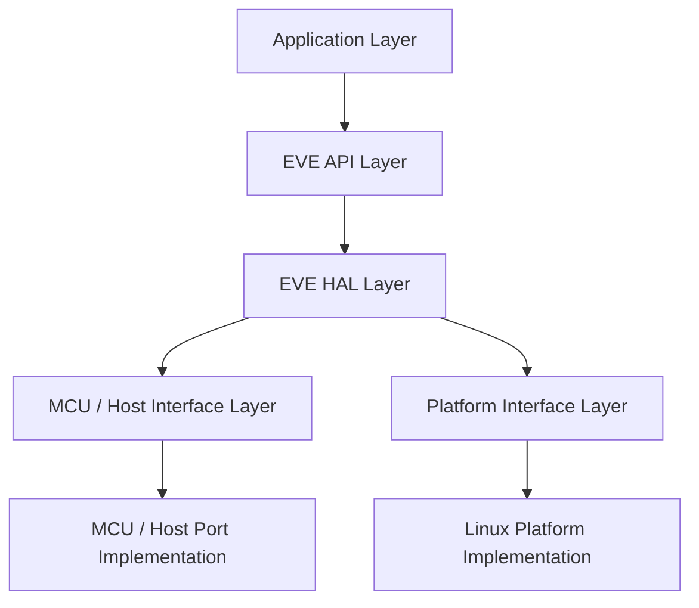
```mermaid
flowchart TD

    APP["Application Layer"]

    API["EVE API Layer"]

    HAL["EVE HAL Layer"]

    MCU["MCU / Host Interface Layer"]
    PLATFORM["Platform Interface Layer"]

    MCUPORT["MCU / Host Port Implementation"]
    LINUXPORT["Linux Platform Implementation"]

    APP --> API
    API --> HAL

    HAL --> MCU
    HAL --> PLATFORM

    MCU --> MCUPORT
    PLATFORM --> LINUXPORT
```

The intended architectural dependency direction is from the Application Layer through the EVE API and HAL layers to the MCU or Platform interface, and finally to the platform-specific implementation.

The HAL layer contains EVE-specific protocol handling, while the MCU and Platform layers provide host-specific SPI, GPIO, timing, interrupt, and operating-system functionality.

Lower-level MCU and platform implementations should remain independent of the public EVE API and HAL interfaces.

### Folder Structure

The library is organised into a number of top-level directories. 

- The `include` directory contains the header files for the EVE API, EVE HAL, and MCU-specific interface.
- The `source` directory contains the common EVE API and EVE HAL implementations.
- Platform-specific MCU implementations are located under the `ports` directory and are selected through the build configuration or platform-specific macros.
- Device- and feature-specific functionality that is not part of the common API implementation is separated into `extensions` subdirectories in the `include` and `source` directories, containing the public extension interfaces and their corresponding source implementations.
- Example applications are published in the `examples` folder.
- Code for simulation and test are placed in the `test` folder.

#### Common Library Files

The library common files for the EVE API and EVE HAL are in the source directory. There are separate files for an MCU implementation and for a _Linux-like_ SPI character device implementation. The HAL abstracts the calls from the API layer selecting the lower MCU or Platform layer for interfacing with the hardware.

The file `EVE_HAL.c` is intended for MCU platforms, the file `EVE_HAL_Linux.c` is for _Linux-like_ platforms such as BeagleBone and RPi platforms. Code which uses the MPSSE and FT4222H interfaces will use the simpler `EVE_HAL.c` code.

Contents of the `source` directory:

- **`EVE_API.c`** The programming interface to the library.
- `EVE_HAL.c` Hardware abstraction layer for MCU-style and supported host-interface ports implementing `MCU.h`.
- `EVE_HAL_Linux.c` Hardware abstraction layer for Linux SPI device ports implementing `Platform.h`.

Include files show the layers inherent in the library. The main API can be accessed with just the `EVE.h` header file which will include all the required header files to compile using the EVE API. The configuration for the display panel and other relevant configurable settings is modified in the `EVE_config.h` file. For most applications this is the only file in the library that will need modification.

Contents of the `include` directory:

- **`EVE.h`** Main public header for applications using the library. It includes the
  configured EVE settings, command definitions, register definitions and public API
  declarations required by an application.

- **`EVE_config.h`** Overridable target configuration file. This is the primary
  configuration file for selecting the EVE device, module, panel, display resolution
  and optional library features.

- `EVE_defs.h` Common definitions used by `EVE_config.h`, including supported EVE
  devices, Bridgetek modules and panels, display resolutions, RAM_G sizes and other
  configuration values.

- `EVE_settings.h` Derives the effective library configuration from `EVE_config.h`.
  This includes EVE API and sub-API selection, module and panel expansion, display
  settings, feature support and compatibility handling for deprecated configuration
  macros.

- `EVE_commands.h` Cross-generation display-list command, co-processor command and
  option definitions. Definitions are selected at compile time for the configured
  EVE API.

- `EVE_registers.h` Cross-generation EVE memory-map and register definitions.
  Register addresses are selected at compile time for the configured EVE API.

- `EVE_debug.h` Platform-specific debug output macros. This header is independent of
  the EVE device configuration and selects the appropriate logging mechanism for the
  target platform.

- `HAL.h` Interface between the EVE API layer and the hardware abstraction layer.

- `MCU.h` Interface implemented by MCU-style and host-interface ports used by
  `EVE_HAL.c`. It defines the SPI, GPIO, timing and other host-side functions required
  by the HAL.

- `Platform.h` Interface implemented by Linux SPI device ports used by
  `EVE_HAL_Linux.c`.

**Bold** files are the files with the recommended access points for a program into the library.

Applications should normally include only `EVE.h`.

The remaining headers are intended for library implementation, configuration or port
development. Each header includes the configuration or standard-library headers that
it directly depends upon and should not rely on `EVE.h` having been included first.

`EVE_config.h` may be replaced by an application-specific version by placing the
replacement earlier in the compiler include search path.

Extension-specific functionality is separated from the common EVE API source and header files. Extension header files are located in `include/extensions`, with their corresponding implementations located in `source/extensions`. These files provide functionality which is required only for specific EVE device generations or configurations and can be excluded from projects if they are not required.

* `/source/extensions/bt82x_patch.c` Implementation of the BT82x base patch loader and the additional API commands provided by the base patch for EVE API level 5 devices.
* `/include/extensions/bt82x_patch.h` Definitions and function declarations for the BT82x base patch functionality.
* `/source/extensions/custom_touch_fw.c` Implementation for loading custom touch firmware into supported EVE devices when the `EVE_CUSTOM_TOUCH` define is enabled.
* `/include/extensions/custom_touch_fw.h` Function declarations for the custom touch firmware extension.
* `/source/extensions/lcd_panel_init.c` Implementation for optional LCD panel driver initialisation when the `EVE_LCD_INIT` define is enabled. MCU-specific GPIO, SPI and timing functionality may be required to provide the interface to the LCD panel driver. Some panel controllers may also require additional MCU GPIOs for signals such as a dedicated reset or chip-select.
* `/include/extensions/lcd_panel_init.h` Function declarations for the LCD panel initialisation extension.

The extension source files are included in the build only where required for the selected EVE API or configuration. Extension headers are referenced through the main `include` directory, for example `#include <extensions/bt82x_patch.h>`.

#### Port Files

The `ports` directory contains a folder for each supported platform.

MCU-style and host-interface ports implement the interface declared by `MCU.h` and are used by `EVE_HAL.c`.

Linux SPI ports implement the interface declared by `Platform.h` and are used by `EVE_HAL_Linux.c`.

These implementations provide the host-specific SPI, GPIO, timing, byte-order and optional interrupt functionality required by the HAL. Where supported, a port may also provide host-side configuration for optional interfaces such as Quad SPI. Port-specific SPI buffer sizes and transfer limits are implementation details and are independent of `EVE_HAL_CHUNK_SIZE`.

EVE-specific register and command handling remains in the HAL layer and should not normally be implemented by the MCU or Platform layer. Likewise, HAL transfer chunking policy remains in the HAL layer, while MCU and Platform implementations manage only the transfer and buffering constraints of their host interface.

It is further discussed in the [Ports](#ports) section.

#### Example Files

The examples directory contains all the examples provided. There are more details in the [Example Code](#example-code) section.

### Header Dependency

The library headers are grouped below by their role within the library structure. The arrows show direct include dependencies between files. Software layers are
shown alongside shared configuration, definition, extension, and utility headers.

The public EVE-MCU-Dev interface headers `EVE.h`, `HAL.h`, `MCU.h`, and `Platform.h` are included through the configured include path using angle brackets. Extension headers under `include/extensions` are also included through the configured include path, for example `<extensions/bt82x_patch.h>`.

Internal support headers such as `EVE_registers.h`, `EVE_commands.h`, and `EVE_debug.h` use quoted includes where they are consumed within the library or port implementations. `EVE_settings.h` is likewise an internal library header. `EVE_config.h` and `EVE_defs.h` are intentionally included using angle brackets so that applications may provide a matching pair of configuration and definition headers through the configured include path.

#### Application Layer


```mermaid
block
  block:APPLICATION[" "]
    columns 3
    A1["Application <br>Source Code"] space B1["EVE.h"]
    
    A1 --> B1
  end
```

#### EVE API Layer

Public API header and source implementation:

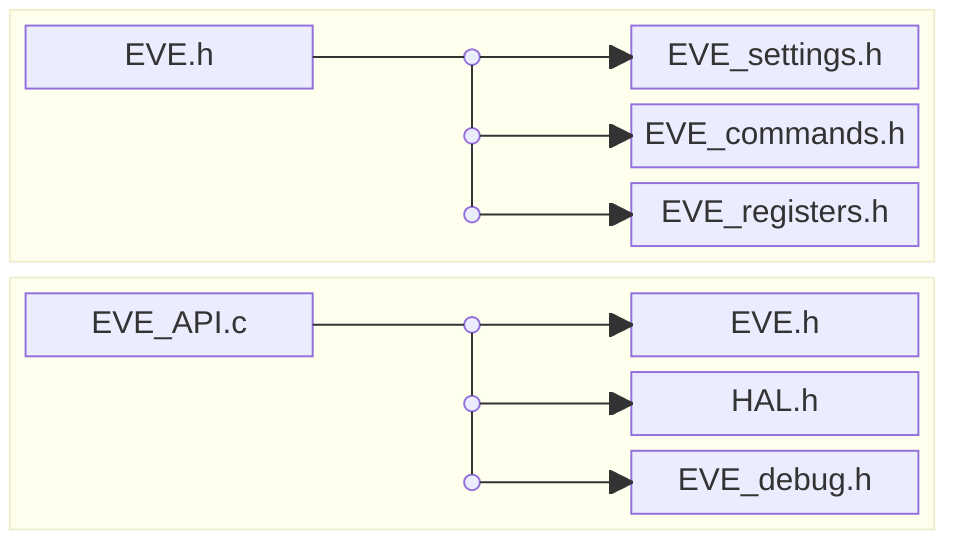
```mermaid
block
  columns 3
  block:HEADER_LAYER[" "]:3
    columns 3
    A1["EVE.h"]      X1((" "))   B1["EVE_settings.h"]
    space            X2((" "))  B2["EVE_commands.h"]
    space            X3((" "))  B3["EVE_registers.h"]
    A1 --- X1
    X1 --- X2
    X2 --- X3
    X1 --> B1
    X2 --> B2
    X3 --> B3
  end
  block:SOURCE_LAYER[" "]:3
    columns 3
    A2["EVE_API.c"]  X4((" "))    B4["EVE.h"]
    space            X5((" "))    B5["HAL.h"]
    space            X6((" "))    B6["EVE_debug.h"]
    A2 --- X4
    X4 --- X5
    X5 --- X6
    X4 --> B4
    X5 --> B5
    X6 --> B6
  end
```

#### Shared Configuration Headers

These headers provide shared compile-time configuration used by multiple library layers and interfaces:

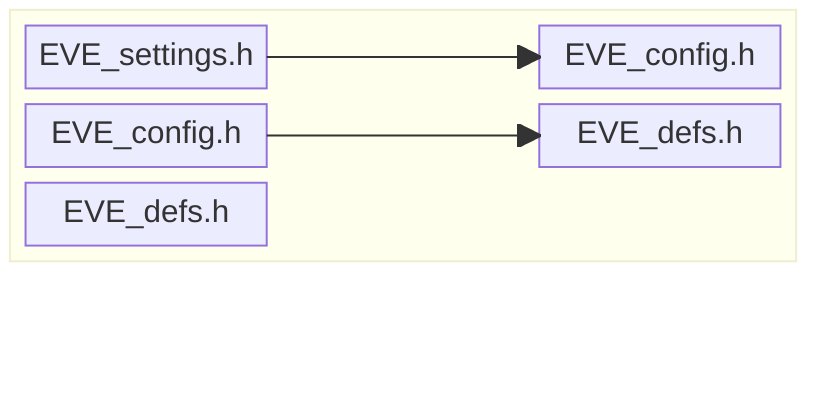
```mermaid
block
  columns 3

  block:CONFIG_LAYER[" "]:3
    columns 3

    A1["EVE_settings.h"]  space   B1["EVE_config.h"]
    A2["EVE_config.h"]    space   B2["EVE_defs.h"]
    A3["EVE_defs.h"] space space

    A1 --> B1
    A2 --> B2
  end
```

#### EVE Command and Register Definitions

Command encodings and register definitions used by the EVE API and HAL implementations:

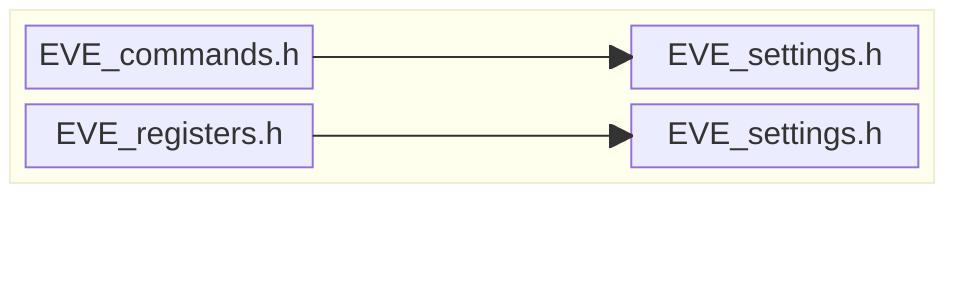
```mermaid
block
  columns 3
  block:COMMAND_REGISTER_LAYER[" "]:3
    columns 3

    A1["EVE_commands.h"]    space  B1["EVE_settings.h"]  
    A2["EVE_registers.h"]   space  B2["EVE_settings.h"]

    A1 --> B1
    A2 --> B2
  end
```

#### HAL Layer

Public HAL header and source implementations for MCU/host or Linux-based platforms:

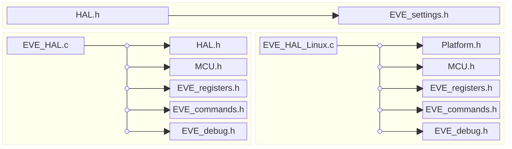
```mermaid
block
columns 4

  block:HEADER[" "]:4
    columns 3
    A1["HAL.h"]     space       B1["EVE_settings.h"]
    A1 --> B1
  end 

  block:MCU_LAYER[" "]:2
    columns 3
    A2["EVE_HAL.c"] X2((" "))   B2["HAL.h"]             
    space           X3((" "))   B3["MCU.h"]             
    space           X4((" "))   B4["EVE_registers.h"]   
    space           X5((" "))   B5["EVE_commands.h"]    
    space           X6((" "))   B6["EVE_debug.h"]       
    A2 --- X2
    X2 --- X3
    X3 --- X4
    X4 --- X5
    X5 --- X6
    X2 --> B2
    X3 --> B3
    X4 --> B4
    X5 --> B5
    X6 --> B6
  end

  block:PLATFORM_LAYER[" "]:2
    columns 3
    A3["EVE_HAL_Linux.c"]  X7((" "))   B7["Platform.h"]
    space                  X8((" "))   B8["MCU.h"] 
    space                  X9((" "))   B9["EVE_registers.h"]
    space                  X10((" "))  B10["EVE_commands.h"]
    space                  X11((" "))  B11["EVE_debug.h"]
    A3 --- X7
    X7 --- X8
    X8 --- X9
    X9 --- X10
    X10 --- X11
    X7 --> B7
    X8 --> B8
    X9 --> B9
    X10 --> B10
    X11 --> B11
  end
  
```

#### MCU / Platform Interface Layer

Public HAL-facing interfaces with no dependency on `EVE.h` or `HAL.h`:


```mermaid
block
  columns 2


  block:MCU_SIDE[" "]:1
    columns 3

    A1["MCU.h"] space B1["EVE_settings.h"]

    A1 --> B1
  end

  block:PLATFORM_SIDE[" "]:1
    columns 3

    A2["Platform.h"] space B2["EVE_settings.h"]

    A2 --> B2
  end
```

#### Port Implementation 
Port-specific source implementations:

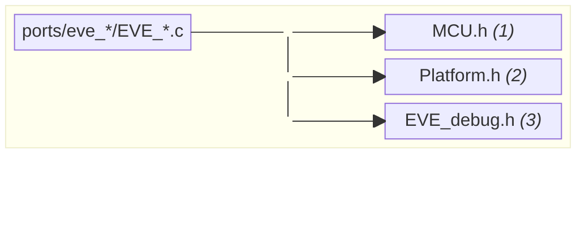
```mermaid
block
  columns 3
  block:PORT[" "]:3
    columns 3

    A1["ports/eve_*/EVE_*.c"] X1((" ")) B1["MCU.h <i>(1)</i>"]
    space                    X2((" ")) B2["Platform.h <i>(2)</i>"]
    space                    X3((" ")) B3["EVE_debug.h <i>(3)</i>"]

    A1 --- X1

    X1 --- X2
    X2 --- X3

    X1 --> B1
    X2 --> B2
    X3 --> B3

  end  

  style X1 fill:none,stroke:none
  style X2 fill:none,stroke:none
  style X3 fill:none,stroke:none
```

* _(1)_ Ports using `EVE_HAL.c` through the `MCU.h` interface.
* _(2)_ Ports using `EVE_HAL_Linux.c` through the `Platform.h` interface.
* _(3)_ Where required by individual port implementations. 


#### Feature and Device-Specific Extensions

Feature- or device-specific code isolated behind the associated configuration or feature guard.

Extensions may use common EVE functionality and, where required, may contain MCU- or platform-specific implementation code.

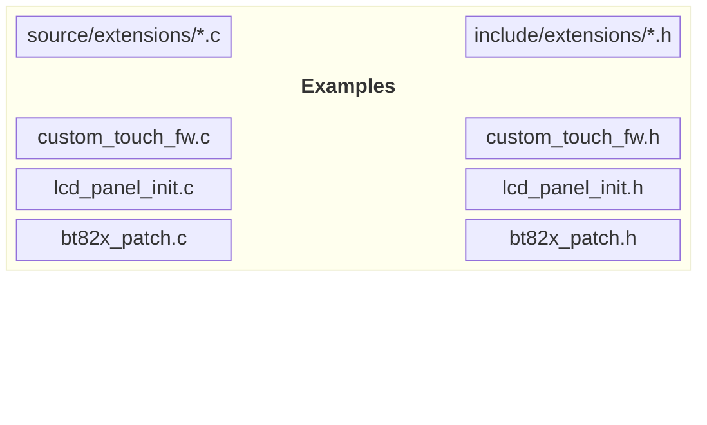
```mermaid
block
  columns 3

  block:EXTENSIONS[" "]:3
    columns 3

    A1["source/extensions/*.c"] space B1["include/extensions/*.h"]

    EXAMPLES["<b>Examples</b>"]:3

    C1["custom_touch_fw.c"] space C2["custom_touch_fw.h"]
    D1["lcd_panel_init.c"]  space D2["lcd_panel_init.h"]
    E1["bt82x_patch.c"]     space E2["bt82x_patch.h"]
  end

  style EXAMPLES fill:none,stroke:none
```
#### Independent Debug Utility

Shared debug macro interface with no dependency on `EVE.h`:


```mermaid
block
    columns 1
    A1["EVE_debug.h"]:20
```

### Configuration Headers

The configuration headers provide a shared foundation:

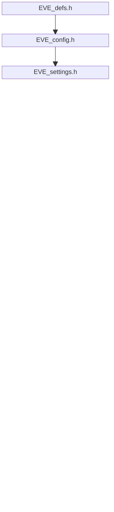
```mermaid
block
  columns 1
  A1["EVE_defs.h"]:20
  space
  A2["EVE_config.h"]:20
  space
  A3["EVE_settings.h"]:20
  
  A1 --> A2
  A2 --> A3
```

`EVE_settings.h` is consumed by the API, HAL, MCU, platform, command, and register definition headers as required. This is a shared configuration dependency rather than a dependency on a higher-level software interface.

Lower-level MCU and platform implementation files should not depend on higher-level headers such as `EVE.h` or `HAL.h`. They may, however, depend on `EVE_settings.h` where derived build-time configuration such as the selected EVE API level or QSPI support affects the host interface implementation

`EVE_debug.h` remains independent and may be used by API, HAL, MCU, platform, or port implementation code without requiring `EVE.h`.

Extension code under `include/extensions` and `source/extensions` should depend only on the functionality required by that feature and should remain isolated behind the relevant feature guards. Where required, an extension may contain MCU- or platform-specific implementation code for functionality that is not provided by the common library interfaces.

#### Custom EVE Configuration Headers

`EVE_settings.h` includes `EVE_config.h`, and `EVE_config.h` includes `EVE_defs.h`, using the compiler include search path:

```c
#include <EVE_config.h>
#include <EVE_defs.h>
```

This allows an application to provide custom configuration and definition headers from another include directory. When overriding the library configuration, a compatible `EVE_config.h` and `EVE_defs.h` must both be available in the configured include path.

The two headers should therefore be treated as a matching pair when overriding the library defaults. This prevents a custom `EVE_config.h` from being combined unintentionally with an incompatible library-local `EVE_defs.h`.

### Device and Panel Selection

The library __must__ be compiled for the correct EVE device and panel type. The target EVE device and panel type are defined in the file `EVE_config.h`.

It is **recommended** that the `EVE_config.h` file is modified in a user program by including the modified version before the library version in the search path for include files passed to the compiler.

There are three methods of configuring the EVE device and panel type. 
- The `EVE_DEVICE` macro and `EVE_DISPLAY_RES` macro. (Formerly the `FT8XX_TYPE` macro and `DISPLAY_RES` macro).
  This is the simplest method if a configuration is fixed. The `EVE_MODULE` and `EVE_PANEL` macros may be removed or be set to `EVE_NO_MODULE` and `EVE_NO_PANEL` respectively.
- The `EVE_DEVICE` macro and `EVE_PANEL` macro.
  This sets the `EVE_DISPLAY_RES` for a panel. The `EVE_MODULE` macros may be removed or be set to `EVE_NO_MODULE`.
- A Bridgetek module type may be set. 
  This will configure the `EVE_DEVICE` and `EVE_PANEL` macros. 
  The `EVE_PANEL` macro will be further expanded into a `EVE_DISPLAY_RES` macro.
  
In all cases, the selected module, device and panel settings are resolved in `EVE_settings.h`.

Where `EVE_MODULE` is selected, it determines the corresponding `EVE_DEVICE` and `EVE_PANEL` and may also enable/disable module-specific features.

Where `EVE_PANEL` is selected, it determines the corresponding `EVE_DISPLAY_RES` and may also enable panel-specific features.

`EVE_DISPLAY_RES` is then used to derive the `EVE_DISP_*` timing macro settings used when initialising the EVE display interface.

The `EVE_PANEL` setting is optionally used in the `examples/snippets/touch.c` example snippet to select predefined touchscreen configuration values and bypass calibration. The `EVE_MODULE` setting is also used by `source/extensions/lcd_panel_init.c` to select the appropriate LCD panel driver initialisation sequence where supported. 

The following flowchart describes the above heirarchy of options:

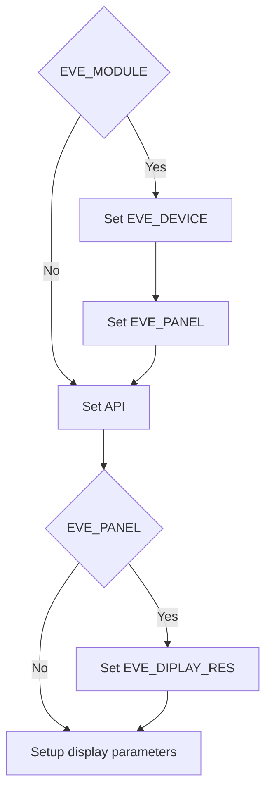
```mermaid
flowchart

    MODULE{EVE_MODULE}
    SD[Set EVE_DEVICE]
    SP[Set EVE_PANEL]
    MODULE --> |Yes| SD
    MODULE -->|No| API
    SD --> SP

    API[Set API]

    PANEL{EVE_PANEL}
    SR[Set EVE_DIPLAY_RES]
    PANEL -->|Yes| SR
    PANEL -->|No| FINISH

    API --> PANEL
    FINISH[Setup display parameters]

    SP --> API
    SR --> FINISH
```

#### Device and Panel Options

The following options are supported in `EVE_config.h`:

- `EVE_DEVICE` specifies the EVE device type. The following device types are supported:

  | Device Type | Relevant Product |
  | --- | --- | 
  | **EVE_FT800** | [FT800Q](https://brtchip.com/product/ft800/) |
  | **EVE_FT801** | [FT801Q](https://brtchip.com/product/ft801/) |
  | **EVE_FT810** | [FT810Q](https://brtchip.com/product/ft810q-2/) | 
  | **EVE_FT811** | [FT811Q](https://brtchip.com/product/ft811/) |
  | **EVE_FT812** | [FT812Q](https://brtchip.com/product/ft812/) |
  | **EVE_FT813** | [FT813Q](https://brtchip.com/product/ft813/) |
  | **EVE_BT880** | [BT880Q](https://brtchip.com/product/bt880/) |
  | **EVE_BT881** | [BT881Q](https://brtchip.com/product/bt881/) | 
  | **EVE_BT882** | [BT882Q](https://brtchip.com/product/bt882/) | 
  | **EVE_BT883** | [BT883Q](https://brtchip.com/product/bt883/) | 
  | **EVE_BT815** | [BT815Q](https://brtchip.com/product/bt815/) | 
  | **EVE_BT816** | [BT816Q](https://brtchip.com/product/bt816/) | 
  | **EVE_BT817** | [BT817Q](https://brtchip.com/product/bt817q/), [BT817AQ](https://brtchip.com/product/bt817aq/) | 
  | **EVE_BT818** | [BT818Q](https://brtchip.com/product/bt818/) |
  | **EVE_BT820** | [BT820B](https://brtchip.com/product/bt820b/) |

- `EVE_DISPLAY_RES` The resolution of the display panel.
  The following resolutions are defined:
  | Resolution Name | Size | Example |
  | ----- | ----- | ----- |
  | **EVE_QVGA**    | 320 x 240   | [DP-0351-11A](https://brtchip.com/product/dp-0351-11a/) | 
  | **EVE_WQVGA**   | 320 x 240   | [DP-0431-11A](https://brtchip.com/product/dp-0431-11a/), [DP-0502-11A](https://brtchip.com/product/dp-0502-11a/) |
  | **EVE_WQVGAR**  | 480 x 480   | [IDM2040-21R](https://brtchip.com/product/idm2040-21r/) with 2.1-inch round display |
  | **EVE_WVGA**    | 800 x 480   | [DP-0501-01A](https://brtchip.com/product/dp-0501-01a/), [DP-0501-11A](https://brtchip.com/product/dp-0501-11a/), [DP-0701-01A](https://brtchip.com/product/dp-0701-01a/) |
  | **EVE_WSVGA**   | 1024 x 600  | [ME817EV](https://brtchip.com/product/me817ev/) with 7-inch display |
  | **EVE_WXGA**    | 1280 x 800  | [DP-1011-01A](https://brtchip.com/product/dp-1011-01a/) |
  | **EVE_WXGA_NG** | 1280 x 800  | [DP-1011-02A](https://brtchip.com/product/dp-1011-02a/) |
  | **EVE_FULLHD**  | 1920 x 1080 | [DP-1561-01A](https://brtchip.com/product/dp-1561-01a/), [DP-1561-02A](https://brtchip.com/product/dp-1561-02a/) |
  | **EVE_WUXGA**   | 1920 x 1200 | [DP-1012-01A](https://brtchip.com/product/dp-1012-01a/) |
  

- `EVE_PANEL` The Bridgetek panel type of the display panel.
  The following panels are defined:
  | Panel Name | Description | Touch Type |
  | ----- | ----- | ----- |
  | **EVE_DP_0351_11A** | 3.5-inch display panel (**QVGA**) |  Resistive | 
  | **EVE_DP_0431_11A** | 4.3-inch display panel (**WQVGA**) | Resistive  |
  | **EVE_DP_0501_01A** | 5-inch display panel (**WVGA**) | Capacitive  |
  | **EVE_DP_0501_11A** | 5-inch display panel (**WVGA**) | Resistive |
  | **EVE_DP_0502_11A** | 5-inch display panel (**WQVGA**) |  Resistive |
  | **EVE_DP_0701_01A** | 7-inch display panel (**WVGA**) | Capacitive |
  | **EVE_DP_1011_01A** | 10.1-inch display panel (**WXGA**) | Capacitive |
  | **EVE_DP_1011_02A** | 10.1-inch display panel (**WXGA_NG**) | Capacitive |
  | **EVE_DP_1012_01A** | 10.1-inch  display panel (**WUXGA**) |  Capacitive |
  | **EVE_DP_1561_01A** | 15.6-inch display panel (**FullHD**) | Capacitive |
  | **EVE_DP_1561_02A** | 15.6-inch display panel (**FullHD**) | Capacitive |
  | **EVE_DP_IDM21R**   | 2.1-inch display panel (**WQVGAR**) | Capacitive |

- `EVE_MODULE` The Bridgetek module or development kit type for EVE device and display panel. The following options are defined:
  | Module or Kit Name | Description |
  | ----- | ----- |
  | **EVE_VM800B**      | [VM800B35A-BK](https://brtchip.com/product/vm800b35a-bk/) with 3.5-inch display. (**FT800** with **DP-0351-11A**) |
  | **EVE_VM800C35A**   | [VM800C35A-D](https://brtchip.com/product/vm800c35a-d/) with 3.5-inch display. (**FT800** with **DP-0351-11A**) |
  | **EVE_VM800C43A**   | [VM800C43A-D](https://brtchip.com/product/vm800c43a-d/) with 4.3-inch display. (**FT800** with **DP-0431-11A**) |
  | **EVE_VM800C50A**   | [VM800C50A-D]() with 5-inch display. (**FT800** with **DP-0502-11A**) |
  | **EVE_VM810C**      | [VM810C50A-D](https://brtchip.com/product/vm810c50a-d/) with 5-inch display. (**FT810** with **DP-0501-11A**) |
  | **EVE_ME812A**      | [ME812A-WH50R](https://brtchip.com/product/me812a-wh50r/), [ME812AU-WH50R](https://brtchip.com/product/me812au-wh50r/) with 5-inch display. (**FT812** with **DP-0501-11A**) |
  | **EVE_ME813A**      | [ME813A-WH50C](https://brtchip.com/product/me813a-wh50c/) with 5-inch display. (**FT813** with **DP-0501-01A**) |
  | **EVE_VM816C**      | [VM816C50A-D](https://brtchip.com/product/vm816c50a-d/), [VM816CU50A-D](https://brtchip.com/product/vm816cu50a-d/) with 5-inch display. (**BT816** with **DP-0501-11A**) |
  | **EVE_VM880C**      | [VM880C](https://brtchip.com/product/vm880c/) with assumed 4.3-inch display. (**BT880** with **DP-0431-11A**) |
  | **EVE_IDM204021R**  | [IDM2040-21R](https://brtchip.com/product/idm2040-21r/) (**FT800** with 2.1-inch display) |
  | **EVE_IDM204043A**  | [IDM2040-43A](https://brtchip.com/product/idm2040-43a/) (**BT883** with **DP-0431-11A**) |
  | **EVE_IDM20407A**   | [IDM2040-7A](https://brtchip.com/product/idm2040-7a/) (**BT817** with **DP-0701-01A**) |
  | **EVE_VM820B10A**   | [VM820B10A](https://brtchip.com/product/vm820b10a/) with 10.1-inch display. (**BT820** with **DP-1011-02A**) |
  | **EVE_VM820B15A**   | [VM820B15A](https://brtchip.com/product/vm820b15a/) with 15.6-inch display. (**BT820** with **DP-1561-02A**) |
  | **EVE_IDK_FT810_43A**   | [FT810 IC Development Kit](https://brtchip.com/product/idk-ft810-43a/) with 4.3-inch display. (**FT810** with **DP-0431-11A**) |
  | **EVE_IDK_BT816_50A**   | [BT816 IC Development Kit](https://brtchip.com/product/idk-bt816-50a/) with 5.0-inch display. (**BT816** with **DP-0501-11A**) |
  | **EVE_IDK_BT817_70A**   | [BT817 IC Development Kit](https://brtchip.com/product/idk-bt817-70a/) with 7.0-inch display. (**BT817** with **DP-0701-01A**) |
  | **EVE_IDK_BT817_101A**   | [BT817 IC Development Kit](https://brtchip.com/product/idk-bt817-101a/) with 10.1-inch display. (**BT817** with **DP-1011-02A**) |
  | **EVE_IDK_BT820_101A**   | [BT820 IC Development Kit](https://brtchip.com/product/idk-bt820-101a/) with 10.1-inch display. (**BT820** with **DP-1012-01A**) | 

#### Device Selection

The EVE device to target is set in the file `EVE_config.h`, `EVE_settings.h` then maps the selected `EVE_DEVICE` to the corresponding `EVE_API` and, where required, `EVE_SUB_API` to choose the device or the API respectively. One or other of these macros **must** be set correctly for the device being used.

There are predefined settings mapping of device names for `EVE_DEVICE` to `EVE_API`/`EVE_SUB_API` in the EVE API in the library. The [device API table](#device-api-support) can be used to select the correct value of `EVE_DEVICE`.

If the `EVE_DEVICE` macro is used then the "FT" or "BT" part number, above, of the device is set. This line will set a BT820 device and EVE API 5 will be selected automatically.
```c
#define EVE_DEVICE EVE_BT820
```
If `EVE_API` is used this will override any `EVE_DEVICE` values and a number from 1 to 5 is used. For EVE API 2 a subtype of the API is set in the `EVE_SUB_API` macro. So for an FT813 device the following can be used:
```c
#define EVE_API 2
#define EVE_SUB_API 1
```
**The default in the distribution will be a BT817 device**. This is the EVE device used in the [IDK-BT817-70A](https://brtchip.com/product/idk-bt817-70a/) modules.

Note that the example programs will take the `EVE_config.h` file from the `include` directory.

#### Display Panel Selection

The display panel dimensions to use are set in the file `EVE_config.h` using the `EVE_DISPLAY_RES` or `EVE_PANEL` macros.

The macro `EVE_DISPLAY_RES` will enable one of the pre-defined panel settings to be configured with the register values needed for that panel type. The registers are calculated for the standard Bridgetek panels in the resolution indicated by the `EVE_DISPLAY_RES` macro. Other panels may require different register settings. If a new panel is needed then the settings can be derived from the panel specifications or contact Bridgetek Support for advice.

The display panel settings **must** be correct for the panel in used otherwise it is unlikely that there will be any output visible.

**The default in the distribution will be a WVGA panel**. This is the panel used in the [IDK-BT817-70A](https://brtchip.com/product/idk-bt817-70a/) modules.

### Co-processor Method Selection

The `EVE_COPRO_METHOD` selection allows selection over the method used to control the co-processor command buffer. There are three methods which can be used. Not all can be used on all devices and in all ports.

On EVE2 onwards the library can use `REG_CMDB_WRITE` for automatic control of the FIFO of the co-processor command buffer. EVE1 will use the `REG_CMD_WRITE` and `REG_CMD_READ` registers to address the co-processor buffer. See the "Command FIFO" section in the Programming Guides for details of the differences.

If `REG_CMD_WRITE` and `REG_CMD_READ` are used to control the buffer then the INT# hardware line can be used to signal that the co-processor has completed all the commands in the buffer. The "Interrupts" section in the Data Sheets explains the use of the INT# line.

| Co-processor Method | Description |
| --- | --- | 
| **EVE_COPRO_CMDB_WRITE** | Use the `REG_CMDB_WRITE` register to address the command buffer. |
| **EVE_COPRO_CMD_WRITE** | Use `REG_CMD_WRITE` and `REG_CMD_READ` to control the command buffer. |
| **EVE_COPRO_INT** | Use `REG_CMD_WRITE`, `REG_CMD_READ` and the INT# line to control the command buffer. |

### QuadSPI Selection

The `EVE_QSPI_ENABLE` flag will enable QuadSPI on platforms which support it.

### RAM_G Size for BT82x

On BT82x the size of the RAM_G can be changed depending on the DRAM device used. The `EVE_RAM_G_CONFIG_SIZE` settingcan be used to change this from the default of 1 Gbit (`EVE_RAM_G_1_GBIT`).

| RAM_G Config Size | Description |
| --- | --- | 
| **EVE_RAM_G_32_MBIT** | 0.03Gb |
| **EVE_RAM_G_64_MBIT** | 0.06Gb |
| **EVE_RAM_G_128_MBIT** | 0.12Gb | 
| **EVE_RAM_G_256_MBIT** | 0.25Gb | 
| **EVE_RAM_G_512_MBIT** | 0.5Gb | 
| **EVE_RAM_G_1_GBIT** | 1Gb | 
| **EVE_RAM_G_2_GBIT** | 2Gb | 
| **EVE_RAM_G_4_GBIT** | 4Gb | 
| **EVE_RAM_G_8_GBIT** | 8Gb | 

### Setting Options in Build Configuration

The `EVE_MODULE`, `EVE_DEVICE`, `EVE_PANEL`, `EVE_DISPLAY_RES`, and `EVE_COPRO_METHOD` macros can be set in a build file as a C define. This can be used to change the configuration without editing or changing the `EVE_config.h` file. 

The `EVE_MODULE` macro is parsed first. Setting this to `EVE_NO_MODULE` will allow one or all of the `EVE_DEVICE`, `EVE_PANEL` and `EVE_DISPLAY_RES` macros to be picked up from the build file C definitions. The `EVE_COPRO_METHOD` is always parsed but ignored if the device type does not support the method.

Note that the preprocessor may complain if it is asked to change the value of one of the macros. 

## Supported Platforms

The supported platforms are listed in the [ports/README.md](ports/README.md) file. 

The source code for each platform is stored in the [ports](ports) directory. Each source file in each ports folder is guarded by one of the PLATFORM_<i>xxx</i> macros, USE_<i>xxx</i> macros, or a development environment specific macro. This way all the files in the ports directory can be loaded into a compiler and ignored if they are not relevant.

## Example Code

There are example projects for each supported platform. The [examples/README.md](examples/README.md) file has details on each of the included examples.

The ["simple"](examples/simple/README.md) example provides build environments for all supported platforms and forms the basis of the other examples provided. Build instructions are included in the ["simple" example directory.](examples/simple/README.md).

## Module Connections

There are 2 standard connectors for EVE modules used by BridgeTek. Alternatively, an MPSSE cable or FT4222 based module can be used to interface with a host PC via USB.

The connectors can be interfaced with a host MCU using jumper wires. The wiring colours in photographs in this section for each connection are defined in the following table.

| Colour | EVE Signal |
| --- | --- |
| Blue | SCK |
| Green | MOSI |
| Yellow | MISO |
| Orange | CS# |
| Red | PD# |
| Purple | INT# |
| Brown | GND |
| Not shown | INT# |

### Through-Board 2x8 Pins

This connector is a through-board connector 2x8 pin with 2.54mm spacing commonly found on the "ME" range of boards. These are designed with longer pins that can be used with the MM900EVxB FT9XX boards to mount the MCU board on top of the EVE module.

| Pin | EVE Signal | Pin | EVE Signal |
| --- | --- | --- | --- |
| 1 | N/C | 2 | N/C |
| 3 | INT# | 4 | PD# |
| 5 | GND | 6 | N/C |
| 7 | 5V | 8 | N/C |
| 9 | N/C | 10 | N/C |
| 11 | N/C | 12 | N/C |
| 13 | MOSI | 14 | MISO |
| 15 | CS# | 16 | SCK |

The 2x8 header can be connected as in the following picture. **NOTE:** The INT# line is not shown connected.

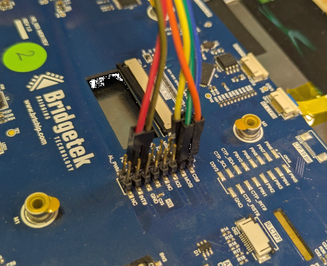

### Header 1x10 Pins

This connector is the header pin connector 1x10 pin with 2.54mm spacing commonly found on the "VM" range of modules such as the VM800B, VM810C50A and VM816C50A. The connector directly mates with the [MM4222-QSPI](https://brtchip.com/product/mm4222-qspi/) board or VA800A-SPI. ***Note**: that the VA800A-SPI is now discontinued but the information is retained here for reference.*

| Pin | EVE Signal |
| --- | --- |
| 1 | SCK |
| 2 | MOSI |
| 3 | MISO |
| 4 | CS# |
| 5 | INT# |
| 6 | PD# |
| 7 | 5V |
| 8 | N/C |
| 9 | GND |
| 10 | GND |

The 1x10 header can be connected as in the following picture. **NOTE:** The INT# line is not shown connected.

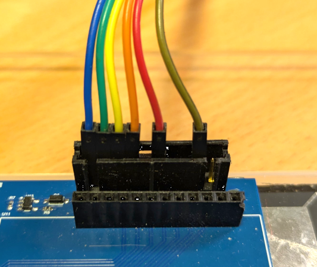

### MPSSE USB Cables

MPSSE USB cables such as the [MPSSE cables from FTDI](https://ftdichip.com/product-category/products/cables/usb-mpsse-spi-i2c-jtag-master-cable-series/) or [Connective Peripherals High Speed MPSSE Type-C](https://connectiveperipherals.com/products/usb-type-c-high-speed-mpsse) can be used to connect a host PC to an EVE module. 

These cables have wire-ends colour coded as follows.

| Wire colour | EVE Signal |
| --- | --- |
| Orange | SCK |
| Yellow | MOSI |
| Green | MISO |
| Brown | CS# |
| Blue | PD# |
| Purple | INT# |
| Red | 5V |
| Black | GND |

## Creating screens and executing commands

The API Layer provides functions to begin and end lists of co-processor commands. 
The co-processor commands must be preceded and followed by co-processor management functions.

Please refer to the following memory areas in the programming guide for the EVE device in
use. Both are memory mapped in the address space and can be accessed from the SPI.
- `RAM_DL` is the memory mapped area of the EVE device where the display list is accessed.
- `RAM_CMD` is the co-processor FIFO buffer.

The Co-Processor does not directly render screen content but instead acts as an assistant to
creating screen content within the `RAM_DL`. One of the main uses of the co-processor is to take
more complex items such as widgets which the GPU cannot process directly and create display list
entries in `RAM_DL` that the GPU can use. For example, a button command is turned into a series of
primitive shapes which the GPU can understand.

The Co-Processor also performs tasks which involve processing such as running calibration, taking
a compressed image and inflating it into an area of RAM_G in a form which the GPU can reference
from a display list. The co-processor can also access registers (for example, a `CMD_SWAP` can be
used which results in `REG_SWAP` being written).

The co-processor can accept both commands (e.g. `CMD_BUTTON` which must be used via the coprocessor), 
and GPU primitives (e.g. `COLOR_RGB()` which could have been written directly to the `RAM_DL`).

In the latter case, it passes these GPU instructions directly through to the created display list. 
This allows an entire screen to be created via the co-processor FIFO rather than mixing writes to
`RAM_DL` and `RAM_CMD` which requires very careful memory management.

### EVE Data Paths

The diagram below provides a simplified overview of the main data paths used when an MCU or host communicates with EVE.

The application can interact with EVE in several ways, including sending commands through the co-processor command buffer `RAM_CMD`, writing display-list instructions directly to `RAM_DL`, transferring graphics data such as bitmaps and fonts to `RAM_G`, and reading or writing EVE registers. Depending on the EVE device, graphics assets may also be stored in external `flash` and referenced or transferred for use by the graphics engine.

These different data paths allow an application to select the most appropriate method for creating and managing display content. For example, display lists may be generated through the co-processor or written directly, while graphics resources can be stored in `RAM_G` or `flash` (where applicable) and referenced by the display list.

Each EVE memory area and interface has its own addressing, transfer and management requirements. The EVE API and HAL layers abstract these details from the main application, including the EVE communications protocol and the handling required for areas such as `RAM_CMD`. This allows application code to use a consistent set of library functions while keeping the lower-level communication and data-management details within the library.


```mermaid
block
  columns 12
    block:HOST_LAYER[" "]:1
        columns 1
        space
        HOST["<b>MCU<br>or<br>Host</b>"]
        space
    end
    block:EVE["<br><br><br><br><br><br><br><br><br><br><br><br><br><br><br><br><br><br><br><br><br><br><br><br><br><b>Embedded Video Engine "]:9
        block:CONN1
            columns 1
            space:3 X4((" ")) space:3 X8((" ")) space:3 X12((" ")) space:2 X15((" "))
        end
        block:COPRO
            columns 1
            space
            coproc["Co-Processor<br><b>RAM_CMD</b>"]
            space  
        end
        block:CONN2
            columns 1
            space X17((" ")) space X19((" ")) X20((" ")) space X22((" ")) space X24((" ")) space X26((" ")) space:4
        end
        block:CONN3
            columns 3
            space:4 X35((" ")) space:2 X38((" ")) space X40((" ")) X41((" ")) space:4
            space:4 X50((" ")) space:2 X53((" ")) space:2 X56((" ")) space:4
            space X62((" ")) space X64((" ")) X65((" ")) space:2 X68((" ")) space:4 X73((" ")) space:2
        end
        block:INTERNALS
            columns 1
            block:flash[" "]
            columns 1
                flashtitle[("<b>FLASH</b><br>(EVE 3/4/5)")]
            end
            block:ram_dl(" ")
            columns 2
                BG(["BG"]):1
                FG(["FG"]):1
                dltitle("<b>RAM_DL</b>"):2
                BG ===> FG
            end
            ram_g["<b>RAM_G</b>"]
            block:registers[" "]
            columns 1
                reg[["<b>Registers</b>"]]
            end
        end
        block:CONN4
            columns 3
            space:5 X81((" ")) space X83((" ")) space:5 X89((" ")) space
            space:2 X93((" ")) space X95((" ")) space:5 X101((" ")) space:3 X105((" "))
            space:2 X108((" ")) space:2 X111((" ")) space:2 X114((" ")) space:2 X117((" ")) space:2 X120((" "))
        end
        block:CONN5
            columns 3
            space:4 X125((" ")) space:2  X128((" ")) space:2 X131((" ")) space:2 X134((" ")) space
            space:10 X146((" ")) space:4
            space X152((" ")) space:5 X158((" ")) space:2 X161((" "))space:2 X164((" ")) space
        end
        block:ENGINES
            columns 1
            gpu["<b>GPU</b>"]
            space
            touch["<b>Touch<br>Engine</b>"]
            space
            audio["<b>Audio<br>Engine</b>"]
        end
    end
    block:CONN6:1
        columns 1
        space:5 X165((" ")) space X166((" ")) space:7
    end
    block:OUTPUT_LAYER[" "]:1
        columns 1
        block:LCDPANEL[" "]
            columns 1
            lcd("Display Driver")
            lcdtitle("<b>LCD Panel</b>")
            touchout("Touch Controller")
        end
        space
        block:AUDIOCOMPONENTS[" "]
            columns 1
            amp("Amplifier")
            space 
            speak("Speaker")
        end
    end

%% copro connections
%% copro to flash
coproc --- X20
X20 --- X17
X35 ---> flash
X17-- "Commands<br>and Data" --- X35
%% copro to ram_dl
coproc === X22
X50 ===> ram_dl
X22 <== "Create Display<br>List Entries" === X50

%%copro to ram_g
coproc --- X24
X56 ---> ram_g
X24 <-- "Inflate data<br>to RAM_G" --- X56

%%copro to registers
coproc --- X26
X68 ---> registers
X68 --- X62
X26 <-- "Read/Write registers" --- X62

%% host connections
%% host to COPRO/common
HOST <== "SPI/QSPI" === X8
X8 ===> coproc
X8 === X12
%%host to RAM_CMD
X64 --- X65
X65 ---> ram_g
X12 <-- "Write raw image/font data" --- X64
%% host to ram_dl
X8 === X4
X19 === X40
X41 === X40
X41 ===> ram_dl
X4 <== "Write RAM_DL directly" === X19
%% host to registers
X12 === X15
X15 <== "Read/Write registers" === X73
X73 ==> registers

%% engines connections

%% flash
%%flash to gpu
X81 === flash
X125 ===> gpu
X81 <=="Data referenced<br>by Display List"=== X125
%%ram_dl
ram_dl --- X89
X83 ---> flash
X89 --"Data<br>lookup"--- X83
%%ram_dl to gpu
ram_dl === X93
X93 =="Display List"=== X128
X128 ===> gpu
%%ram_dl to ram_g
ram_dl --- X95
X101 ---> ram_g
X95 --"Data<br>lookup"--- X101

%%ram_g connections
ram_g === X105
X105 <=="Data referenced<br>by Display List"===  X131
X131 ===> gpu
%%ram_g to audio
ram_g --- X108
X108--- X114
X114 -- "Audio data"--- X158
X158 ---> audio

%% regsiters 
%% reg to touch
registers <--- X117
X161 --- X152
touch <--- X152
X117 --"Touch Registers"--- X161
%%reg to audio
registers <--- X120
X164 ---> audio
X120 --"Audio Registers"--- X164
%%reg to gpu
registers === X111
X111 <=="Display settings"=== X146
X146 === X134
X134 ===> gpu

%%flash to ram_g
flash --- X38
X38 --"Copy<br>data"--- X53
X53 ---> ram_g

%% output connections
%%gpu to LCD
gpu =="Pixel Data"==> lcd

%% touch to LCD
touch <--- X166
X165 --- touchout 
X166 --"Touch Inputs"--- X165

%% audio to speaker
audio --"Audio Output"--> amp
amp ---> speak

%% styling
%% layers
style HOST_LAYER fill:none,stroke:none
style CONN1 fill:none,stroke:none
style COPRO fill:none,stroke:none
style CONN2 fill:none,stroke:none
style CONN3 fill:none,stroke:none
style INTERNALS fill:none,stroke:none
style CONN4 fill:none,stroke:none
style CONN5 fill:none,stroke:none
style ENGINES fill:none,stroke:none
style CONN6 fill:none,stroke:none
style OUTPUT_LAYER fill:none,stroke:none

%% boxes
style HOST stroke:#cf4730,stroke-width:8px
style LCDPANEL stroke:#1f4488,stroke-width:8px
style gpu stroke:#30b8cf,stroke-width:4px
style touch stroke:#cf9730,stroke-width:4px
style AUDIOCOMPONENTS stroke:#1f890b,stroke-width:8px
style audio stroke:#68cf30,stroke-width:4px
style amp stroke:#68cf30,stroke-width:3px
style speak stroke:#68cf30,stroke-width:3px
style coproc stroke:#9730cf,stroke-width:4px
style flash stroke:#9730cf,stroke-width:4px
style ram_dl stroke:#9730cf,stroke-width:4px
style ram_g stroke:#9730cf,stroke-width:4px
style registers stroke:#9730cf,stroke-width:4px
style touchout stroke:#cf9730,stroke-width:3px
style lcd stroke:#30b8cf,stroke-width:3px
style lcdtitle fill:none, stroke:none
style dltitle stroke:none
style BG stroke:#9730cf,stroke-width:1px
style FG stroke:#30b8cf,stroke-width:1px
style flashtitle stroke:#9730cf,stroke-width:1px
style reg stroke:#9730cf,stroke-width:1px

%%connections
style X4 fill:#cf4730,stroke:#cf4730
style X8 fill:#cf4730,stroke:#cf4730
style X12 fill:#cf4730,stroke:#cf4730
style X15 fill:#cf4730,stroke:#cf4730
style X17 fill:#9730cf,stroke:#9730cf
style X20 fill:#9730cf,stroke:#9730cf
style X22 fill:#9730cf,stroke:#9730cf
style X24 fill:#9730cf,stroke:#9730cf
style X26 fill:#9730cf,stroke:#9730cf
style X35 fill:#9730cf,stroke:#9730cf
style X38 fill:#9730cf,stroke:#9730cf
style X40 fill:#cf4730,stroke:#cf4730
style X53 fill:#9730cf,stroke:#9730cf
style X56 fill:#9730cf,stroke:#9730cf
style X62 fill:#9730cf,stroke:#9730cf
style X64 fill:#cf4730,stroke:#cf4730
style X68 fill:#9730cf,stroke:#9730cf
style X73 fill:#cf4730,stroke:#cf4730
style X81 fill:#30b8cf,stroke:#30b8cf
style X83 fill:#9730cf,stroke:#9730cf
style X89 fill:#9730cf,stroke:#9730cf
style X93 fill:#30b8cf,stroke:#30b8cf
style X95 fill:#9730cf,stroke:#9730cf
style X101 fill:#9730cf,stroke:#9730cf
style X105 fill:#30b8cf,stroke:#30b8cf
style X108 fill:#68cf30,stroke:#68cf30
style X114 fill:#68cf30,stroke:#68cf30
style X117 fill:#cf9730,stroke:#cf9730
style X120 fill:#68cf30,stroke:#68cf30
style X125 fill:#30b8cf,stroke:#30b8cf
style X128 fill:#30b8cf,stroke:#30b8cf
style X131 fill:#30b8cf,stroke:#30b8cf
style X134 fill:#30b8cf,stroke:#30b8cf
style X146 fill:#30b8cf,stroke:#30b8cf
style X152 fill:#cf9730,stroke:#cf9730
style X161 fill:#cf9730,stroke:#cf9730
style X164 fill:#68cf30,stroke:#68cf30
style X165 fill:#cf9730,stroke:#cf9730
style X166 fill:#cf9730,stroke:#cf9730

%% blank connections
style X19 fill:none,stroke:none
style X41 fill:none,stroke:none
style X50 fill:none,stroke:none
style X65 fill:none,stroke:none
style X111 fill:none,stroke:none
style X158 fill:none,stroke:none

```

### Writing DL Instructions and Co-Processor Commands

Using EVE commands via the co-processor requires some data formatting to convert the parameters 
of the command into the correct binary values to be sent as well as keeping track of the number 
of bytes sent to update the write pointer correctly. Some commands also require padding to make 
their total size including parameters a multiple of 4 bytes. The functions in EVE_API hide this 
from the main application.

The co-processor is fed commands via a circular FIFO (called `RAM_CMD`). The application must 
note the following:

- Always treat the FIFO as a true circular buffer with read and write pointers and must not
begin every new command or set of commands at `RAM_CMD + 0`. The application should
check for free space and then determine the current value of `REG_CMD_WRITE` and use
this as the starting point for the next command or set of commands.
- Always write multiples of four bytes as each command must begin at an offset with
multiple of 4. Some commands such as buttons, text and sliders have parameters which
may make the overall length of command plus parameters non-multiple of 4. In these
cases, dummy 0x00 bytes should be sent at the end of the last parameter to pad it to a
multiple of 4 bytes.
- The co-processor indicates a fault condition by setting the low bits of `REG_CMD_READ`
resulting in an odd number being read back.
This could occur for example where invalid image data is supplied after `CMD_INFLATE` or
`CMD_LOADIMAGE`, or if an attempt is made to load more than the maximum number of instructions 
into `RAM_DL` via the co-processor. The programmers guide will have further information on
this.
- For widgets, the resulting number of display list instructions to create the shapes may be
significantly more than the number of bytes in the co-processor command for that widget.
Therefore, it cannot be assumed that _n_ co-processor commands will make only _n_
display list entries. `REG_CMD_DL` can be checked to keep track of the number of DL entries.
See [Profiling the Co-processor List](#profiling-the-co-processor-list) for helper functions
for this.

It is not recommended to write directly to `RAM_DL` as there is little advantage to write
display lists directly compared to using the management functions in the co-processor.

The circular buffer can be visualised by the following steps. 
The circular buffer pointers can be controlled directly by the application or,
on EVE2 onwards, automatically by the co-processor.

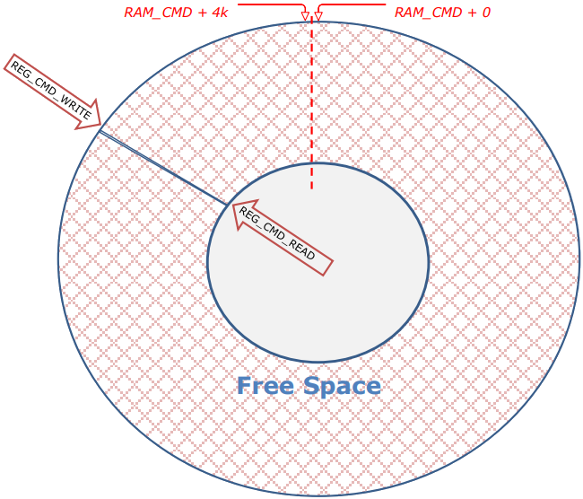

**Step 1:** The read and write pointers are initially equal and so the FIFO is empty. 
The current value of the `REG_CMD_WRITE` (starting offset) pointer is used as 
the first location of the next co-processor list. 

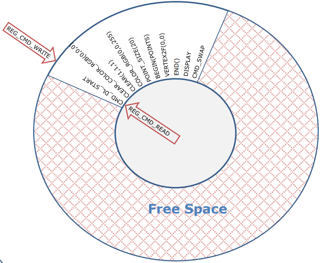

**Step 2:** The application writes the new commands to the FIFO. 
The current write address pointer increments for each 32-bit command written.
This has to take account of the rollover at the end of the `RAM_CMD` buffer.

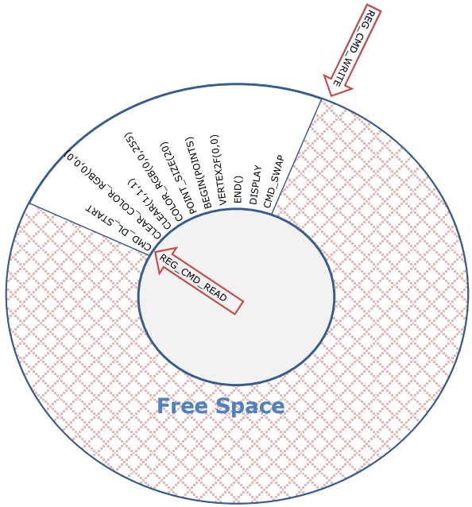

**Step 3:** The `REG_CMD_WRITE` register is updated to prime the co-processor to process the list.
Since the write pointer is greater than the read pointer the co-processor will start working
through the commands in the list.

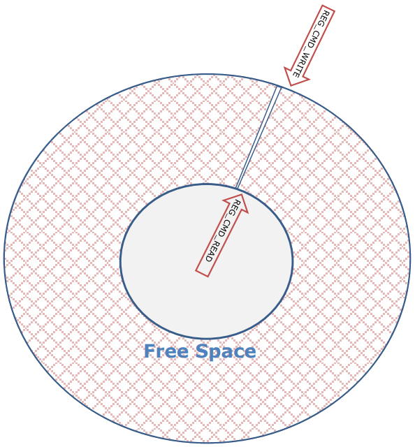

**Step 4:** The co-processor will now consume and execute each command in turn and will 
update `REG_CMD_READ` as it does until the pointers become equal. 
The display list will be generated in `RAM_DL` as the co-processor works through the
commands and the swap will be carried out. The display list now appears as shown below:

| Address | Instruction |
| --- | --- |
| RAM_DL | CLEAR_COLOR_RGB(0,0,0) |
| RAM_DL + 4 | CLEAR(1,1,1) |
| RAM_DL + 8 | COLOR_RGB(0,0,255) |
| RAM_DL + 12 | POINT_SIZE(20) |
| RAM_DL + 16 | BEGIN(POINTS) |
| RAM_DL + 20 | VERTEX2F(0,0) |
| RAM_DL + 24 | END() |
| RAM_DL + 28 | DISPLAY |


#### Writing RAM_CMD Directly

Co-processor commands can be written directly to `RAM_CMD` on all EVE generations.
The co-processor buffer is managed by the `REG_CMD_WRITE` and `REG_CMD_READ` registers.

The free space remaining in the circular buffer is calculated by the difference between 
the values in the `REG_CMD_READ` and `REG_CMD_WRITE` registers. If the sum is negative
then bitwise AND with the size of the circular buffer will modify the result to an
integer within the bounds of the buffer size.

_FreeSpace_ = ( _WritePointer_ - _ReadPointer_ ) & ( _CircularBufferSize_ - 1)

When the amount of data to send is less than the free space in the circular buffer 
the process is as follows:

* Perform an SPI read from the `REG_CMD_WRITE` register. 
Set this as the starting _START_ pointer within the circular buffer.
Copy the value into another _WRITE_ pointer to preserve the starting address.
This provides the memory location at which the co-processor buffer will be written.
* Start an SPI write transfer to the address stored in the _WRITE_ pointer.
This initiates a write operation to the `RAM_CMD` memory directly. 
The co-processor does not action the commands send at this time.
  * Continue writing and incrementing the _WRITE_ pointer until the end of the 
  `RAM_CMD` memory area is reached _OR_ all the data has been sent.
  * Finish the SPI write transfer.
  * If there is data remaining then set the _WRITE_ pointer to the start of the
  `RAM_CMD` area and repeat.
* Perform an SPI write to the `REG_CMD_READ` register with the original value of
the circular buffer write pointer in the _START_ pointer.
  * At this point the co-processor will begin working on the data in the circular 
  buffer.

#### CMDB Method for Writing RAM_CMD

EVE generations 2 onward have an additional Bulk writing feature.
The co-processor will manage the circular buffer automatically when data to add
to `RAM_CMD` is written directly to the `REG_CMDB_WRITE` register.

The `REG_CMDB_SPACE` register indicates the amount of free space in the buffer. 
This can be used instead of awaiting the read and write pointers becoming equal. 

When the amount of data to send is less than the free space in the circular buffer 
the process is as follows:

* Perform an SPI read from the `REG_CMDB_SPACE` register. 
Ensure that there is space in the circular buffer for the transfer.
The code can wait until there is space if it is working on previous actions.
* Start an SPI write transfer to the `REG_CMDB_WRITE` register.
This initiates a write operation to the `RAM_CMD` memory directly by the co-processor.
  * Write the data continuously until all the data has been sent.
  The co-processor may action the command in the circular buffer at this time.
  * Finish the SPI write transfer.

### Beginning and Ending Co-Processor Lists

All co-processor lists must begin with a call to [`EVE_LIB_BeginCoProList`](API.md#eve_lib_begincoprolist).  
If any display list items or co-processor commands which use the display list are to be 
added then a call to `EVE_CMD_DLSTART` is required immediately after this.

For the avoidance of doubt, commands that only read or write registers, read or write 
memory, access flash or access the SD card do not require the `EVE_CMD_DLSTART` call.

All co-processor lists displaying graphics would be preceded by:

```c
    EVE_LIB_BeginCoProList(); // CS low and send address in RAM_CMD 
    EVE_CMD_DLSTART(); // When executed, EVE will begin a new DL
```

And followed by:

```c
    EVE_LIB_EndCoProList(); // CS high
    EVE_LIB_AwaitCoProEmpty(); // Wait for FIFO to be finish
```

A call to [`EVE_LIB_AwaitCoProEmpty`](API.md#eve_lib_awaitcoproempty) is implied in 
the call to [`EVE_LIB_BeginCoProList`](API.md#eve_lib_begincoprolist). 
Therefore it is not necessary to wait at the end of the co-processor  
list for the completion of the commands allowing program to perform other 
tasks not related to programming the EVE device.

The [`EVE_LIB_AwaitCoProEmpty`](API.md#eve_lib_awaitcoproempty) function will return zero if the co-processor commands have run successfully. 
If there was an error with a co-processor command or data used by the co-processor 
then an exception can be raised which will require the application to handle. 
The Programming Guide for each generation details the actions required when this occurs. 
See the section called "Coprocessor Faults" or "Fault Scenarios".

On EVE API 3, 4 and 5 there is a text message generated by the co-processor with a brief description of the fault. 
This message can be obtained with the [`EVE_LIB_GetCoProException`](API.md#eve_lib_getcoproexception) function.

### Simple Co-Processor List

The following is a simple list to write text on the screen in white letters:

```c
    EVE_LIB_BeginCoProList(); // CS low and send address in RAM_CMD 
    EVE_CMD_DLSTART(); // When executed, EVE will begin a new DL
    
    EVE_CLEAR_COLOR_RGB(0, 0, 0); // Select colour to clear screen to 
    EVE_CLEAR(1,1,1); // Clear screen

    EVE_COLOR_RGB(255, 255, 255);
    EVE_CMD_TEXT(100, 100, 28, EVE_OPT_CENTERX | EVE_OPT_CENTERY, "Hello");
    
    EVE_DISPLAY(); // Tells EVE that this is the end 
    EVE_CMD_SWAP(); // Swaps new list into foreground buffer  
    EVE_LIB_EndCoProList(); // CS high and end list 
    EVE_LIB_AwaitCoProEmpty(); // Wait for FIFO to be empty 
    // (commands executed) 
```

To send a display list to the screen the commands `EVE_CMD_DLSTART` is required at 
the beginning of a co-processor list before any display list items are added.

To finish the `EVE_DISPLAY` command is sent to the display list then the `EVE_CMD_SWAP` 
co-processor command is used to effect the change of display list being rendered on the screen.

### Executing a Single Co-Processor Command

When just executing a co-processor command (for example calling CMD_SETROTATE during set-up 
of the application to set the screen orientation) then the following can be used:

```c
    EVE_LIB_BeginCoProList(); // CS low and send address in RAM_CMD 

    EVE_CMD_SETROTATE(2);

    EVE_LIB_EndCoProList(); // CS high
    EVE_LIB_AwaitCoProEmpty(); // Wait for FIFO to be finish
```

If there is no display list created for a set of co-processor commands then there is no 
need for the `EVE_CMD_DLSTART`, `EVE_DISPLAY` or `EVE_CMD_SWAP`.

### Large Co-Processor Lists

On EVE1, EVE2, EVE3 and EVE4 there is 4 kB of co-processor list buffer space, on EVE5 there is 16 kB. 
A large co-processor list can use the whole buffer space many times over.
If an image is being decoded with `EVE_CMD_LOADIMAGE` then wrapping around the buffer space is a common occurrance.

The simpler examples above are small and do not need to check how much space is remaining in the co-processor list buffer. 
Large lists that potentially wrap the buffer space need a better stategy.

Register reads are not allowed within a co-processor list. The following methods can be used to safely manage the list.

#### Splitting Co-Processor Lists

A co-processor list can be created in more than one section, as shown below, to create the same display list. 

For tasks sending long display lists, the data can be divided into smaller chunks and sent with the program waiting for sufficient buffer space before continuing with the next chunk.

This example below shows how to split a co-processor list to generate a display list correctly. Note the position of the `EVE_CMD_DLSTART`, `EVE_DISPLAY` or `EVE_CMD_SWAP` commands.

```c
  // FIRST SECTION OF LIST
  EVE_LIB_BeginCoProList(); // CS low and send address in RAM_CMD
  EVE_CMD_DLSTART(); // When executed, EVE will begin a new DL
  EVE_CLEAR_COLOR_RGB(0, 0, 0); // Select colour to clear screen 
  EVE_CLEAR(1,1,1); // Clear the screen
  EVE_COLOR_RGB(255, 255, 255);
  EVE_LIB_EndCoProList(); // CS high 
  EVE_LIB_AwaitCoProEmpty(); // Wait for FIFO to be empty 
  // (commands executed)
  // **** You can write or read registers here ****
  // SECOND SECTION OF LIST
  EVE_LIB_BeginCoProList(); // CS low and send address in RAM_CMD
  EVE_CMD_TEXT(100, 100, 28, OPT_CENTERX|OPT_CENTERY,"Hello");
  EVE_DISPLAY(); // Tells EVE that this is the end 
  EVE_CMD_SWAP(); // Swaps new list into foreground buffer  
  EVE_LIB_EndCoProList(); // CS high
  EVE_LIB_AwaitCoProEmpty(); // Wait for FIFO to be empty 
  // (commands executed) 
```

The above sequence will create the same set of commands in RAM_DL as the code below.

```c
  EVE_LIB_BeginCoProList(); // CS low and send address in RAM_CMD
  EVE_CMD_DLSTART(); // When executed, EVE will begin a new DL 
  EVE_CLEAR_COLOR_RGB(0, 0, 0); // Select colour to clear screen to
  EVE_CLEAR(1,1,1); // Clear the screen
  EVE_COLOR_RGB(255, 255, 255);
  EVE_CMD_TEXT(100, 100, 28, EVE_OPT_CENTERX | EVE_OPT_CENTERY, "Hello");  
  EVE_DISPLAY(); // Tells EVE that this is the end  
  EVE_CMD_SWAP(); // Swaps new list into foreground buffer  
  EVE_LIB_EndCoProList(); // CS high 
  EVE_LIB_AwaitCoProEmpty(); // Wait for FIFO to be empty 
  // (commands executed)
```

The API function [`EVE_LIB_GetCoProSpace`](API.md#eve_lib_getcoprospace) can be used to check if there is sufficient space 
available in the co-processor for further commands to be sent. 
The command will not stop and restart the co-processor lists as in the example above but 
will pause the co-processor list to perform a register read before resuming another 
transfer without interrupting the program flow.

#### Writing Co-Processor Lists in Chunks

The [`EVE_LIB_WriteDataToCMD`](API.md#eve_lib_writedatatocmd) implements an efficient strategy to write large amounts of data to 
the co-processor buffer, where a block of data may be larger than the size of the `RAM_CMD` memory.
The block is divided into smaller chunks of data which are smaller than the `RAM_CMD` area.

The following flowchart describes the process. 
The _FreeSpace_ value used is either the difference between `REG_CMD_READ` and `REG_CMD_WRITE` or the value from `REG_CMDB_SPACE`;
_DataRemaining_ is the number of bytes to send in total; _ChunkSize_ is the number of bytes to send in each chunk.
The "Write ChunkSize bytes" block is specific to whether the `REG_CMDB_WRITE` method is being used.

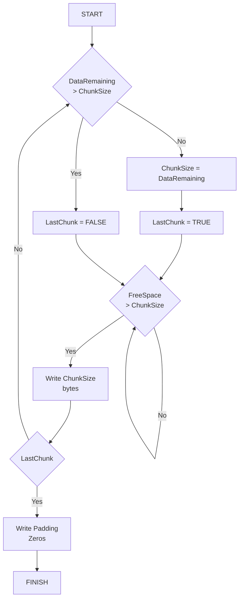
```mermaid
flowchart
    START
    START --> COND1
    
    COND1{DataRemaining \n> ChunkSize}

    T1Y[LastChunk = FALSE]

    COND1 --> |Yes| T1Y

    T1N[ChunkSize = DataRemaining]
    T2N[LastChunk = TRUE]
    COND1 -->|No| T1N
    T1N --> T2N
    T2N --> COND2
    T1Y --> COND2
    
    COND2{FreeSpace \n> ChunkSize}
    COND2 -->|No| COND2
    COND2 -->|Yes| W1Y

    W1Y[Write ChunkSize \nbytes]
    W1Y --> COND3

    COND3{LastChunk}
    COND3 -->|No| COND1
    COND3 -->|Yes| WSP

    WSP[Write Padding \nZeros]
    WSP --> FINISH

    FINISH
```

Checking free space instead of awaiting the FIFO empty is especially useful if writing 
the compressed data to the FIFO following a `CMD_INFLATE` for example.

### Profiling the Co-processor List

Setting the `EVE_COPROC_PROFILE` macro will enable code that can count the number of bytes sent to the co-processor. This is useful to find out the size of each co-processor list.

It is initilised using [`EVE_LIB_BeginCoProProfile`](API.md#eve_lib_begincoproprofile) at the beginning of a list to measure. The call to [`EVE_LIB_GetCoProProfile`](API.md#eve_lib_getcoproprofile) will return the number of bytes written since the list profiling was initialised.

This feature can be used in conjunction with [`EVE_LIB_GetCoProSpace`](API.md#eve_lib_getcoprospace) to predict the size of the co-processor fullness.

Enabling the macro will add one 16-bit storage variable to the compiled project.

### Limitations in RAM_DL and RAM_CMD

It is important to note that the overall limit of 8K for the generated RAM_DL list still applies, even if lists are sent in multiple sections. It is also important to bear in mind that the size of a co-processor command is not always the same as the size of the resulting RAM_DL instructions which the co-processor generates from the commands.

For example, the CMD_BUTTON uses 16 bytes of RAM_CMD plus the size of the string (plus any string arguments in BT81x) for the command, but the graphic operations in RAM_DL which the co-processor creates to render the button will be larger than this. The 8K RAM_DL limit does not therefore mean that 8K of co-processor commands can be used in one list.

REG_CMD_DL indicates the next available location in RAM_DL and so after executing a list commands (but before the swap) this register can be used to check how full RAM_DL is. The value read will be between 0 and 8191 with 8191 indicating the RAM_DL is full.

The value of REG_CMD_DL is read after executing the commands above but before the swap is executed. The swap is sent using a separate transaction (beginning with [`EVE_LIB_BeginCoProList`](API.md#eve_lib_begincoprolist) and ending with [`EVE_LIB_EndCoProList`](API.md#eve_lib_endcoprolist) and [`EVE_LIB_AwaitCoProEmpty`](API.md#eve_lib_awaitcoproempty) ) because a register read or write cannot take place whilst an existing SPI transaction (burst write or read) is in progress.  Note that in this example the [`EVE_LIB_MemRead16`](API.md#eve_lib_memread16) is used and will work on EVE APIs 1 to 4, on EVE 5 only 32-bit reads and writes are supported.

```c
  EVE_LIB_BeginCoProList(); // CS low and send address in RAM_CMD
  EVE_CMD_DLSTART(); // When executed, EVE will begin a new DL 
  EVE_CLEAR_COLOR_RGB(0, 0, 0); // Select color to clear screen to  
  EVE_CLEAR(1,1,1); // Clear the screen
  EVE_COLOR_RGB(255, 255, 255);
  EVE_CMD_TEXT(100, 100, 28, EVE_OPT_CENTERX | EVE_OPT_CENTERY, "Hello");  
  EVE_DISPLAY(); // Tells EVE that this is end of the list  
  EVE_LIB_EndCoProList(); // CS high 
  EVE_LIB_AwaitCoProEmpty(); // Wait for FIFO to be empty 
  // (commands executed)
  uint16_t RAM_DL_fullness = EVE_LIB_MemRead16(EVE_REG_CMD_DL); // check value in MCU debugger or print to UART etc.
  EVE_LIB_BeginCoProList(); // CS low and send address in RAM_CMD 
  EVE_CMD_SWAP(); // Swaps new list into foreground buffer  
  EVE_LIB_EndCoProList(); // CS high 
  EVE_LIB_AwaitCoProEmpty(); // Wait for FIFO to be empty 
  // (commands executed)
```

### Writing RAM_G and RAM_CMD

These functions allow burst writes to RAM_G and RAM_CMD. Individual bursts must not exceed 65535 bytes; larger transfers must be split into smaller sections. The HAL further divides transfers into chunks of up to `EVE_HAL_CHUNK_SIZE` bytes, while the underlying MCU or Platform implementation may apply additional host-interface-specific transfer limits.

```c
void EVE_LIB_WriteDataToRAMG(const uint8_t *ImgData, uint32_t DataSize, uint32_t DestAddress)
```

This function performs an SPI burst write to RAM_G. The starting address, as well as the source of the data and amount of data are specified. EVE can be written in a similar fashion to an SPI memory device. After asserting CS and sending the address, data can be written as a burst whilst keeping CS low. A similar function performs a read of the selected memory.

```c
void EVE_LIB_WriteDataToCMD(const uint8_t *ImgData, uint32_t DataSize) 
```

This function allows a block of data to be written to RAM_CMD which is needed when writing data to be inflated for example. This is more complex as the circular nature of the buffer must be handled in addition to splitting data into chunks since the buffer is only 4K in size. This function handles the entire process and so makes writing to RAM_CMD as simple as to RAM_G for the layers above. A flow chart can be found in BRT_AN_008 (FT81x Creating a Simple Library For PIC MCU) for loading data via the co-processor buffer RAM_CMD.  
Other helper functions are provided such as for writing strings and for retrieving co-processor results (as some commands such as CMD_GETPROPS return their result via RAM_CMD).

```c
uint16_t EVE_LIB_SendString(const char* string)
```

This function sends a string of characters and is used by commands such as CMD_TEXT, CMD_BUTTON and CMD_TOGGLE which all use text strings. This function takes care of the extra padding which is required as all EVE commands must be 32-bit aligned. Therefore, depending on the length of the string (plus the necessary null character to terminate it) then between one and three extra "\0" (NUL) bytes are added to pad the command to be a multiple of 4 bytes. The main application can therefore send strings without needing to consider the padding.

### Handling Interrupts

The interrupt register `REG_INT_FLAGS` is provided to allow an application to see if one of several interrupt events are flagged. These can be polled by reading the register. However, the register is automatically cleared on each read.

The API provides a method for accessing the register and preserving any tested flags for later testing. The [`EVE_LIB_GetInterrupt`](API.md#eve_lib_getinterrupt) function is provided to load and store the current bits set to keep a set of flags set in a global variable. There is a mask value as a parameter to the function which is used to test the set bits. Once the bits have been tested in the global variable they can be cleared.

For example, if a key press was detected and the bit set in the register during the period the application was waiting for a command buffer empty event the API can be queried with `EVE_LIB_GetInterrupt(EVE_INT_CMD_EMPTY)`. The `EVE_INT_TOUCH` bit would be unaffected and the application could later independently test the command for that event.

Enabling the macro will add one 8-bit storage variable to the compiled project.

### Accessing the INT# line

The optional INT# line is provided for the EVE device to signal to the host MCU that an event has occurred.

This status can be accessed from the EVE API with the [`EVE_LIB_Int`](API.md#eve_lib_int) function. A value greater than zero indicates that the INT# line is asserted. On MCUs and Platforms that do not support reading the INT# line the return value will be -1.

## API Reference

This callable layer is implemented in `EVE.h` and `EVE_API.c` and is called by the main loop of the application. 

Details of the API are in the [API Reference](API.md) document.

## Porting

The [Porting Guide](PORTING.md) describes the steps required to add support for a new MCU or host platform to the EVE-MCU-Dev library.

## Documentation Reference

The Programming Guides for each generation of EVE device is found in the [Bridgetek Programming and User Guides](https://brtchip.com/document/programming-guides/).

Application notes upon which this repository is based are the [Bridgetek EVE Examples](https://brtchip.com/software-examples/eve-examples-2/) page:

* [BRT_AN_006 FT81x Simple PIC Example Introduction](https://brtchip.com/wp-content/uploads/Support/Documentation/Application_Notes/ICs/EVE/BRT-AN-006-FT81x-Simple-PIC-Example.pdf)
* [BRT_AN_008 FT81x Creating a Simple Library For PIC MCU](https://brtchip.com/wp-content/uploads/Support/Documentation/Application_Notes/ICs/EVE/BRT_AN_008_FT81x_Creating_a_Simple_Library_For_PIC_MCU.pdf)
* [BRT_AN_014 FT81X Simple PIC Library Examples](https://brtchip.com/wp-content/uploads/Support/Documentation/Application_Notes/ICs/EVE/BRT_AN_014_FT81X_Simple_PIC_Library_Examples.pdf)
* [BRT_AN_025 Portable EVE Library](https://brtchip.com/wp-content/uploads/2024/04/BRT_AN_025_EVE_Portable_MCU_Example-R.pdf)
* [BRT_AN_062 Porting Guide](https://brtchip.com/wp-content/uploads/2024/04/BRT_AN_062_Porting_BRT_AN_025_to_NXP_MCU.pdf)
* [BRT_AN_074 EVE Colour Picker Example](https://brtchip.com/wp-content/uploads/2024/04/BRT_AN_074__BT81x_Simple_Colour_Picker_with_PWM_LED_Control.pdf)
