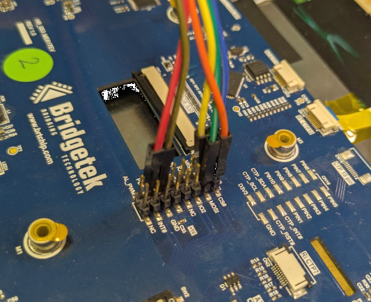

# EVE-MCU-Dev

This library allows a variety of hardware to communicate with FT8xx and BT8xx graphics controller devices: embedded MCUs using their native SPI hardware; Linux PCs using SPI character devices; PCs using FT4222H or MPSSE USB devices. 

This library is intended to provide a **C** library for embedded designs.

## Contents

- [Overview](#overview)
  - [History](#history)
  - [Scope](#scope)
  - [Prerequisites](#prerequisites)
- [Software Layers](#software-layers)
  - [Folder Structure](#folder-structure)
    - [Common Library Files](#common-library-files)
    - [Port Files](#port-files)
    - [Example Files](#example-files)
  - [Device and Panel Selection](#device-and-panel-selection)
    - [Device Selection](#device-selection)
    - [Display Panel Selection](#display-panel-selection)
- [Ports](#ports)
- [Examples Code](#example-code)
- [Module Connections](#module-connections)
  - [Through-Board 2x8 Pins](#through-board-2x8-pins)
  - [Header 1x10 Pins](#header-1x10-pins)
- [Library Usage](#library-usage)
  - [Initialising EVE](#initialising-eve)
  - [Co-Processor Helpers](#co-processor-helpers)
  - [Creating screens and executing commands](#creating-screens-and-executing-commands)
    - [Writing DL Instructions and Co-Processor Commands](#writing-dl-instructions-and-co-processor-commands)
    - [Beginning and Ending Co-Processor Lists](#beginning-and-ending-co-processor-lists)
    - [Simple Co-Pocessor List](#simple-co-pocessor-list)
    - [Executing a Single Co-Processor Command](#executing-a-single-co-processor-command)
    - [Co-Processor Lists of more than 4K Size](#co-processor-helpers)
    - [Limitations in RAM_DL and RAM_CMD#### Writing RAM_G and RAM_CMD](#limitations-in-ram_dl-and-ram_cmd)

## Overview

This library is designed to facilitate interfacing to an EVE graphics controller across a variety of MCUs and host platforms. 

It is based around a common set of layers provided as C and Header files which have been arranged to ease portability. Each MCU also has its own source file which includes any MCU-specific items. This allows developers to easily port the code to their chosen MCU type. Full code projects are provided for a range of MCUs and additional types of MCU can be targeted using the same principles explained here.

In addition to the example library framework, the code also includes a simple demo application which uses touch, custom fonts, and an image.

### History

This document and code library are refered to from the following page on the Bridgetek Website [Home / Software Examples / EVE Examples / Portable EVE Library](https://brtchip.com/software-examples/eve-examples-2/). 

This library was previously described by Application Note [BRT_AN_025 EVE Portable MCU Example](https://brtchip.com/wp-content/uploads/2024/04/BRT_AN_025_EVE_Portable_MCU_Example-R.pdf). **This document and the code within this library superceeds BRT_AN_025**.

The BRT_AN_025 application note built upon the framework described in earlier application notes in the EVE for MCUs series including BRT_AN_008 and explained how it could be ported to other MCU platforms in addition to the original PIC MCU. It focused on aspects of making the library easy to use and demonstrating how it can be run on different MCUs.

### Scope

This document covers the following topics:

- The structure of the library
- The different library layers which are common to all platforms.
- The basic main sample application provided with the library
- How to modify the settings and the main example code to produce your own application 
- A separate section for each of the target MCUs describing the hardware requirements and any MCU-specific considerations.

**Note 1:** This code is intended to act as a starting point for customers to create their own application rather than being a complete library package. It is necessary that developers of the final application incorporating this library review all layers of the code as part of their product validation. By using any part of this code, the customer agrees to accept full responsibility for ensuring that their final product operates correctly and complies with any operational and safety requirements and accepts full responsibility for any consequences resulting from its use.

**Note 2:** The library functions are intended to perform a basic set-up of the MCU so that the EVE functionality can be demonstrated. The reader must consult the product documentation provided by the manufacturer of their selected MCU, and the Bridgetek documentation for their EVE device, to confirm that their final code and hardware complies with all recommendations, best practices, and specifications, so that reliable operation of the final product can be assured. The information provided in this document and code is not intended to override any information or specifications in the product datasheets.

### Prerequisites

This code can be used on a wide range of MCUs. Key requirements for compatible MCU are listed below:

- Single or Quad SPI Master with SPI Mode 0 capability.
- SPI signals for SCK and MOSI/MISO (or four bi-directional lines for Quad SPI)
- GPIO line or controllable Chip Select signal for device control
- GPIO line for Power Down control

The code is designed with SPI master routines which can read/write *at a minimum* a single byte at a time and have manual control over chip select. 

Chip select control is required to meet the EVE SPI protocol. 

Some of the provided ports require source code modification if the MCU uses a SPI API library which sends a complete buffer of bytes (such as via a DMA transfer) with automatic chip select control. This is out of the scope of this document and sample code. Most MCUs can however be programmed at a level which interacts directly with the SPI hardware registers and GPIO for chip select. 

This library includes several example projects containing an example framework and sample main application for the following MCUs. However, the code can be ported to other MCUs.

There are 5 levels of API coinciding with each generation of EVE device and one generation has a SUB API version to allow for hardware differences:

- EVE API 1: FT800, FT801
- EVE API 2 - SUB API 1: FT810, FT811, FT812, FT813
- EVE API 2 - SUB API 2: BT880, BT881, BT882, BT883
- EVE API 3: BT815, BT816
- EVE API 4: BT817, BT818
- EVE API 5: BT820

## Software Layers

The software consists of several layers which are shown below. The different layers are discussed in greater detail in following sections of this document.

- Main Application
- EVE API Layer
- EVE HAL Layer
- MCU Specific Layer

The library structure is designed to provide a format where multiple examples with support for multiple platforms can be presented.

### Folder Structure

The library is structured as follows. There are common sections with have source code for the EVE API and EVE HAL layer and header files for the EVE API, EVE HAL and MCU Specific layer. The interface between the EVE HAL layer and the MCU Specific layer are defined in these headers and the source code for each MCU port can be selected in the build instructions or using defined macros.

#### Common Library Files

- **`\source\EVE_API.c`** The programming interface to the library.
- `\source\EVE_HAL.c` The abstraction layer between the programming interface and the MCU specfic layer.
- `\source\EVE_HAL_Linux.c` The abstraction layer between the programming interface and the Linux SPI character device.
- `\include\HAL.h` Definitions for accessing the abstraction layer from the API layer.
- **`\include\EVE.h`** Header file to include to access all required programming interface entry points and definitions.
- `\include\Platform.h` Linux header file for access to the MCU layer from the abstraction layer.
- **`\include\EVE_Config.h`** Overridable configuration file for target application.
- `\include\MCU.h` Embedded header file for access to the MCU layer from the abstraction layer.
- `\include\FT8xx.h` Header file which selects the EVE API specific header file below.

**Bold** files are the files with the recommended access points for a program into the library.

EVE API specific header files.

- `\include\FT80x.h` Header file for API 1
- `\include\FT81x.h` Header file for API 2 SUB APIs 1 and 2
- `\include\BT81x.h` Header file for API 4 and 5
- `\include\BT82x.h` Header file for API 5

The file `EVE_HAL.c` is intended for MCU platforms, the file `EVE_HAL_Linux.c` is for _Linux-like_ platforms such as BeagleBone and RPi platforms. Code which uses the MPSSE and FT4222H interfaces will use the simpler `EVE_HAL.c` code.

#### Port Files

The ports directory has folder for each platform supported. These will contain a file that implements the interface described in `\include\MCU.h` or `\include\Platform.h`. This will deal with any byte-order changing required and all access to the GPIO and SPI interfaces. 

It is further discussed in the [Ports](#ports) section.

#### Example Files

The examples directory contains all the examples provided. There are more details in the [Example Code](#example-code) section.

### Device and Panel Selection

The library __must__ be built for the correct EVE device and panel type. This is defined in the file [include/EVE_config.h](include/EVE_config.h).

The `EVE_config.h` file may be overridden in a user program by including the modified version before the library version in the search path for include files passed to the compiler.

#### Device Selection

The EVE device to target is set in the file `EVE_config.h`. The macro `FT8XX_TYPE` or `EVE_API`/`EVE_SUB_API` is set to choose the device or the API respectively. One or other of these macros **must** be set correctly for the device being used.

There are predefined settings mapping of device names for `FT8XX_TYPE` to `EVE_API`/`EVE_SUB_API` in the EVE API in the library. The following table can be used to select the correct value of `FT8XX_TYPE`.

- EVE API 1
  - `FT800` 
  - `FT801`
- EVE API 2
  - EVE SUB API 1
    - `FT810`
    - `FT811`
    - `FT812`
    - `FT813`
  - EVE SUB API 2
    - `BT880`
    - `BT881`
    - `BT882`
    - `BT883`
- EVE API 3
  - `BT815`
  - `BT816`
- EVE API 4
  - `BT817`
  - `BT818`
- EVE API 5
  - `BT820`

If the `FT8XX_TYPE` macro is used then the "FT" or "BT" part number, above, of the device is set. This line will set a BT820 device and EVE API 5 will be selected automatically.
```
#define FT8XX_TYPE BT820
```
If `EVE_API` is used this will override any `FT8XX_TYPE` values and a number from 1 to 5 is used. For EVE API 2 a subtype of the API is set in the `EVE_SUB_API` macro. So for an FT813 device the following can be used:
```
#define EVE_API 2
#define EVE_SUB_API 1
```
**The default in the distribution will be a BT820 device**.

Note that the example programs will take the `EVE_config.h` file from the `include` directory.

#### Display Panel Selection

The display panel dimensions to use are set in the file `EVE_config.h` using the macro `DISPLAY_RES`. 

Various standard panels are included, if a new panel is needed then the settings can be derived from the panel specifications or contact Bridgetek Support for advice.

The display panel settings **must** be correct for the panel in used otherwise it is unlikely that there will be any output visible.

The following are included in the distribution:
- QVGA *320x240* (VM800B with 3.5 inch display)
- WQVGA *480x272* (VM800B with 5 or 4.3 inch display)
- WVGA *800x480* (ME813A-WH50C or VM816)
- WSVGA *1024x600* (ME817EV with 7 inch display)
- WXGA *1280x800* (ME817EV with 10.1 inch display)
- FULLHD *1920x1080* (15 inch high definition display)
- WUXGA *1920x1200* (10 inch high definition display)

This line will set the panel to a ME-813A-WH50C (800 x 400).
```
#define DISPLAY_RES WVGA
```

**The default in the distribution will be a WUXGA panel**.

## Ports

The supported platforms are listed in the [ports/README.md](ports/README.md) file. 

The source code for each platform is stored in the [ports](ports) directory. Each source file in each ports folder is guarded by one of the PLATFORM_<i>xxx</i> macros, USE_<i>xxx</i> macros, or a develoment environment specific macro. This way all the files in the ports directory can be loaded into a compiler and ignored if they are not relevant.

## Example Code

There are example projects for many each supported platform. The [examples/README.md](examples/README.md) file has details on each of the included examples.

The [simple](examples/simple) example has build environments for all platforms and forms the basis of other examples that are provided. Build instructions are included in the simple example directory in the file [simple/README.md](examples/simple/README.md).

## Module Connections

There are 2 standard connectors for EVE modules used by BridgeTek. 

The wiring colours in the section for each connection are defined in the following table.

| Colour | EVE Signal |
| --- | --- |
| Blue | SCK |
| Green | MOSI |
| Yellow | MISO |
| Orange | CS# |
| Red | PD# |
| Brown | GND |

### Through-Board 2x8 Pins

This connector is a through-board connector 2x8 pin with 2.54mm spacing commonly found on the "ME" range of boards. These are designed with longer pins that can be used with the MM900EVxB FT9XX boards to mount the MCU board ontop of the EVE module.

| Pin | EVE Signal | Pin | EVE Signal |
| --- | --- | --- | --- |
| 1 | N/C | 2 | N/C |
| 3 | N/C | 4 | PD# |
| 5 | GND | 6 | N/C |
| 7 | 5V | 8 | N/C |
| 9 | N/C | 10 | N/C |
| 11 | N/C | 12 | N/C |
| 13 | MOSI | 14 | MISO |
| 15 | CS# | 16 | SCK |

The 2x8 header can be connected as in the following picture.



### Header 1x10 Pins

This connector is the header pin connector 1x10 pin with 2.54mm spacing commonly found on the "VM" range of modules such as the VM800B, VM810C50A and VM816C50A. The connector directly mates with the VA800A-SPI board. 

| Pin | EVE Signal |
| --- | --- |
| 1 | SCK |
| 2 | MOSI |
| 3 | MISO |
| 4 | CS# |
| 5 | INT# |
| 6 | PD# |
| 7 | 5V |
| 8 | N/C |
| 9 | GND |
| 10 | GND |

The 1x10 header can be connected as in the following picture.


## Library Usage

This callable layer is implemented in `EVE_API.c` and is called by the main loop of the application. 

Its purpose is to allow theprogram to use the same syntax as the EVE Programmers Guide when writing to the co-processor and so make programming of the display simpler and more easily maintained. 

The file contains several types of helper function including: 
- Functions which are used to begin, finish and check execution of co-processor lists. 
- Functions for writing data to RAM_G and RAM_CMD.
- A function for calling each Display List instruction and each Co-Processor command from the EVE programmers guide.

### Initialising EVE

Before using the library to send instructions to the EVE device the `EVE_Init()` function **must** be called.

This function will initialise the GPIO and SPI interface through the port file for the target MCU specific library. It will also write the display settings registers to the values defined in `EVE_config.h`. Note that these **must** be adjusted to suit your display. It then sets up the GPIO and other registers such as PWM (for the backlight) and sound on the EVE device.

A short co-processor list is used to clear the screen.

One additional step performed in `EVE_API.c` is to clear the bitmap handle properties (including BITMAP_LAYOUT_H and BITMAP_SIZE_H). It is important that this code is executed after the GPU is running and rendering the screen and therefore after the REG_PCLK has been set to the required value.

### Co-Processor Helpers

These functions perform the necessary tasks to begin and execute co-processor lists.

`void EVE_LIB_BeginCoProList(void)`

Puts Chip Select low and sends the starting address of the RAM_CMD location where the commands will be written. Chip Select remains low.

`void EVE_LIB_EndCoProList(void)`

Brings Chip Select high to end the burst and ensures that the co-processor will execute the newly added commands.

`void EVE_LIB_AwaitCoProEmpty(void)`

Waits for the completion of the current commands sent to the co-processor.

### Creating screens and executing commands

The API Layer provides functions to begin and end lists of co-processor commands. The co-processor commands must be preceeded and followed by co-processor management functions. 

#### Writing DL Instructions and Co-Processor Commands

Using EVE commands via the co-processor requires some data formatting to convert the parameters of the command into the correct hex values to be sent as well as keeping track of the number of bytes sent to update the write pointer correctly. Some commands also require padding to make their total size including parameters a multiple of 4 bytes. The functions in EVE_API hide this from the main application.

#### Beginning and Ending Co-Processor Lists

The co-processor has a command which initialises a new display list called `CMD_DLSTART`, this should be included in all lists.

All co-processor lists would be preceeded by:
```
    EVE_LIB_BeginCoProList(); // CS low and send address in RAM_CMD 
    EVE_CMD_DLSTART(); // When executed, EVE will begin a new DL
```
And followed by:
```
    EVE_LIB_EndCoProList(); // CS high
    EVE_LIB_AwaitCoProEmpty(); // Wait for FIFO to be finish
```

#### Simple Co-Pocessor List

The following is a simple list to write text on the screen in white letters:

```
    EVE_LIB_BeginCoProList(); // CS low and send address in RAM_CMD 
    EVE_CMD_DLSTART(); // When executed, EVE will begin a new DL
    
    EVE_CLEAR_COLOR_RGB(0, 0, 0); // Select colour to clear screen to 
    EVE_CLEAR(1,1,1); // Clear screen

    EVE_COLOR_RGB(255, 255, 255);
    EVE_CMD_TEXT(100, 100, 28, EVE_OPT_CENTERX | EVE_OPT_CENTERY, "Hello");
    
    EVE_DISPLAY(); // Tells EVE that this is the end 
    EVE_CMD_SWAP(); // Swaps new list into foreground buffer  
    EVE_LIB_EndCoProList(); // CS high and end list 
    EVE_LIB_AwaitCoProEmpty(); // Wait for FIFO to be empty 
    // (commands executed) 
```

#### Executing a Single Co-Processor Command

When just executing a co-processor command (for example calling CMD_SETROTATE during set-up of the application to set the screen orientation) then the following can be used:

```
    EVE_LIB_BeginCoProList(); // CS low and send address in RAM_CMD 
    EVE_CMD_DLSTART(); // When executed, EVE will begin a new DL

    EVE_CMD_SETROTATE(2);

    EVE_LIB_EndCoProList(); // CS high
    EVE_LIB_AwaitCoProEmpty(); // Wait for FIFO to be finish
```

#### Co-Processor Lists of more than 4K Size

The examples above use burst writes (CS low, write address, stream data holding CS low, CS high). 

Therefore, no register writes should be carried out in the middle as this would interrupt the burst. A list can however be created in more than one section as shown below. This is also useful if a list consists of more than (4K-4) bytes. In this latter case the list would be written in smaller sections, each section being executed to create more space in the RAM_CMD FIFO before the next section is sent.

```
  // FIRST SECTION OF LIST
  EVE_LIB_BeginCoProList(); // CS low and send address in RAM_CMD
  EVE_CMD_DLSTART(); // When executed, EVE will begin a new DL
  EVE_CLEAR_COLOR_RGB(0, 0, 0); // Select colour to clear screen 
  EVE_CLEAR(1,1,1); // Clear the screen
  EVE_COLOR_RGB(255, 255, 255);
  EVE_LIB_EndCoProList(); // CS high 
  EVE_LIB_AwaitCoProEmpty(); // Wait for FIFO to be empty 
  // (commands executed)
  // **** You can write or read registers here ****
  // SECOND SECTION OF LIST
  EVE_LIB_BeginCoProList(); // CS low and send address in RAM_CMD
  EVE_CMD_TEXT(100, 100, 28, OPT_CENTERX|OPT_CENTERY,"Hello");
  EVE_DISPLAY(); // Tells EVE that this is the end 
  EVE_CMD_SWAP(); // Swaps new list into foreground buffer  
  EVE_LIB_EndCoProList(); // CS high
  EVE_LIB_AwaitCoProEmpty(); // Wait for FIFO to be empty 
  // (commands executed) 
```
The above sequence will create the same set of commands in RAM_DL as the code below.
```
  EVE_LIB_BeginCoProList(); // CS low and send address in RAM_CMD
  EVE_CMD_DLSTART(); // When executed, EVE will begin a new DL 
  EVE_CLEAR_COLOR_RGB(0, 0, 0); // Select colour to clear screen to
  EVE_CLEAR(1,1,1); // Clear the screen
  EVE_COLOR_RGB(255, 255, 255);
  EVE_CMD_TEXT(100, 100, 28, EVE_OPT_CENTERX | EVE_OPT_CENTERY, "Hello");  
  EVE_DISPLAY(); // Tells EVE that this is the end  
  EVE_CMD_SWAP(); // Swaps new list into foreground buffer  
  EVE_LIB_EndCoProList(); // CS high 
  EVE_LIB_AwaitCoProEmpty(); // Wait for FIFO to be empty 
  // (commands executed)
```
The usage is fundamentally the same as the library and examples described in BRT_AN_008 (FT81x Creating a Simple Library For PIC MCU) and BRT_AN_014 (FT81X Simple PIC Library Examples) and so these can be used as a reference when using this library. 

#### Limitations in RAM_DL and RAM_CMD

It is important to note that the overall limit of 8K for the generated RAM_DL list still applies, even if lists are sent in multiple sections. It is also important to bear in mind that the size of a co-processor command is not always the same as the size of the resulting RAM_DL instructions which the coprocessor generates from the commands.

For example, the CMD_BUTTON uses 16 bytes of RAM_CMD plus the size of the string (plus any string arguments in BT81x) for the command, but the graphic operations in RAM_DL which the co-processor creates to render the button will be larger than this. The 8K RAM_DL limit does not therefore mean that 8K of co-processor commands can be used in one list.

REG_CMD_DL indicates the next available location in RAM_DL and so after executing a list commands (but before the swap) this register can be used to check how full RAM_DL is. The value read will be between 0 and 8191 with 8191 indicating the RAM_DL is full. 

The value of REG_CMD_DL is read after executing the commands above but before the swap is executed. The swap is sent using a separate transaction (beginning with EVE_LIB_BeginCoProList() and ending with EVE_LIB_EndCoProList() and EVE_LIB_AwaitCoProEmpty() ) because a register read or write cannot take place whilst an existing SPI transaction (burst write or read) is in progress.  Note that in this example the `EVE_LIB_Read16` is used and will work on EVE APIs 1 to 4, on EVE 5 only 32-bit reads and writes are supported.

```
  EVE_LIB_BeginCoProList(); // CS low and send address in RAM_CMD
  EVE_CMD_DLSTART(); // When executed, EVE will begin a new DL 
  EVE_CLEAR_COLOR_RGB(0, 0, 0); // Select color to clear screen to  
  EVE_CLEAR(1,1,1); // Clear the screen
  EVE_COLOR_RGB(255, 255, 255);
  EVE_CMD_TEXT(100, 100, 28, EVE_OPT_CENTERX | EVE_OPT_CENTERY, "Hello");  
  EVE_DISPLAY(); // Tells EVE that this is end of the list  
  EVE_LIB_EndCoProList(); // CS high 
  EVE_LIB_AwaitCoProEmpty(); // Wait for FIFO to be empty 
  // (commands executed)
  uint16_t RAM_DL_fullness = EVE_LIB_Read16(EVE_REG_CMD_DL); // check value in MCU debugger or print to UART etc.
  EVE_LIB_BeginCoProList(); // CS low and send address in RAM_CMD 
  EVE_CMD_SWAP(); // Swaps new list into foreground buffer  
  EVE_LIB_EndCoProList(); // CS high 
  EVE_LIB_AwaitCoProEmpty(); // Wait for FIFO to be empty 
  // (commands executed)
```

#### Writing RAM_G and RAM_CMD

These functions allow burst writes to be performed to RAM_G and RAM_CMD.

```
void EVE_LIB_WriteDataToRAMG(const uint8_t *ImgData, uint32_t DataSize, uint32_t DestAddress)
```
This function performs an SPI burst write to RAM_G. The starting address, as well as the source of the data and amount of data are specified. EVE can be written in a similar fashion to an SPI memory device. After asserting CS and sending the address, data can be written as a burst whilst keeping CS low. A similar function performs a read of the selected memory.
```
void EVE_LIB_WriteDataToCMD(const uint8_t *ImgData, uint32_t DataSize) 
```
This function allows a block of data to be written to RAM_CMD which is needed when writing data to be inflated for example. This is more complex as the circular nature of the buffer must be handled in addition to splitting data into chunks since the buffer is only 4K in size. This function handles the entire process and so makes writing to RAM_CMD as simple as to RAM_G for the layers above. A flow chart can be found in BRT_AN_008 (FT81x Creating a Simple Library For PIC MCU) for loading data via the co-processor buffer RAM_CMD.
Other helper functions are provided such as for writing strings and for retrieving co-processor results (as some commands such as GetProps return their result via RAM_CMD).
```
uint16_t EVE_LIB_SendString(const char* string)
```
This function sends a string of characters and is used by commands such as CMD_TEXT, CMD_BUTTON and CMD_TOGGLE which all use text strings. This function takes care of the extra padding which is required as all EVE commands must be 32-bit aligned. Therefore, depending on the length of the string (plus the necessary null character to terminate it) then between one and three extra 00 bytes are added to pad the command to be a multiple of 4 bytes. The main application can therefore send strings without needing to consider the padding. 

