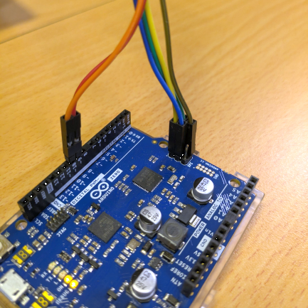

# EVE-MCU-Dev Arduino Library Builder

[Back](../README.md)

This directory is used to build an EVE library for Arduino. There are template files which are used to supplement the EVE-MCU-Dev library to make it accessible as a library when called by an Arduino sketch.

## Contents

- [Introduction](#introduction)
- [Setting Up the Arduino Library](#setting-up-the-arduino-library)
  - [Files copied to the Arduino Library](#files-copied-to-the-arduino-library)
  - [Manually Adding the Library to a Sketch](#manually-adding-the-library-to-a-sketch)
  - [Adding the Library to a Sketch](#adding-the-library-to-a-sketch)
- [Distributing the Arduino Library](#distributing-the-arduino-library)
  - [Adding the ZIP file to the Arduino IDE](#adding-the-library-to-a-sketch)
  - [Publishing the Library](#publishing-the-library)
- [Module Connections](#module-connections)
  - [Through-Board 2x8 Pins](#through-board-2x8-pins)
  - [Header 1x10 Pins](#header-1x10-pins)
  - [Arduino Connection](#arduino-connection)

## Introducion

The script will build a library for one generation of EVE device. Each generation requires a seperate library since the API and supported options on each device are different. Supporting multiple APIs with a single library would lead to larger code size of the library.

The display panel settings can be chosen at runtime from a set configured into the template files.

## Setting Up the Arduino Library

The python script `libbuild.py` is run with the the following options:

```
> libbuild.py --help
usage: libbuild.py [-h] [--src SRC] [--dest DEST] [--api API] [--apisub APISUB]

Library Builder for EVE

options:
  -h, --help       show this help message and exit
  --src SRC        distribution directory for EVE-MCU-Dev
  --dest DEST      destination directory for Arduino library
  --api API        EVE API to build library for
  --apisub APISUB  EVE SUB API to build library for
```
The `--src` option tells the script where the root directory of the EVE-MCU-Dev code is located. This is the folder that contains the `source`, `include`, `ports`, and `examples` directories. The script will take files that it needs from the EVE-MCU-Dev libraries. The default is `../..` since this the relative path to the code from the normal location of this script.

The `--dest` options is the folder where the Arduino library code will be written to. This is, by default, `./BridgetekEVE<API>` where `<API>` is replaced with the API version, and the SUB API version if applicable.

The EVE API to use is set by the `--api` and `--apisub` parameters. The default is `5` for BT82x. The `--subapi` is only used for the API 2 which distinguishes between the FT81x and BT88x range.

The available EVE device APIs and SUB APIs are:

- EVE API 1
  - FT800 
  - FT801 
- EVE API 2
  - EVE SUB API 1
    - FT810 
    - FT811 
    - FT812 
    - FT813 
  - EVE SUB API 2
    - BT880 
    - BT881 
    - BT882 
    - BT883 
- EVE API 3
  - BT815 
  - BT816 
- EVE API 4
  - BT817 
  - BT818 
- EVE API 5
  - BT820 

The name of the library will be generated from the EVE API and SUB API. If there is a SUB API greater than "1" then this is appended to the EVE API to make the "full" API version. So, for example, the API for a BT820 will be "5", FT81x will be "2", and for a BT88x will be "2_2".

### Files copied to the Arduino Library

The script will build a library suitable to be loaded into the Arduino IDE. It will copy files from the EVE-MCU-Dev library and alter template files to form the interface to the user in the Arduino programming environment.

The following files are copied without change from the EVE-MCU-Dev library.

- From the `include` directory following library header files will be copied:
  - EVE.h
  - MCU.h
  - HAL.h
  - FT8xx.h
  - BT81x.h  (for EVE API 3,4 only)
  - BT82x.h  (for EVE API 5 only)
  - FT80x.h  (for EVE API 1 only)
  - FT81x.h  (for EVE API 2 only)
- From the `source` directory add the library files:
  - EVE_API.c
  - EVE_HAL.c
- From the `ports\eve_bt82x` directory add the BT82x base patch (for API 5 only):
  - patch_base.c
  - patch_base.h
- From the `ports\eve_arch_arduino` directory add the MCU layer sketch for Arduino:
  - eve_arch_arduino.ino (renamed to EVE_MCU.cpp)

Template files are added to this to form the library.
- EVE_config.h.template 
- bteve.h.template
- bteve.cpp.template
- library.properties.template
- README.md.template
- test.ino.template

The following example projects are added:
- examples/simple

The output directory is a library specifically for the API version that was specified in the command line. It cannot be used for EVE devices that support a different API level.

### EVE_config.h.template 

This contains configuration parameters for the library including definitions for all the display panels.

### bteve.h.template

This template file is the Arduino library header containing function declarations and constants which are available in the Arduino programming environment from the EVE-MCU-Dev API. The declarations and constants are generated by preprocessing the file `EVE_API.c` and parsing the output to find API entry points. This file is included as a `#include` in an Arduino sketch to load the library.

It is renamed to `BridgetekEVE<API>.h`, where `<API>` is the full EVE API.

### bteve.cpp.template

This is the C++ file that implements the library in the Arduino programming environment. It implements functions which pass Arduino library calls in C++ to the EVE-MCU-Dev functions in C. There can only be one instance of this library called by a sketch. 

Function names map to the EVE-MCU-Dev library as with the `EVE_` prefix added in the call to the EVE-MCU-Dev library. For instance, in EVE-MCU-Dev a function called `EVE_<function_name>(parameters)` will be called `<function_name>(parameters)` in the Arduino library. 

When the Arduino library function is called the name of the library is prefixed to the function name. The Arduino library is loaded as a C++ class and referred to with the class name. If the library is loaded as a class called `eve` then a call to the "BEGIN" function in the library would be `eve.BEGIN(eve.BEGIN_BITMAPS)` - this would call a function in the Arduino library that would call `EVE_BEGIN(EVE_BEGIN_BITMAPS)` in the EVE-MCU-Dev library.

The template file is renamed to `BridgetekEVE<API>.cpp`, where `<API>` is the EVE API generation.

### library.properties.template

The properties file is used in the Arduino IDE to find releases of the library in GitHub when the library has been registered with Arduino IDE.

### README.md.template

A README.md file is compiled from the template to include information pertinant to the library.

### test.ino.template

This is a minimal test script that can be loaded in the Arduino IDE to test if the library can be loaded.

### Python Script Requirements

The script needs a valid EVE-MCU-Dev directory with current files located either in the default location `../..` or the directory pointed to by the `--src` parameter.

## Using the Arduino Library

### Manually Adding the Library to a Sketch

The library can be added to a sketch by including the lines in the example below. This example is for the API 5 library for BT82x, the number corresponds to the API.
```
#include <BridgetekEVE5.h>

BridgetekEVE5 eve;

void setup(){
  eve.setup(WVGA);

  eve.Init()
}
```
Display lists can be generated in the same way as they are in EVE-MCU-Dev.

### Adding the Library to a Sketch

The library can be added to a sketch and the `#include` will be added automatically by Arduino IDE.

## Distributing the Arduino Library

The generated library code can be distributed as a ZIP file and loaded into Arduino IDE or uploaded to the Arduino Library Registry.

### Adding the ZIP file to the Arduino IDE

Once the library has been generated by the above script the output directory can be ZIPped into a single file. Using the Arduino IDE the ZIP file can be added to the librarues by selecting "Include Library ->" from the Menu then "Add .ZIP Library...".

Alternatively, the contents of the output directory can be copied into a directory in the "libraries" directory found within the "Arduino" directory in the User's "Documents" directory. The library will be able to be added manually afterwards.

### Publishing the Library

Adding the URL of the library's GitHub repository to the Arduino library register will allow the library to be searched for and loaded directly in the Arduino IDE. Bridgetek will manage the updates of this feature.

## Module Connections

There are 2 standard connectors for EVE modules used by BridgeTek. 

The wiring colours in the section for each connection are defined in the following table.

| Colour | EVE Signal |
| --- | --- |
| Blue | SCK |
| Green | MOSI |
| Yellow | MISO |
| Orange | CS# |
| Red | PD# |
| Brown | GND |

### Through-Board 2x8 Pins

This connector is a through-board connector 2x8 pin with 2.54mm spacing commonly found on the "ME" range of boards. These are designed with longer pins that can be used with the MM900EVxB FT9XX boards to mount the MCU board ontop of the EVE module.

| Pin | EVE Signal | Pin | EVE Signal |
| --- | --- | --- | --- |
| 1 | N/C | 2 | N/C |
| 3 | N/C | 4 | PD# |
| 5 | GND | 6 | N/C |
| 7 | 5V | 8 | N/C |
| 9 | N/C | 10 | N/C |
| 11 | N/C | 12 | N/C |
| 13 | MOSI | 14 | MISO |
| 15 | CS# | 16 | SCK |

The 2x8 header can be connected as in the following picture.


### Header 1x10 Pins

This connector is the header pin connector 1x10 pin with 2.54mm spacing commonly found on the "VM" range of modules such as the VM800B, VM810C50A and VM816C50A. The connector directly mates with the VA800A-SPI board. 

| Pin | EVE Signal |
| --- | --- |
| 1 | SCK |
| 2 | MOSI |
| 3 | MISO |
| 4 | CS# |
| 5 | INT# |
| 6 | PD# |
| 7 | 5V |
| 8 | N/C |
| 9 | GND |
| 10 | GND |

The 1x10 header can be connected as in the following picture.


### Arduino Connection 

The Arduino module can be connected via short wires to the corresponding signals of an EVE module. Please reference the Arduino Datasheet for more information.

| Arduino Name | Arduino Pin | EVE Signal |
| --- | --- | --- |
| SCLK | ISCP 3 | SCK |
| COPI | ISCP 4 | MOSI |
| CIPO | ISCP 1 | MISO |
| D10 | PB6 | CS# |
| D9 | PB5 | PD# |
| - | ISCP 2 | 5V |
| - | ISCP 6 / GND | GND |

Ensure that the power supply from the Arduino module is capable of also powering the EVE board. If using third-party modules which may consume more current, a separate power connection to the EVE module could be used, with the grounds of the Beaglebone Black and EVE modules common to both power sources.

An Arduino board can be connected to an EVE board as in the following picture.


