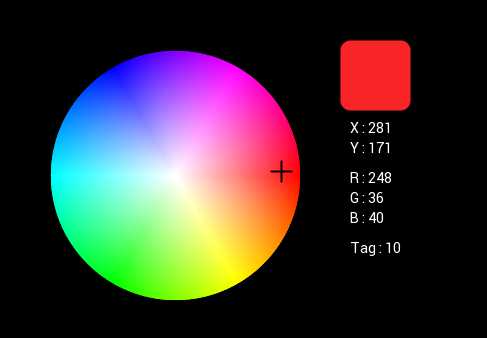

# EVE-MCU-Dev Colour Picker Example

[Back](../README.md)

## Colour Picker Example

The `colourpicker` example demonstrates drawing a colour picker wheel using several bitmap formats. If a touch is detected on the colour wheel then the colour is decoded from the raw image stored in RAM_G. The correct bitmap format is decoded into RGB components. These are displayed on the screen for reference. If a touch is detected outwith the wheel then a red circle is drawn around the wheel to indicate an error.

The example code uses the `touch` snippet from the [snippets](../snippets) directory to provide application functionality.

The generation of the bitmap for the colour picker wheel is done using floating point arithmetic when the program starts to run. The platform on which this is being run must therefore support floating point libraries.

## Screenshot

The following is an screenshot of the `colourpicker` example:



## Platform Support

This example supports the following platforms:

| Port Name | Port Directory | Supported |
| --- | --- | --- |
| [Generic using libFT4222](libft4222/README.md) | [libft4222](libft4222/) | Yes |
| [Generic using EVE Emulator](emulator/README.md) | [emulator](emulator/) | Yes |

Platform specific build instructions and setup requirements are shown in the `README.md` file in the platform build directory.

## EVE API Support

Supported EVE APIs in this example:

| EVE API 1 | EVE API 2 | EVE API 3 | EVE API 4 | EVE API 5 |
| --- | --- | --- | --- | --- |
| No | Yes | Yes | Yes | Yes |

## Files and Folders

The example contains a common directory with several files which comprises all the demo functionality.

| File/Folder | Description |
| --- | --- |
| [common/eve_example.c](common/eve_example.c) | Example source code file |
| [snippets/touch.c](../snippets/touch.c) | Calibration and touch detection routines |
| [docs](docs) | Documentation support files |


## Platform Files

### `main.c`

The application starts up in the file `main.c` which provides initial MCU configuration and then calls `eve_example.c` where the remainder of the application will be carried out. 

The `main.c` code is platform specific. It must provide any functions that rely on a platform's operating system, or built-in non-volatile storage mechanism. The required functions store and recall previous touch screen calibration settings:
- **platform_calib_init** initialise a platform's non-volatile storage system.
- **platform_calib_read** read a previous touch screen calibration or return a value indicating that there are no stored calibration setting.
- **platform_calib_write** write a touch screen calibration to the platform's non-volatile storage.

The example program in the common code is then called.

## Common Files

### `eve_example.c`

In the function `eve_example` the basic format is as follows:

```
void eve_example(void)
{
    // Initialise the display
    EVE_DEBUG_PRINTF("Initialising display...\n");
    if (EVE_Init() != 0)
    {
        EVE_DEBUG_ERROR("ERROR: EVE_Init() failed.\n");
        while (1);
    }

    // Calibrate the display
    EVE_DEBUG_PRINTF("Calibrating display...\n");
    if (eve_calibrate() != 0)
    {
        EVE_DEBUG_ERROR("ERROR: eve_calibrate() failed.\n");
    }

    // Generate a colour wheel in RAM_G
    EVE_DEBUG_PRINTF("Generating Colour Wheel...\n");
    generate_colour_wheel();

    // Load the colour wheel as a bitmap into a handle
    EVE_DEBUG_PRINTF("configuring Colour Wheel...\n");
    EVE_LIB_BeginCoProList();
    EVE_CMD_DLSTART();
    EVE_BEGIN(EVE_BEGIN_BITMAPS);
    EVE_BITMAP_HANDLE(WHEEL_HANDLE);
    EVE_CMD_SETBITMAP(WHEEL_RAMG_ADDR, WHEEL_FORMAT, 250, 250);
    EVE_BITMAP_SIZE(EVE_FILTER_NEAREST, EVE_WRAP_BORDER, EVE_WRAP_BORDER, 250, 250);
    EVE_DISPLAY();
    EVE_CMD_SWAP();
    EVE_LIB_EndCoProList();
    EVE_LIB_AwaitCoProEmpty();

    // Start example code
    EVE_DEBUG_PRINTF("Starting demo:\n");
    eve_display();          // Run Application
}
```
The call to `EVE_Init()` is made which sets up the EVE environment on the platform. This will initialise the SPI communications to the EVE device and set-up the device ready to receive communication from the host.

Next, the function `eve_calibrate()` is then called which uses the calibration co-processor command to display the calibration screen and asks the user to tap the three dots (see `touch.c` below).

Once calibration is complete, the main loop is called which sits in a continuous loop within `eve_display()`. Each time round the loop, a screen is created using a co-processor list. 

### `touch.c`

This function is used to show the touchscreen calibration screen and prompt the user to touch the screen at the required positions to generate an accurate transformation matrix. This matrix is used to translate the raw touch input into precise points on the screen.

The platform specific functions in `main.c` are called from this routine to store and read touchscreen calibration settings so that the user only needs to perform the action once.
