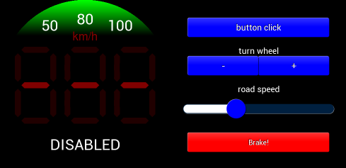

# EVE-MCU-Dev Cruise Example

[Back](../README.md)

## Cruise Example

The `cruise` example demonstrates drawing multiple seven segment displays on the same screen, blending, scissoring, and trackers. The example code code uses the `sevenseg` snippet from the [snippets](../snippets) directory to perform some of the drawing. 

The example is intended to show a reimagined cruise control for a vehicle. The physical control for which would be a rotating turn wheel (with presumably a shaft encoder), an integrated click button (the whole rotating wheel physically registers a press) and a touchscreen display. An external input would provide a signal for when the vehicle would disengage cruise control, e.g. when the brakes are depressed. The touchscreen would be overridden and disabled in software by the click button.

The display comprises two parts: the left side is a circular display which is the operational part of the touchscreen on the physical control; the right side are touchscreen controls to mimic the function of the turn wheel, button click and brake input.

On screens of width/height 480 pixels only the circular control is shown. On wider screens the control buttons will be shown.

## Screenshot

The following is an screenshot of the `cruise` example:




## EVE API Support

Supported EVE APIs in this example:

| EVE API 1 | EVE API 2 | EVE API 3 | EVE API 4 | EVE API 5 |
| --- | --- | --- | --- | --- |
| No | Yes | Yes | Yes | Yes |


## Platform Support

This example supports the following platforms:

| Port Name | Port Directory | Supported |
| --- | --- | --- |
| [Bridgetek FT9xx](ft900/README.md) | [ft900](ft900/) | Yes | 
| [Raspberry Pi Pico](pico/README.md) | [pico](pico/) | Yes |
| [Generic using libFT4222](libft4222/README.md) | [libft4222](libft4222/) | Yes |
| [Generic using EVE Emulator](emulator/README.md) | [emulator](emulator/) | Yes |

Platform specific build instructions and setup requirements are shown in the `README.md` file in the platform build directory.

## Platform Files

### `main.c`

The application starts up in the file `main.c` which provides initial MCU configuration and then calls `eve_example.c` where the remainder of the application will be carried out. 

The `main.c` code is platform specific. It must provide any functions that rely on a platform's operating system, or built-in non-volatile storage mechanism. The required functions store and recall previous touch screen calibration settings:
- **platform_calib_init** initialise a platform's non-volatile storage system.
- **platform_calib_read** read a previous touch screen calibration or return a value indicating that there are no stored calibration setting.
- **platform_calib_write** write a touch screen calibration to the platform's non-volatile storage.

The example program in the common code is then called.

## Common Files and Folders

The example contains a common directory with several files which comprises all the demo functionality.

| File/Folder | Description |
| --- | --- |
| [common/eve_example.c](common/eve_example.c) | Example source code file |
| [snippets/touch.c](../snippets/touch.c) | Calibration and touch detection routines |
| [snippets/widgets/sevenseg.c](../widgets/sevenseg.c) | Implementation file for 7 segment LED widget |
| [docs](docs) | Documentation support files |

### `eve_example.c`

In the function `eve_example` the basic format is as follows:

```c
void eve_example(void)
{
    // Initialise the display
    EVE_DEBUG_PRINTF("Initialising display...\n");
    if (EVE_Init() != 0)
    {
        EVE_DEBUG_ERROR("ERROR: EVE_Init() failed.\n");
        while(1);
    }
    
    // Calibrate the display
    EVE_DEBUG_PRINTF("Calibrating display...\n");
    if (eve_calibrate() != 0)
    {
        EVE_DEBUG_ERROR("ERROR: eve_calibrate() failed.\n");
        while(1);
    }

    // Start example code
    EVE_DEBUG_PRINTF("Starting demo:\n");
    eve_display();          // Run Application
}
```
The call to `EVE_Init()` is made which sets up the EVE environment on the platform. This will initialise the SPI communications to the EVE device and set-up the device ready to receive communication from the host.

Next, the function `eve_calibrate()` is then called which uses the calibration co-processor command to display the calibration screen and asks the user to tap the three dots (see `touch.c` below).

Once calibration is complete, the main loop is called which sits in a continuous loop within `eve_display()`. Each time round the loop, a screen is created using a co-processor list. 

### `touch.c`

This function is used to show the touchscreen calibration screen and prompt the user to touch the screen at the required positions to generate an accurate transformation matrix. This matrix is used to translate the raw touch input into precise points on the screen.

The platform specific functions in `main.c` are called from this routine to store and read touchscreen calibration settings so that the user only needs to perform the action once.

### `seveseg.c`

This widget will simulate a 7 segment LED display. Active LEDs will be drawn in the foreground colour and inactive ones as the background. The digit to be displayed is sent in the range 0-16. For values 0 to 9 the decimal number is shown, for 10 to 15 the letters 'a' to 'f' are shown for hexadecimal displays, and for 16 a dash '-' is displayed.
