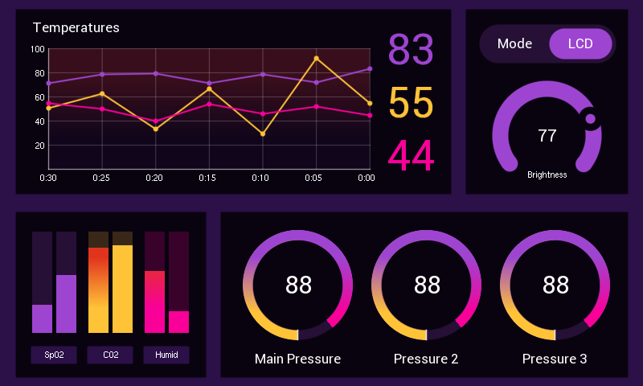

# EVE-MCU-Dev Data Visualiser Example

[Back](../README.md)

## Data Visualiser Example

The `datavisualiser` example demonstrates drawing a simple data visualiser application, utilising in-built EVE graphics primitives only to generate a variety of data indicator widgets. 

The data indicator widgets are defined in standalone functions which can be easily incorporated into other applications, and are constructed entirely without any external graphics assets. These widgets can be resized as required and include; line plot graphs, bar indicators, circular gauges, and pie (or doughnut) chart segments.

The example includes a 'settings menu' button in the top right corner, which includes two sub menus:

- The first sub menu can be used to select between running the example in 'demo' mode or in 'sensor' mode. The sensor mode functionality has intentionally not been implemented to allow users freedom in this regard. The demo mode utilises global variables to cycle readings on the indicator widgets.
 
- The second sub menu utilises a arc control widget to implement a slider for controlling the LCD display brightness. The tracker feature is used for touch inputs on this widget.

The following is an screenshot of the datavisulaiser screen:




## Platform Support

This example supports the following platforms:

| Port Name | Port Directory | Supported |
| --- | --- | --- |
|Raspberry Pi Pico | pico | Yes |
|Generic using libFT4222 | libft4222 | Yes |

## EVE API Support

Supported EVE APIs in this example:

| EVE API 1 | EVE API 2 | EVE API 3 | EVE API 4 | EVE API 5 |
| --- | --- | --- | --- | --- |
| Yes | Yes | Yes | Yes | Yes |


The screen items are scaled based on the defined screen resolution, as such there is no set maximum or minimum supported resolution. 

## Platform Files and Folders

### `main.c`

The application starts up in the file `main.c` which provides initial MCU configuration and then calls `eve_example.c` where the remainder of the application will be carried out. 

The `main.c` code is platform specific. It must provide any functions that rely on a platform's operating system, or built-in non-volatile storage mechanism. The required functions store and recall previous touch screen calibration settings:
- **platform_calib_init** initialise a platform's non-volatile storage system.
- **platform_calib_read** read a previous touch screen calibration or return a value indicating that there are no stored calibration setting.
- **platform_calib_write** write a touch screen calibration to the platform's non-volatile storage.


The example program in the common code is then called.

## Common Files and Folders

The example contains a common directory with several files which comprises all the demo functionality.

| File/Folder | Description |
| --- | --- |
| [README.md](README.md) | This file |
| [common/eve_example.c](common/eve_example.c) | Example source code file |
| [snippets/touch.c](../snippets/touch.c) | Calibration and touch detection routines |
| [snippets/controls/arcs.c](../snippets/controls/arcs.c) | Arc style control widget routines |
| [snippets/maths/trig_furman.c](../snippets/controls/arcs.c) | Trigonometric maths routines
| [docs](docs) | Documentation support files |

### `eve_example.c`

In the function `eve_example` the basic format is as follows:

```
void eve_example(void)
{
    EVE_Init();             // Initialise the display

    eve_calibrate();        // Calibrate the display

    eve_display();          // Run Application
}
```
The call to `EVE_Init()` is made which sets up the EVE environment on the platform. This will initialise the SPI communications to the EVE device and set-up the device ready to receive communication from the host.

Next, the function `eve_calibrate()` is then called which uses the calibration co-processor command to display the calibration screen and asks the user to tap the three dots (see `touch.c` below).

Once the precceeding steps are complete, the main loop is called which sits in a continuous loop within `eve_display()`. Each time round the loop, a screen is created using a co-processor list. 

### `touch.c`

This function is used to show the touchscreen calibration screen and prompt the user to touch the screen at the required positions to generate an accurate transformation matrix. This matrix is used to translate the raw touch input into precise points on the screen.

The platform specific functions in `main.c` are called from this routine to store and read touchscreen calibration settings so that the user only needs to perform the action once.

Another function of this file is to read a single touch tag from the screen.

```
    Read_tag = EVE_LIB_MemRead32(EVE_REG_TOUCH_TAG);
    if ((EVE_LIB_MemRead32(EVE_REG_TOUCH_RAW_XY) & 0xffff) != 0xffff)
    {
        key_detect = 1;
        *key = Read_tag;
    }
```

A TAG event is read from the EVE_REG_TOUCH_TAG register. This is verified by reading the EVE_REG_TOUCH_RAW_XY register. 
If that register indicates a valid touch then this is flagged to the calling program.
