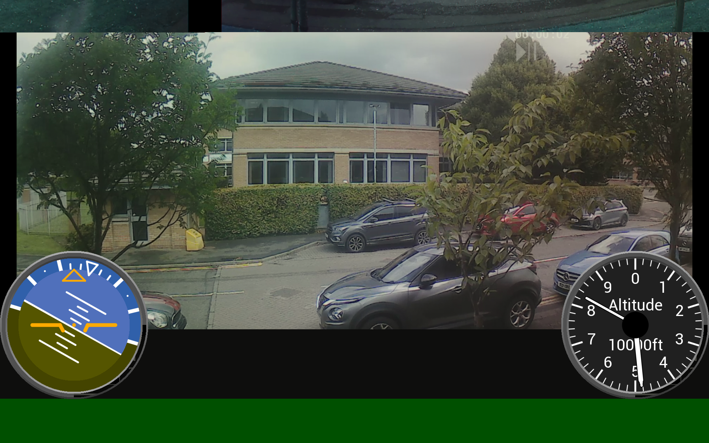

# EVE-MCU-Dev BT82x Video Example

[Back](../README.md)

## BT82x Video Example

The `dronefpv-bt82x` example demonstrates LVDS video. **This demo only works on the BT82x devices.**

Video is taken from the LVDS RX channel and rendered into RAM_G as a bitmap. The rendered bitmap is used on the screen a background on the display. An altimeter and attitude indicator are drawn from the snippets library ontop of the video background. See the [flightdeck](../flightdeck/README.md) example for information on the altimeter and attitude indicator.

A 1920 x 1200 or 1080 screen is recommended. An LVDS video input of 1920 x 1080 is expected.

This example supports the following platforms:

| Port Name | Port Directory | Supported |
| --- | --- | --- |
|Generic using libMPSSE | libft4222 | Yes |
|Generic using libFT4222 | libmpsse | Yes |

Supported EVE APIs in this example:

| EVE API 1 | EVE API 2 | EVE API 3 | EVE API 4 | EVE API 5 |
| --- | --- | --- | --- | --- |
| No | No | No | No | Yes |

The following is an screenshot of the simple example.



### `main.c`

The application starts up in the file `main.c` which provides initial MCU configuration and then calls `dronefpv.c` where the remainder of the application will be carried out. 

The `main.c` code is platform specific. It must provide any functions that rely on a platform's operating system, or built-in non-volatile storage mechanism. The required functions store and recall previous touch screen calibration settings:
- **platform_calib_init** initialise a platform's non-volatile storage system.
- **platform_calib_read** read a previous touch screen calibration or return a value indicating that there are no stored calibration setting.
- **platform_calib_write** write a touch screen calibration to the platform's non-volatile storage.

The example program in the common code is then called.

### `eve_example.c`

In the function `eve_example` the basic format is as follows:

```
void eve_example(void)
{
    uint32_t font_end;
    // Initialise the display
    EVE_Init();
    // Calibrate the display
    eve_calibrate();
    // Start example code
    eve_display();
 }
```
The call to `EVE_Init()` is made which sets up the EVE environment on the platform. This will initialise the SPI communications to the EVE device and set-up the device ready to receive communication from the host.

Next, the function `eve_calibrate()` is then called which uses the calibration co-processor command to display the calibration screen and asks the user to tap the three dots (see `eve_calibrate.c` below).

Once calibration is complete, the main loop is called which sits in a continuous loop within `eve_display()`. Each time round the loop, a screen is created using a co-processor list. 

### `eve_calibrate.c`

This function is used to show the touchscreen calibration screen and prompt the user to touch the screen at the required positions to generate an accurate transformation matrix. This matrix is used to translate the raw touch input into precise points on the screen.

The platform specific functions in `main.c` are called from this routine to store and read touchscreen calibration settings so that the user only needs to perform the action once.

## Files and Folders

The example contains a common directory with several files which comprises all the demo functionality.

| File/Folder | Description |
| --- | --- |
| [common/dronefpv.c](common/dronefpv.c) | Example source code file |
| [common/eve_calibrate.c](common/eve_calibrate.c) | Calibrations routines |
| [common/eve_helper.c](common/eve_helper.c) | General helper routines (touch detection) |
| [docs](docs) | Documentation support files |
