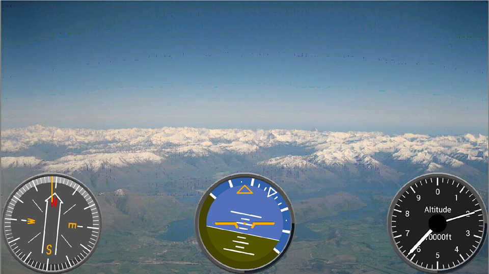

# EVE-MCU-Dev Flightdeck BT82x Video Example

[Back](../README.md)

## BT82x Video Example

The `flightdeck-bt82x` example demonstrates LVDS video. **This demo only works on the BT82x devices and works best with an LVDS video source.**

Video is taken from the LVDS RX channel and rendered into RAM_G as a bitmap. The rendered bitmap is used on the screen a background on the display. An altimeter and attitude indicator are drawn from the snippets library on top of the video background. If there is no LVDS input then a fixed image is used.

See the [flightdeck](../flightdeck/README.md) example for information on the altimeter and attitude indicator.

A WUXGA (1920x1200) or FullHD (1920x1080) screen is recommended. A FullHD LVDS video input of 1920x1080 is expected.

## Platform Support

This example supports the following platforms:

| Port Name | Port Directory | Supported |
| --- | --- | --- |
| [Generic using libFT4222](libft4222/README.md) | [libft4222](libft4222/) | Yes |
| [Generic using libMPSSE](libmpsse/README.md) | [libmpsse](libmpsse/) | Yes |

Platform specific build instructions and setup requirements are shown in the `README.md` file in the platform build directory.

## EVE API Support

Supported EVE APIs in this example:

| EVE API 1 | EVE API 2 | EVE API 3 | EVE API 4 | EVE API 5 |
| --- | --- | --- | --- | --- |
| No | No | No | No | Yes |

The following is an screenshot of the simple example.



## Platform Files and Folders

### `main.c`

The application starts up in the file `main.c` which provides initial MCU configuration and then calls `eve_example.c` where the remainder of the application will be carried out. 

The `main.c` code is platform specific. It must provide any functions that rely on a platform's operating system, or built-in non-volatile storage mechanism. The required functions store and recall previous touch screen calibration settings:
- **platform_calib_init** initialise a platform's non-volatile storage system.
- **platform_calib_read** read a previous touch screen calibration or return a value indicating that there are no stored calibration setting.
- **platform_calib_write** write a touch screen calibration to the platform's non-volatile storage.

The example program in the common code is then called.

### `eve_example.c`

In the function `eve_example` the basic format is as follows:

```
void eve_example(void)
{
    // Initialise the display
    DEBUG_PRINTF("Initialising display...\n");
    if (EVE_Init() != 0)
    {
        DEBUG_ERROR("ERROR: Exception in EVE_Init()...\n");
        while(1);
    }

    DEBUG_PRINTF("Loading patch...\n");
    eve_loadpatch();
 
    // Calibrate the display
    DEBUG_PRINTF("Calibrating display...\n");
    if (eve_calibrate() != 0)
    {
        DEBUG_ERROR("ERROR: Exception in eve_calibrate()  ...\n");
        while(1);
    }

    // Load backup image
    DEBUG_PRINTF("Loading image...\n");
    eve_load_image(lake_wanaka, lake_wanaka_size, 0, HND_BACKUP);

    // Start example code
    DEBUG_PRINTF("Starting demo:\n");
    eve_display();
}
```
The call to `EVE_Init()` is made which sets up the EVE environment on the platform. This will initialise the SPI communications to the EVE device and set-up the device ready to receive communication from the host.

Next, the function `eve_calibrate()` is then called which uses the calibration co-processor command to display the calibration screen and asks the user to tap the three dots (see `touch.c` below).

Once calibration is complete, the main loop is called which sits in a continuous loop within `eve_display()`. Each time round the loop, a screen is created using a co-processor list. 

### `touch.c`

This function is used to show the touchscreen calibration screen and prompt the user to touch the screen at the required positions to generate an accurate transformation matrix. This matrix is used to translate the raw touch input into precise points on the screen.

The platform specific functions in `main.c` are called from this routine to store and read touchscreen calibration settings so that the user only needs to perform the action once.

## Files and Folders

The example contains a common directory with several files which comprises all the demo functionality.

| File/Folder | Description |
| --- | --- |
| [common/eve_example.c](common/eve_example.c) | Example source code file |
| [snippets/touch.c](../snippets/touch.c) | Calibration and touch detection routines |
| [snippets/dials/sub_controls.h](../snippets/dials/sub_controls.h) | Header file for submarine control widgets |
| [snippets/dials/sub_depth.c](../snippets/dials/sub_depth.c) | Implementation file for submarine depth widget |
| [snippets/dials/compass_controls.h](../snippets/dials/compass_controls.h) | Header file for compass widgets |
| [snippets/dials/compass_bulkhead.c](../snippets/dials/compass_bulkhead.c) | Implementation file for bulkhead compass widget |
| [docs](docs) | Documentation support files |
