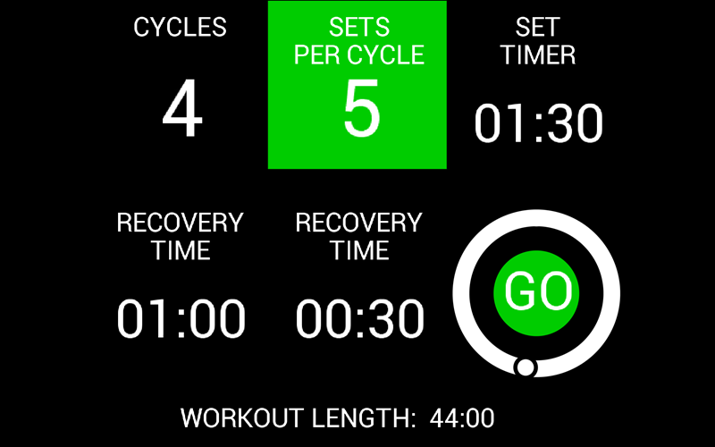
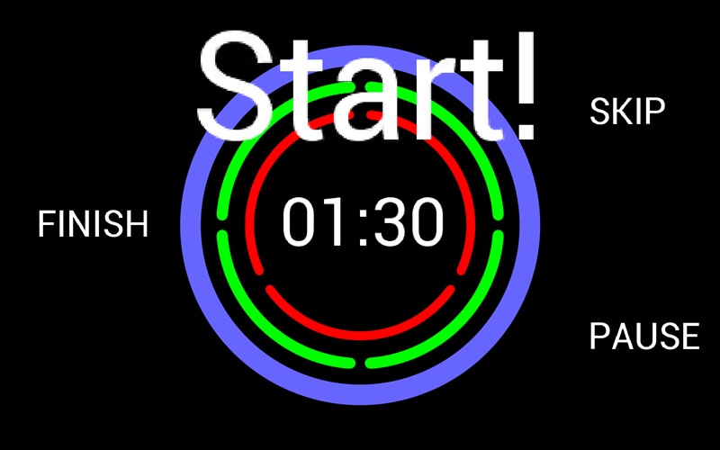
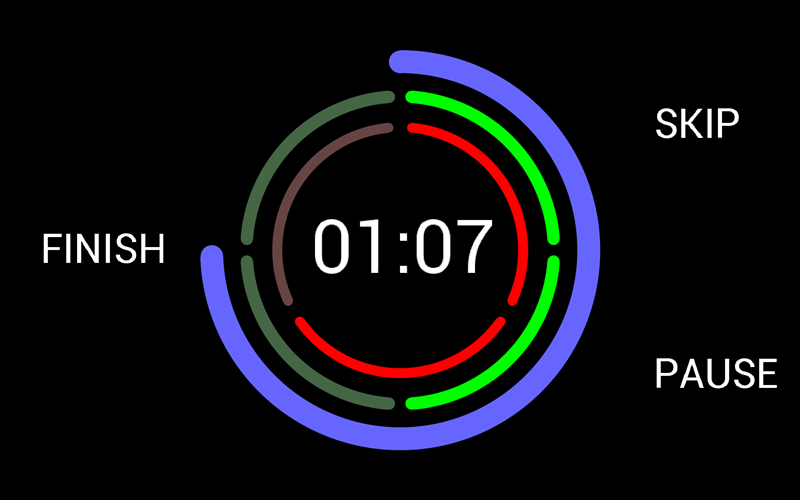

# EVE-MCU-Dev GymInterval Example

[Back](../README.md)

## GymInterval Example

The `gyminterval` example demonstrates drawing a countdown timer for interval training in a gym. 

An animated countdown timer is drawn using arcs, text scaling and simple animation. The tracker feature is used for setting up the example. 

There are two pages displayed during the example. The first is the setup screen showing the number and length of the intervals, the second is the countdown timer.

The interval timer allows a variable number of "sets" which are repeated a by the number of "cycles". Rest times between sets and cycles can be changed to suit the workout.

### Setup Screen

The number of sets and cycles, along with the length of each set and the reset times between each set and cycle is setup. To change one of the 5 parameters click on the setting to change then adjust the counter or time using the scroll-wheel surrounding the "GO" button.

The following is an screenshot of the gyminterval setup screen.



### Timer Screen

Once the timer has started then the countdown will be shown as a time in the centre of the timer and as a decreasing light blue arc. The sets are represented by the green arc segments and the cycles by the red arc settings.





## Platform Support

This example supports the following platforms:

| Port Name | Port Directory | Supported |
| --- | --- | --- |
|Raspberry Pi Pico | pico | Yes |
|Generic using libFT4222 | libft4222 | Yes |

## EVE API Support

Supported EVE APIs in this example:

| EVE API 1 | EVE API 2 | EVE API 3 | EVE API 4 | EVE API 5 |
| --- | --- | --- | --- | --- |
| Yes | Yes | Yes | Yes | Yes |

The minimum screen size supported is 1920x1080 pixels. The display will fit in larger displays.

## Platform Files and Folders

### `main.c`

The application starts up in the file `main.c` which provides initial MCU configuration and then calls `eve_example.c` where the remainder of the application will be carried out. 

The `main.c` code is platform specific. It must provide any functions that rely on a platform's operating system, or built-in non-volatile storage mechanism. The required functions store and recall previous touch screen calibration settings:
- **platform_calib_init** initialise a platform's non-volatile storage system.
- **platform_calib_read** read a previous touch screen calibration or return a value indicating that there are no stored calibration setting.
- **platform_calib_write** write a touch screen calibration to the platform's non-volatile storage.
- **platform_get_time** get the system time elapsed since start in milliseconds.

The example program in the common code is then called.

## Common Files and Folders

The example contains a common directory with several files which comprises all the demo functionality.

| File/Folder | Description |
| --- | --- |
| [README.md](README.md) | This file |
| [common/eve_example.c](common/eve_example.c) | Example source code file |
| [snippets/touch.c](../snippets/touch.c) | Calibration and touch detection routines |
| [docs](docs) | Documentation support files |

### `eve_example.c`

In the function `eve_example` the basic format is as follows:

```
void eve_example(const char *assets)
{
    EVE_Init();                 // Initialise the display

    eve_calibrate();          // Calibrate the display

    eve_display();              // Run Application
}
```
The call to `EVE_Init()` is made which sets up the EVE environment on the platform. This will initialise the SPI communications to the EVE device and set-up the device ready to receive communication from the host.

Next, the function `eve_calibrate()` is then called which uses the calibration co-processor command to display the calibration screen and asks the user to tap the three dots (see `touch.c` below).

Once the precceeding steps are complete, the main loop is called which sits in a continuous loop within `eve_display()`. Each time round the loop, a screen is created using a co-processor list. 

### `touch.c`

This function is used to show the touchscreen calibration screen and prompt the user to touch the screen at the required positions to generate an accurate transformation matrix. This matrix is used to translate the raw touch input into precise points on the screen.

The platform specific functions in `main.c` are called from this routine to store and read touchscreen calibration settings so that the user only needs to perform the action once.

Another function of this file is to read a single touch tag from the screen.

```
    Read_tag = EVE_LIB_MemRead32(EVE_REG_TOUCH_TAG);
    if ((EVE_LIB_MemRead32(EVE_REG_TOUCH_RAW_XY) & 0xffff) != 0xffff)
    {
        key_detect = 1;
        *key = Read_tag;
    }
```

A TAG event is read from the EVE_REG_TOUCH_TAG register. This is verified by reading the EVE_REG_TOUCH_RAW_XY register. 
If that register indicates a valid touch then this is flagged to the calling program.
