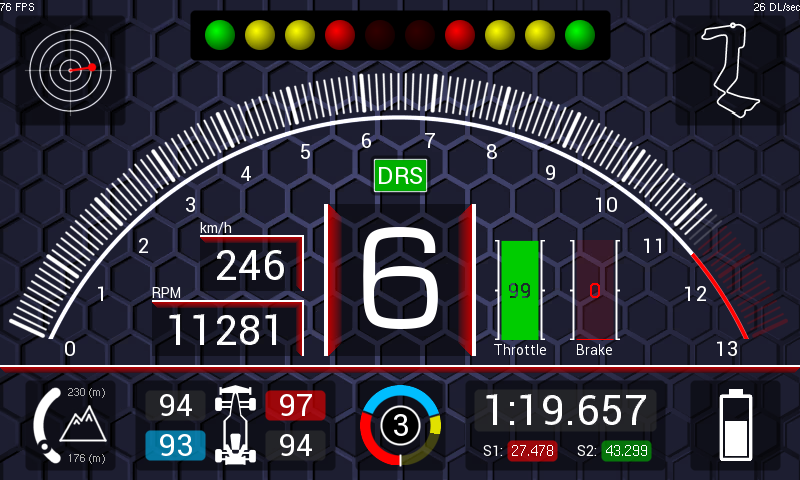

# EVE-MCU-Dev Race Car Dashboard Example

[Back](../README.md)

## Race Car Dashboard Example

The `racecar` example demonstrates drawing a multi-function dashboard for a racing car. **This demo only works on the BT82x and BT81x devices.**

A racecar dashboard is drawn using blending, scissoring, scaling, arcs and custom fonts. The `racecar` code uses the `furman` snippet from the [snippets](../snippets) directory to calculate angles using furman trigonometry. Furman angles are an implementation of angles using only integer values to enable this demo to run on hardware which does not support floating point values. Refer to the BridgeTek Programming Guides for the EVE device for a full explanation of this method.

The example is intended to show an imagined dashboard for a racecar. In real life external inputs would provide the data for the vehicle speed, engine RPM, acceleration, braking, track position, battery charge status and gear selection. This data is precomputed and stored in arrays in the program.

## Screenshot

The following is an screenshot of the racecar example.



## Assets

The program contains image assets, font assets and for BT82x, an extension patch asset. These assets can be stored in different locations that suit the platform that the example code is being run on. The options are to store them in the EVE Flash, in the example program code or as files on the host system. The later option is not suitable for embedded systems without a file system. It is recommended that the assets are stored in EVE Flash as this is the fastest method of loading them into RAM_G when the example is started.

The asset storage method is set in the file `eve_example.h` file in the `ASSETS` macro. Change this macro in the file to choose the method. The macro can be set to one of 4 different values:

### `USE_FLASH` 

Assets are stored in the EVE device Flash. Different Flash images for BT815/6, BT817/8 and BT82x are required. Images assets are stored in ASTC compressed format. The Flash must be preprogrammed before using the example code. There are multiple versions of the flash image (both used in `USE_FLASH` and `USE_FLASHIMAGE`) since the ASTC compressed images differ between BT82x and BT81x. The BT81x versions do not require the extension patch asset for BT82x either.

#### Setup

The addresses of the various assets in the flash image must be modified if the flash image is recreated or modified. To do this a python script called `flashmap.py` is provided in the `assets` directory. This will modify code associated with markers in the source code files to match the flash image. There is a `.bin` file and a `.map` file created by EVE Asset Builder (EAB) when a flash image is created. The script takes the data for the assets from the `.map` file and modifies one of the `common/eve_assetload_flash_eve*.c` files. 

For example, to update the flash image pointers for a BT817/8 (EVE4) the script on Windows from the `assets` directory is run as follows:
```
python flashmap.py eve4\flash-817-default.map ..\common\eve_assetload_flash_eve4.c
```
The map file for the flash image is `assets\eve4\flash-817-default.map` and the C file to update is `common\eve_assetload_flash_eve4.c`. Relative paths from the `assets` directory are shown.

The script confirms the update with the output:
```
Setting map offsets and sizes from "eve4\flash-817-default.map" to "..\common\eve_assetload_flash_eve4.c"
```
The example program will expect assets loaded from the EVE device flash to be at the addresses in the `.map` file. The `.bin` file must be programmed into the EVE device flash.

#### Running the Example

There are no runtime requirements for the example application.

### `USE_FLASHIMAGE` 

Assets are loaded from an image of the Flash on the host PC file system. Different Flash images for BT815/6, BT817/8 and BT82x are required. This method is not suitable for embedded applications where there is no file system. This method uses the same flash image file can be programmed into the EVE device Flash.

#### Setup

Setup of the flash file mapping addresses in the program using `flashmap.py` is identical to the `USE_FLASH` method. The `.bin` file needs to be present and accessible on the host PC system.

#### Running the Example

The example application must be passed a command line argument telling it where the flash image file `.bin` file is located. It will load assets from there at runtime as if they were stored in the EVE device flash. 

### `USE_C_ARRAYS` 

C arrays containing PNG compressed images or raw data for RAM_G are compiled into the example program code. The C arrays and are always compiled in the example. The data will be discarded by the linker if the data is not used in the final application. This method does not require use of the EVE device flash or the host PC file system at the expense of larger binary code for the example. With the `USE_C_ARRAYS` method each asset has PNG images and raw data encodeded into a C source file with the data encoded into an array. The arrays and a counterpart constant `uint32_t` containing the size of the array are included as an `extern` in the `eve_assetload_array.c` file. This allows them to be compiled into the example. 

#### Setup

There is no setup required for this method.

#### Running the Example

There are no runtime requirements for the example application. All data is included in the executable for the example application. 

### `USE_FILES` 

Files are read from the file system of the host PC which contain PNG images or raw data for RAM_G. The image data are stored in files and the example uses the EVE co-processor to decode PNG files into uncompressed bitmaps. This method is not suitable for embedded applications where there is no file system.

#### Setup

There is no setup required for this method.

#### Running the Example

The example application must be passed a command line argument telling it where the source files are located. It will load files from there at runtime and write them into the RAM_G. 

## Platform Support

This example supports the following platforms:

| Port Name | Port Directory | Supported |
| --- | --- | --- |
|Raspberry Pi Pico | pico | Yes |
|Generic using libFT4222 | libmpsse | Yes |

## EVE API Support

Supported EVE APIs in this example:

| EVE API 1 | EVE API 2 | EVE API 3 | EVE API 4 | EVE API 5 |
| --- | --- | --- | --- | --- |
| No | No | Yes | Yes | Yes |

The minimum screen size supported is 800x480 pixels. The display will scale for larger displays.

## Platform Files and Folders

### `main.c`

The application starts up in the file `main.c` which provides initial MCU configuration and then calls `eve_example.c` where the remainder of the application will be carried out. 

The `main.c` code is platform specific. It must provide any functions that rely on a platform's operating system, or built-in non-volatile storage mechanism. The required functions store and recall previous touch screen calibration settings:
- **platform_calib_init** initialise a platform's non-volatile storage system.
- **platform_calib_read** read a previous touch screen calibration or return a value indicating that there are no stored calibration setting.
- **platform_calib_write** write a touch screen calibration to the platform's non-volatile storage.
- **platform_get_time** get the system time elapsed since start in milliseconds.

The example program in the common code is then called.

## Common Files and Folders

The example contains a common directory with several files which comprises all the demo functionality.

| File/Folder | Description |
| --- | --- |
| [README.md](README.md) | This file |
| [common/eve_example.c](common/eve_example.c) | Example source code file |
| [common/eve_calibrate.c](common/eve_calibrate.c) | Calibrations routines |
| [common/eve_helper.c](common/eve_helper.c) | General helper routines (touch detection) |
| [common/eve_assetload_array.c](common/eve_assetload_array.c) | Load assets from C arrays - used in `USE_C_ARRAYS` |
| [common/eve_assetload_file.c](common/eve_assetload_file.c) | Load assets from files - used in `USE_FILES` |
| [common/eve_assetload_flash.c](common/eve_assetload_flash.c) | Load assets from flash or flash image file - used in `USE_FLASH` and `USE_FLASHIMAGE` |
| [common/eve_assetload_flash_eve5.c](common/eve_assetload_flash_eve5.c) | Flash mapping addresses for BT82x |
| [common/eve_assetload_flash_eve4.c](common/eve_assetload_flash_eve4.c) | Flash mapping addresses for BT817/8 |
| [common/eve_assetload_flash_eve3.c](common/eve_assetload_flash_eve3.c) | Flash mapping addresses for BT815/6 |
| [docs](docs) | Documentation support files |
| [assets](assets) | Directory for storage of assets |
| [assets/eve5](assets/eve5) | Directory for storage of encoded ASTC compressed images for BT82x |
| [assets/eve4](assets/eve4) | Directory for storage of encoded ASTC compressed images for BT817/8 |
| [assets/eve3](assets/eve3) | Directory for storage of encoded ASTC compressed images for BT815/6 |
| [assets/c_array_assets](assets/c_array_assets) | Directory for arrays of assets |
| [assets/source](assets/source) | Directory for storage of source PNG and raw files |

### `eve_example.c`

In the function `eve_example` the basic format is as follows:

```
void eve_example(const char *assets)
{
    eve_asset_properties(assets); // Configure asset properties for custom assets used in application

    EVE_Init();                 // Initialise the display

    eve_calibrate();          // Calibrate the display

    eve_display_load_assets();   // Load assets into RAM_G

    eve_display();              // Run Application
}
```
The call to `EVE_Init()` is made which sets up the EVE environment on the platform. This will initialise the SPI communications to the EVE device and set-up the device ready to receive communication from the host.

Next, the function `eve_calibrate()` is then called which uses the calibration co-processor command to display the calibration screen and asks the user to tap the three dots (see `eve_calibrate.c` below).

Following this the `eve_asset_properties()` function is called to configure specific properties for each asset (size, height, witdth, format, etc), which are then used in the `eve_display_load_assets()` funciton to load the assets into RAM_G fo use in the applciation.

Once the precceeding steps are complete, the main loop is called which sits in a continuous loop within `eve_display()`. Each time round the loop, a screen is created using a co-processor list. 

### `eve_calibrate.c`

This function is used to show the touchscreen calibration screen and prompt the user to touch the screen at the required positions to generate an accurate transformation matrix. This matrix is used to translate the raw touch input into precise points on the screen.

The platform specific functions in `main.c` are called from this routine to store and read touchscreen calibration settings so that the user only needs to perform the action once.

### `eve_helper.c`

In this file are a helper routine to detect and report touch events on the screen and functions to find the maximum width and height of the built-in ROM fonts.

### `eve_assetload_array.c`

When the `USE_C_ARRAYS` method for loading assets is used this file will be called to access the array pointers and sizes within the asset files included in the  `assets/c_array_assets` folder. These asset files are C files generated by the "BIN2C" function in EAB from image and raw files. This file and the asset files are included in all builds but will be excluded from the final executable by the linker. The names of a constant values in the asset files are loaded by "extern" linkage in this file and must match those present in the asset files.

### `eve_assetload_file.c`

This code facilitates loading asset files directly from the file system. When `USE_FILES` is set for the method then the file will use standard C file methods (stdio) to load data from image files and raw files and write the results to RAM_G. The path to the asset files location is passed as an argument to the example. The name of the asset files to load is set in the code in this file.

### `eve_assetload_flash.c`

This file implements both `USE_FLASH` and `USE_FLASHIMAGE` methods. The code can load assets from the flash or from a flash image file. The mapping of the flash may be different for BT815/6, BT817/8 and BT820 so seperate files contain a mapping function. These are `eve_assetload_flash_eve5.c` for BT820, `eve_assetload_flash_eve4.c` for BT817/8 and `eve_assetload_flash_eve3.c` for BT815/6.

### `eve_assetload_flash_eve5.c`

Flash mapping addresses for BT82x.

### `eve_assetload_flash_eve4.c`

Flash mapping addresses for BT817/8.

### `eve_assetload_flash_eve3.c`

Flash mapping addresses for BT815/6.
