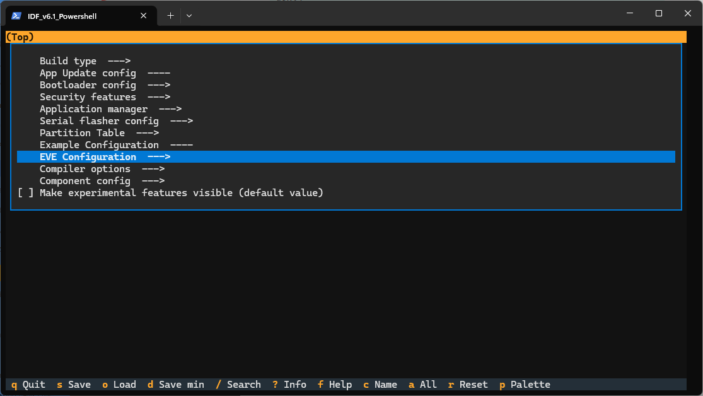
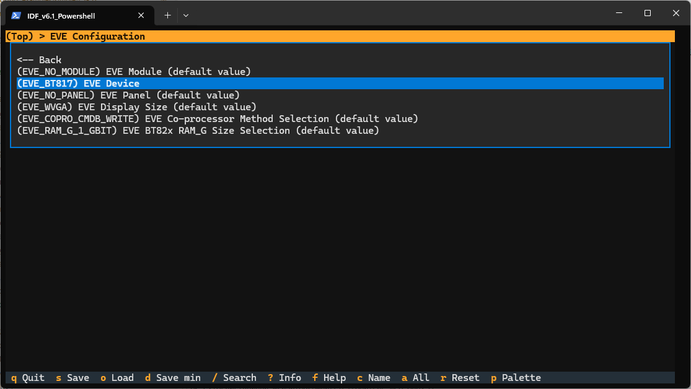

# EVE-MCU-Dev Simple ESP32 Example

[Back](../README.md)

## Using the VSCode Extension for ESP32

The build environment uses the ESP-IDF VSCode Extension. This can be setup following instructions in the [ESP-IDF Extension for VSCode](https://docs.espressif.com/projects/vscode-esp-idf-extension/) document from the Espressif website.

### Compiling the Simple ESP32 VSCode Example

The instructions for compiling and programming the pico can be followed from the ESP-IDF Extension for VSCode documentation. The needs the target device to be "esp32".

## Compiling using ESP-IDF

The ESP-IDF command line interface can be used to compile the example. The full instructions are in the [ESP-IDF Getting Started Guide](https://docs.espressif.com/projects/esp-idf/en/stable/esp32/get-started/index.html) document from the Espressif website.

### Compiling the Simple ESP32 Command Line Example

Firstly the environment must be setup with the correct target. Open the "IDF Powershell" command prompt and change to the directory of this file. The following command will perform the initialisation steps:

```console
idf.py set-target esp32
```

The build options can be updated or set using the IDF menuconfig tool:

```console
idf.py menuconfig
```

The build options are in the main menu under "".



The options which can be changed are shown below (as the default settings):



Next, to build the image for the ESP32 the following command is used.

```console
idf.py build
```
