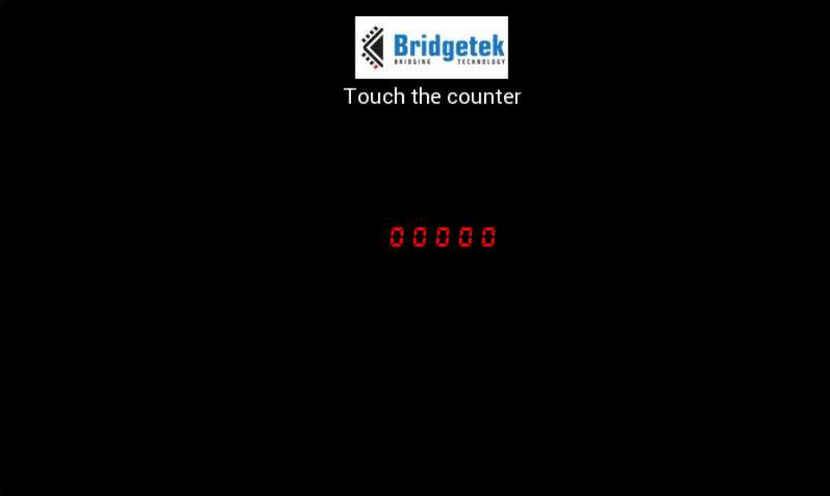

# EVE-MCU-Dev Simple Example

[Back](../README.md)

## Simple Example

The "simple"" example demonstrates detection of a touch event on a display item, and loading both a custom font and a bitmap into RAM_G. 

The custom font provides a character set that contains the numbers 0 to 9 resembling a 7 segment LED. The font is called DS-FONT. A touch event detected on the numbers will increase the number displayed. A BridgeTek logo is loaded as a bitmap and displayed above the counter.



### `main.c`

The application starts up in the file `main.c` which provides initial MCU configuration and then calls `eve_example.c` where the remainder of the application will be carried out. 

The `main.c` code is platform specific. It must provide any functions that rely on a platform's operating system, or built-in non-volatile storage mechanism. The required functions store and recall previous touch screen calibration settings:
- **platform_calib_init** initialise a platform's non-volatile storage system.
- **platform_calib_read** read a previous touch screen calibration or return a value indicating that there are no stored calibration setting.
- **platform_calib_write** write a touch screen calibration to the platform's non-volatile storage.

The example program in the common code is then called.

### `exe_example.c`

In the function `eve_example` the basic format is as follows:

```
void eve_example(void)
{
    uint32_t font_end;
    // Initialise the display
    EVE_Init();
    // Calibrate the display
    eve_calibrate();
    // Load fonts and images
    font_end = eve_init_fonts();
    eve_load_images(font_end);
    // Start example code
    eve_display();
 }
```
The call to `EVE_Init()` is made which sets up the EVE environment on the platform. This will initialise the SPI communications to the EVE device and set-up the device ready to receive communication from the host.

Next, the function `eve_calibrate()` is then called which uses the calibration co-processor command to display the calibration screen and asks the user to tap the three dots (see `eve_calibrate.c` below).

Once calibration is complete, the font for the counter and the image for the logo are both loaded  (see `eve_fonts.c` and `eve_images.c` below).
Finally, the main program sits in a continuous loop within `eve_display()`. Each time round the loop, a screen is created using a co-processor list. 

### `eve.calibrate.c`

This function is used to show the touchscreen calibration screen and prompt the user to touch the screen at the required positions to generate an accurate transformation matrix. This matrix is used to translate the raw touch input into precise points on the screen.

The platform specific functions in `main.c` are called from this routine to store and read touchscreen calibration settings so that the user only needs to perform the action once.

### `eve_fonts.c`

This file contains the data array of a font which was produced by the Font Converter tool which is part of EVE Asset Builder. The code in this file will send the commands to the coprocessor to load the font into RAM_G and set-up the font for use.

### `eve_images.c`

The BridgeTek logo is stored in an array in this file. It is loaded into RAM_G and the commands to setup the image are loaded into a display list. The array in this file contains as a JPEG image of the logo. 

Any valid image image format can be used to 
bitmap generated by the Images Tool in the EVE Asset Builder. In 

## Files and Folders

The example contains a common directory with several files which comprises all the demo functionality.

| File/Folder | Description |
| --- | --- |
| [common/exe_example.c](common/exe_example.c) | Example source code file |
| [docs](docs) | Documentation support files |
