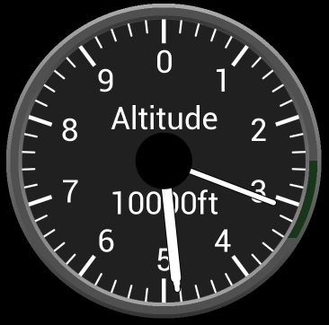
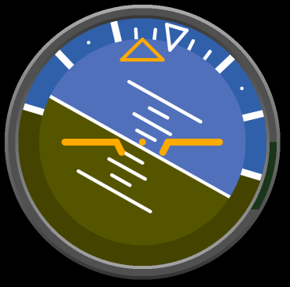

# EVE-MCU-Dev Example Code Snippets

[Back](../README.md)

The `snippets` directory contains code that is used in the examples for the Python BT82x Development moduleEVE-MCU-Dev code. The following code is available in that directory:

## Contents

- [Widgets](#widgets)
  - [Seven Segment LED Widget](#Seven-Segment-LED-Widget)
  - [Flight Control Widgets](#flight-control-widgets)
- [Utilities](#Utilities)
  - [Trigonometry using Furmans](#Trigonometry-using-Furmans)

## Widgets

There are several widgets in the directory:

| File/Folder | Description |
| --- | --- |
| [sevenseg](#Seven-Segment-LED-Widget) | Seven segement LED code |
| [flightcontrols](#flight-control-widgets) | Flight control widgets code |

### Seven Segment LED Widget

This widget will simulate a 7 segment LED display. Active LEDs will be drawn in the foreground colour and inactive ones as the background. The digit to be displayed is sent in the range 0-16. For values 0 to 9 the decimal number is shown, for 10 to 15 the letters 'a' to 'f' are shown for hexadecimal displays, and for 16 a dash '-' is displayed.


_Calling format:_

   `sevensegment(x, y, size, digit, fgcolour, bgcolour);`

_Parameters:_

-   uint32_t **x**, uint32_t **y**: Location of top left of the seven segment LED widget (in pixels).
-   uint16_t **size**: Size of a segment of the seven segment LED widget (in pixels).
-   uint8_t **digit**: Number to display on seven segment LED. 
-   uint32_t **fgcolour**: RGB colour for active segment.
-   uint32_t **bgcolour**: RGB colour for inactive segment.

_Example:_

```
#include "snippets/sevenseg/sevenseg.h"

void drawLED(void){
    // Draw a seven segment LED with bright red ON segments and dark red OFF segments
    sevensegment(200, 100, 90, int(number%10), 0xff0000, 0x200000);
}
```

### Flight Control Widgets

These widgets will simulate an aeroplane altitude indicator and attitude indicator. The file has both indicators included.

Both widgets require the [Trigonometry using Furmans](#Trigonometry-using-Furmans) utility to be compiled with the application.

#### Flight Control Altitude Indicator

This is a simulation of an altitude indicator. It reads from zero to 10000 feet. It has 2 hands measuring thousands and hundreds of feet.

The altitude is specified in the call. It is clamped to 0 to 10000 feet as a real-life altitude indicator would.



_Calling format:_

   `altwidget(x, y, radius, alt)`

_Parameters:_

-   uint32_t **x**, uint32_t **y**: Location of centre of the indicator (in pixels).
-   int16_t **radius**: Radius of the widget dial (in pixels).
-   int **alt**: Altitude to render.

_Example:_

```
altwidget(eve, 300, 300, 200, 4382);
```

#### Flight Control Attitude Indicator

This is a simulation of an attitude indicator. It displays pitch, roll and climb.

The pitch, roll and climb are specified in the call and are in furmans. The range of pitch and climb must be between 0xc000 furmans (-90 degrees) and 0x4000 (+90 degrees). Roll may be between 0x8000 (-180 degrees) and 0x7fff (+180 degrees). 



_Calling format:_

   `attwidget(x, y, radius, pitch, climb, roll)`

_Parameters:_

-   uint32_t **x**, uint32_t **y**: Location of centre of the indicator (in pixels).
-   int16_t **radius**: Radius of the widget dial (in pixels).
-   int **pitch**: Pitch angle in furmans.
-   int **climb**: Climb angle in furmans.
-   int **roll**: Roll angle in furmans.

_Example:_

```
altwidget(eve, 300, 300, 200, 0x1000, 0xe000, 0xd000);
```

## Utilities

### Trigonometry using Furmans

A utility is provided to perform trigonometery using angles in furmans rather than degrees or radians. 

The return value is an `int16_t` format ranging from -0x8000 to +0x7fff.

_Calling format:_

   `sin_furman(angle);`
   `cos_furman(angle);`

_Parameters:_

-   int16_t **angle**: Angle in furmans

_Example:_

```
uint16_t scale = sin_furman(0xd000);
```

#### Trigonometry Furman Macros

Macros are provided to turn degrees into furmans and vice versa. Care needs to be taken as the accuracy in degrees is integer which is much less than the accuracy of furmans.

_Calling format:_

   `FURMAN2DEG(furman);`
   `DEG2FURMAN(degrees);`

_Parameters:_

-   int16_t **furman**: Angle in furmans
-   int **degrees**: Angle in degrees

_Example:_

```
int16_t angle = DEG2FURMAN(0x4000); // angle = 90
```

#### Trigonometry Circle Macros

Macros are provided to turn a radius and degrees/furmans into components for X and Y vector. Note that the return value is signed.

_Calling format:_

   `CIRC_X(radius, furman);`
   `CIRC_X_DEG(radius, degrees);`
   `CIRC_Y(radius, furman);`
   `CIRC_Y_DEG(radius, degrees);`

_Parameters:_

-   int **radius**: Radius of vector
-   int16_t **furman**: Angle in furmans
-   int **degrees**: Angle in degrees

_Example:_

```
// angle = 45
int16_t vx = CIRC_X(0x2000); 
int16_t vy = CIRC_Y(0x2000); 
```
