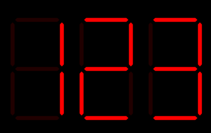
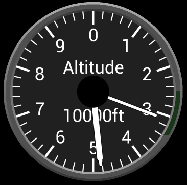
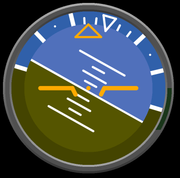
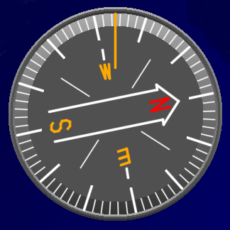
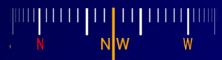
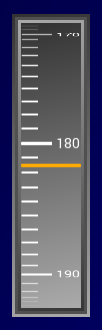

# EVE-MCU-Dev Example Code Snippets

[Back](../README.md)

The `snippets` directory contains code that is used in the examples for the EVE-MCU-Dev code. The code can be included in example projects to extend functionality.

## Contents

- [Utilities](#Utilities)
  - [Calibration Utility](#calibration-utility)
  - [Touch Detection Utility](#touch-detection-utility)
  - [Tag Reading Utility](#tag-reading-utility)
- [Controls](#Controls)
  - [Arcs](#arcs)
  - [Fonts](#fonts)
  - [Sound](#sound)
- [Widgets](#widgets)
  - [Seven Segment LED Widget](#seven-segment-led-widget)
  - [Dialogs Widget](#dialogs-widget)
- [Dials](#dials)
  - [Flight Control Widgets](#flight-control-widgets)
  - [Compass Widgets](#compass-widgets)
  - [Submarine Control Widgets](#submarine-control-widgets)
- [Maths](#maths)
  - [Trigonometry using Furmans](#trigonometry-using-furmans)

## Utilities

### Calibration Utility

This utility can be used to calibrate the touch screen automatically.

If a supported panel is setup in [EVE_config.h](../../include/EVE_config.h) then a standard pre-configured touchscreen matrix is used. Currently DP-1012-01A and DP-1561-01A panels are supported. 

A callback to platform functions are required to store the configuration matrix. These need to store the calibration values using a non-volatile method. On PCs this can be in a regular file, on embedded systems this cabn be flash, NVRAM or any other appropriate methods. The structure `struct touchscreen_calibration` contains the values and is seven 32-bit values.

**NOTE:** Capacitive touch screens can not detect a touch that is present at startup. Therefore for capacitive panels no touch will be detected when a program starts until a new touch even occurs. Resistive panels can detect touches that are present at startup.

_Header File:_

   `#include "snippets/touch.h"`

_Source File:_

   `snippets/touch.c`

_Calling format:_

   `int eve_calibrate(void)`

_Parameters:_

-   None.

_Returns:_

-   int - zero if the calibration has been successful or non-zero if it fails. 

_Example:_

```
   eve_calibrate();
```

### Touch Detection Utility

This utility can be used to detect any touch on the screen. It does not return the touch TAG.

_Header File:_

   `#include "snippets/touch.h"`

_Source File:_

   `snippets/touch.c`

_Calling format:_

   `int eve_key_detect(void)`

_Parameters:_

-   None.

_Returns:_

-   int - zero if the screen is not pressed, non-zero if there is any touch detected. 

_Example:_

```
   eve_key_detect();
```

### Tag Reading Utility

This utility can be used to detect any touch on the screen and return the tag associated with the touch point.

_Header File:_

   `#include "snippets/touch.h"`

_Source File:_

   `snippets/touch.c`

_Calling format:_

   `int eve_read_tag(uint8_t *tag)`

_Parameters:_

-   **tag**: Tag value of currently pressed point on screen.

_Returns:_

-   int - zero if the screen is not pressed, non-zero if there is any touch detected. 

_Example:_

```
   uint8_t tag_val = 0;
   if (eve_read_tag(&tag_val))
   {
      // Screen is pressed, action the tag stored in tag_val
   }
```
## Controls

In this snippets folder you will find code that can be used to help with low level functions on the EVE devices. 

| Snippet | Description |
| --- | --- |
| [arcs](#Arcs) | Arcs control code |
| [fonts](#Fonts) | Fonts helper code |
| [sounds](#Sounds) | Sound Synthesiser helper code |

### Arcs

The arcs snippet will draw a smooth arc using blending and stencilling. An optional gauge method allows the positioning of a marker to indicate where a marker is placed on the arc. This can be used for user interface purposes.

_Header File:_

   `#include "snippets/controls/arcs.h"`

_Source File:_

   `snippets/controls/arcs.c`

#### arc_simple

Draw a simple arc, specifying the width of the arc and the start and end positions.

_Calling format:_

   `void arc_simple(int16_t x, int16_t y, uint16_t r0, uint16_t r1, uint16_t a0, uint16_t a1);`

_Parameters:_

-    **x**, **y**: Location of centre of the arc (in pixels).
-    **r0**: Inner radius of the arc (in pixels).
-    **r1**: Outer radius of the arc (in pixels).
-    **a0**: Angle clockwise from the bottom of the circle for the start of the arc (in furmans).
-    **a1**: Angle clockwise from the bottom of the circle for the end of the arc (in furmans).

#### arc_simple_gauge

Draw a simple arc with a gauge marker, specifying the width of the arc and the start and end positions.

_Calling format:_

   `void arc_simple_gauge(int16_t x, int16_t y, uint16_t r0, uint16_t r1, uint16_t a0, uint16_t a1, uint16_t val);`

_Parameters:_

-    **x**, int16_t **y**: Location of centre of the arc (in pixels).
-    **r0**: Inner radius of the arc (in pixels).
-    **r1**: Outer radius of the arc (in pixels).
-    **a0**: Angle clockwise from the bottom of the circle for the start of the arc (in furmans).
-    **a1**: Angle clockwise from the bottom of the circle for the end of the arc (in furmans).
-    **val**: Angle of gauge marker clockwise from the bottom of the circle (in furmans).

### Fonts

The fonts snippet can provide more information on built-in and custom fonts allowing for font sizes and spacing to be used in calculations. 

Information about a font is cached in a structure passed by the calling program. This can then be used to find the required information about a font.

_Header File:_

   `#include "snippets/controls/fonts.h"`

_Source File:_

   `snippets/controls/fonts.c`

#### font_getmax

Get the highest font handle available on the EVE device. This will differ over each generation of EVE device.

_Calling format:_

   `uint8_t font_getmax(void);`

_Parameters - messagebox():_

-  N/A

_Returns:_

-   uint8_t - The maximum number of fonts supported by the EVE device.

_Examples:_

```
#include "snippets/controls/fonts.h"

uint8_t maxfont = font_getmax();
```

#### font_getromptr

Get a pointer, as an EVE memory address, to a font which resides in ROM. This must be one of the built-in fonts in the EVE device. 

_Calling format:_

   `uint32_t font_getromptr(uint8_t fontnumber);`

_Parameters - messagebox():_

-  **fontnumber**: The handle of the built-in font to find the memory address of.

_Returns:_

-   uint32_t - The EVE memory address of the built-in font.

_Examples:_

```
#include "snippets/controls/fonts.h"

uint32_t fontptr = font_getromptr(16);
```

#### font_getfontinforom

Initialise a cache structure with information about a built-in ROM font. The structure is used in subsequent calls to the font functions.

_Calling format:_

   `void font_getfontinforom(struct eve_font_cache *cache, uint8_t fontnumber);`

_Parameters - messagebox():_

-  **cache**: Structure fill with cached information about the font. This is used when calling further functions in this file to find the font information.
-  **fontnumber**: The handle of the built-in font from which to initialise the cache structure.

_Examples:_

```
#include "snippets/controls/fonts.h"
#define CLOCK_FONT 21

struct eve_font_cache clockfont;
font_getfontinforom(&clockfont, CLOCK_FONT);
```

#### font_getfontinforom

Initialise a cache structure with information about a built-in ROM font. The structure is used in subsequent calls to the font functions.

_Calling format:_

   `void font_getfontinfocustom(struct eve_font_cache *cache, uint8_t fontnumber, uint32_t fontptr, uint8_t first_character);`

_Parameters - messagebox():_

-  **cache**: Structure fill with cached information about the font. This is used when calling further functions in this file to find the font information.
-  **fontnumber**: The handle of the custom font from which to initialise the cache structure.
-  **fontptr**: Pointer to the custom font in RAM_G.
-  **first\_character**: First character defined in the font. See CMD_SETFONT.

_Examples:_

```
#include "snippets/controls/fonts.h"
#define DIGITAL_FONT 12

struct eve_font_cache clockfont;
font_getfontinfocustom(&clockfont, DIGITAL_FONT, 0x1000, 32);
```

#### font_getheight/font_getwidth

Get the width or height of the maximim extent of a character in the cached font.

_Calling format:_

   `uint16_t font_getheight(struct eve_font_cache *cache);`
   `uint16_t font_getwidth(struct eve_font_cache *cache);`

_Parameters - messagebox():_

-  **cache**: The cache structure which has been initialised with the font information.

_Returns:_

-   uint16_t - The width of height of the largest character in the font.

_Examples:_

```
#include "snippets/controls/fonts.h"
#define DIGITAL_FONT 12

struct eve_font_cache clockfont;
font_getfontinfocustom(&clockfont, DIGITAL_FONT, 0x1000, 32);

uint16_t fontw = font_getwidth(&clockfont);
```

#### font_getcharwidth

Get the visible width of a single character in the cached font. This can be used for proportional spacing of letters on the display.

_Calling format:_

   `uint16_t font_getcharwidth(struct eve_font_cache *cache, uint8_t ch);`

_Parameters - messagebox():_

-  **cache**: The cache structure which has been initialised with the font information.
-  **ch**: The character to find the proportional spaced width of.

_Returns:_

-   uint16_t - The width of the character.

_Examples:_

```
#include "snippets/controls/fonts.h"
#define DIGITAL_FONT 12

struct eve_font_cache clockfont;
font_getfontinfocustom(&clockfont, DIGITAL_FONT, 0x1000, 32);

uint16_t fontw_w = font_getcharwidth(&clockfont, 'w');
```

### Sound

The sounds snippet can play the built-in sounds from the audio subsystem.

_Header File:_

   `#include "snippets/controls/sound.h"`

_Source File:_

   `snippets/controls/sound.c`

#### sound_enable

Enable sound generation from the audio synthesizer on the EVE device.

_Calling format:_

   `void sound_enable(void);`

_Parameters:_

-  N/A

_Examples:_

```
#include "snippets/controls/sound.h"

sound_enable();
sound_click();
```

#### sound_is_playing

Dtermine whether the EVE audio synthesizer is playing a sound.

_Calling format:_

   `int sound_is_playing();`

_Parameters:_

-  N/A

_Returns:_

-   int - Non-zero if a sound is currently being played.

_Examples:_

```
#include "snippets/controls/sound.h"

sound_enable();
sound_click();
while (sound_is_playing()) {};
sound_clack();
```

#### sound_mute

Mute sound generation of the audio synthesizer on the EVE device.

_Calling format:_

   `void sound_mute(void);`

_Parameters:_

-  N/A

_Examples:_

```
#include "snippets/controls/sound.h"

sound_enable();
sound_click();
while (sound_is_playing()) {};
sound_mute();
```

#### sound_play

Play a note with the audio synthesizer on the EVE device.

_Calling format:_

   `void sound_play(uint8_t sound, uint8_t note);`

_Parameters:_

-  **sound**: The synthesizer voice to use for the note.
-  **note**: A note to play when the synthesizer voice allows. 

_Examples:_

```
#include "snippets/controls/sound.h"

sound_enable();
sound_play(SOUND_ORGAN, NOTE_C3);
Sleep(1);
sound_play(SOUND_SILENCE, NOTE_C3);
sound_mute();
```

#### sound_click/sound_clack

Play a click or a clack with the audio synthesizer on the EVE device.

_Calling format:_

   `void sound_click(void);`
   `void sound_clack(void);`

_Parameters:_

-  N/A

#### sound_chimes/sound_bell/sound_pip

Play a note with the audio synthesizer on the EVE device.

_Calling format:_

   `void sound_chimes(uint8_t note);`
   `void sound_bell(uint8_t note);`
   `void sound_pip(uint8_t note);`

_Parameters:_

-  **note**: A note to play when the synthesizer voice allows. 

## Widgets

The widget snippets draw complex items on the display. They are usually comprised of several primatives to make the final result. There is source code for widgets in the directory:

| Snippet | Description |
| --- | --- |
| [dialogs](#Dialogs-Widget) | Dialogs (Message Box & Tooltip) code |
| [sevenseg](#Seven-Segment-LED-Widget) | Seven Segement LED code |

### Dialogs Widget

This file provides two dialogs widgets which can be used draw message boxes or tooltips on the screen. The messagebox will render in one of 5 locations on the screen based upon the seleccted options. The tooltip can positioned on the screen as required using input variables. Both widgets will be displayed with a 3D effect by defualt, take an input font handle, and message string. Opptions are aviable to render the widgets flat, and their colour can be set by preceeding CMD_FGCOLOUR call, while the text colour can be set similarly with a COLOR_RGB call.

_Header File:_

   `#include "snippets/widgets/dialogs.h"`

_Source File:_

   `snippets/widgets/dialogs.c`

#### messagebox

_Calling format:_

   `void messagebox(int16_t font, uint16_t options, const char *message);`

_Parameters:_

-   **font**: Font to be used for the text in the messagebox.
-   **options**: Options for rendering position and style. 
-   **message**: Text string to display in the messagebox.

_Examples:_

```
#include "snippets/widgets/dialogs.h"

messagebox(27, 0, "message");
```

#### tooltip

_Calling format:_

   `void tooltip(int16_t x, int16_t y, int16_t font, uint16_t options, const char *message);`

_Parameters:_

-    **x**, int16_t **y**: Location of top left of the tooltip widget (in pixels).
-    **font**: Font to be used for the text in the tooltip.
-    **options**: Options for rendering position and style. 
-    **message**: Text string to display in the tooltip.

_Examples:_

```
#include "snippets/widgets/dialogs.h"

tooltip(100, 100, 27, 0, "message");
```

#### textsize

_Calling format:_

   `void textsize(uint16_t font, uint16_t options, const char *message, uint16_t *w, uint16_t *h);`

_Parameters:_

-    **font**: Font to be used for the text in the tooltip.
-    **options**: Options for rendering position and style. 
-    **message**: Text string to display in the tooltip.
-    **w**, **h**: Returned values containing width and height in pixels.

_Examples:_

```
#include "snippets/widgets/dialogs.h"
uint16_t w, h;
textsize(27, 0, "message", &w, &h);
```

### Seven Segment LED Widget (sevensegment)

This widget will simulate a 7 segment LED display. Active LEDs will be drawn in the foreground colour and inactive ones as the background. The digit to be displayed is sent in the range 0-16. For values 0 to 9 the decimal number is shown, for 10 to 15 the letters 'a' to 'f' are shown for hexadecimal displays, and for 16 a dash '-' is displayed.



_Header File:_

   `#include "snippets/widgets/sevenseg.h"`

_Source File:_

   `snippets/widgets/sevenseg.c`

_Calling format:_

   `void sevensegment(int16_t x, int16_t y, uint16_t size, uint16_t digit, uint32_t fgcolour, uint32_t bgcolour);`

_Parameters:_

-   **x**, **y**: Location of top left of the seven segment LED widget (in pixels).
-   **size**: Size of a segment of the seven segment LED widget (in pixels).
-   **digit**: Number to display on seven segment LED. 
-   **fgcolour**: RGB colour for active segment.
-   **bgcolour**: RGB colour for inactive segment.

_Example:_

```
#include "snippets/widgets/sevenseg.h"

void drawLED(void){
    // Draw a seven segment LED with bright red ON segments and dark red OFF segments
    sevensegment(200, 100, 90, int(number%10), 0xff0000, 0x200000);
}
```

## Dials

This directory contains skeuomorphic dials.

| Snippet | Description |
| --- | --- |
| [flight_controls](#flight-control-widgets) | Flight control widgets code |
| [compass_controls](#compass-widgets) | Compass widgets code |
| [sub_controls](#submarine-control-widgets) | Submarine control widgets code |

### Flight Control Widgets

These widgets will simulate an aeroplane altitude indicator and attitude indicator. The file has both indicators included.

Both widgets require the [Trigonometry using Furmans](#Trigonometry-using-Furmans) utility to be compiled with the application.

#### Flight Control Altitude Indicator (altwidget)

This is a simulation of an altitude indicator. It reads from zero to 10000 feet. It has 2 hands measuring thousands and hundreds of feet.

The altitude is specified in the call. It is clamped to 0 to 10000 feet as a real-life altitude indicator would.



_Header File:_

   `#include "snippets/dials/flight_controls.h"`

_Source File:_

   `snippets/dials/flightalt.c`

_Calling format:_

   `void altwidget(int16_t x, int16_t y, uint16_t radius, int alt);`

_Parameters:_

-   **x**, **y**: Location of centre of the indicator (in pixels).
-   **radius**: Radius of the widget dial (in pixels).
-   **alt**: Altitude to render.

_Example:_

```
#include "snippets/dials/flight_controls.h"

altwidget(300, 300, 200, 4382);
```

#### Flight Control Attitude Indicator (attwidget)

This is a simulation of an attitude indicator. It displays pitch, roll and climb.

The pitch, roll and climb are specified in the call and are in furmans. The range of pitch and climb must be between 0xc000 furmans (-90 degrees) and 0x4000 (+90 degrees). Roll may be between 0x8000 (-180 degrees) and 0x7fff (+180 degrees). 



_Header File:_

   `#include "snippets/dials/flight_controls.h"`

_Source File:_

   `snippets/dials/flightatt.c`

_Calling format:_

   `void attwidget(int16_t x, int16_t y, uint16_t radius, int pitch, int climb, int roll);`

_Parameters:_

-   **x**, **y**: Location of centre of the indicator (in pixels).
-   **radius**: Radius of the widget dial (in pixels).
-   **pitch**: Pitch angle in furmans.
-   **climb**: Climb angle in furmans.
-   **roll**: Roll angle in furmans.

_Example:_

```
#include "snippets/dials/flight_controls.h"

attwidget(300, 300, 200, 0x1000, 0xe000, 0xd000);
```

### Compass Widgets

These widgets will simulate an compass.

These widgets require the [Trigonometry using Furmans](#Trigonometry-using-Furmans) utility to be compiled with the application.

#### compass_binnacle

This is a simulation of a binnacle mounted compass. It portrays a top-down view of a roating compass.



_Header File:_

   `#include "snippets/dials/compass_controls.h"`

_Source File:_

   `snippets/dials/compass_binnacle.c`

_Calling format:_

   `void compass_binnacle(int32_t x, int32_t y, uint16_t radius, uint16_t options, int16_t heading);`

_Parameters:_

-   **x**, **y**: Location of the centre of the indicator (in pixels).
-   **radius**: Radius of the indicator (in pixels).
-   **options**: Rendering options for the indicator.
-   **heading**: Compass bearing to point to North.

_Options:_

- `OPT_COMPASS_BEZEL` Draw the bezel on the compass widgets.
- `OPT_COMPASS_TRANSPARENT` Draw the compass widgets transparently.

_Example:_

```
#include "snippets/dials/compass_controls.h"

compass_binnacle(300, 300, 250, OPT_COMPASS_BEZEL, 127);
```

#### compass_bulkhead

This is a simulation of a binnacle mounted compass. It portrays a side-on view of a roating compass.



_Header File:_

   `#include "snippets/dials/compass_controls.h"`

_Source File:_

   `snippets/dials/compass_bulkhead.c`

_Calling format:_

   `void compass_bulkhead(int32_t x, int32_t y, uint16_t radius, uint16_t options, int16_t heading);`

_Parameters:_

-   **x**, **y**: Location of the centre of the indicator (in pixels).
-   **radius**: Radius of the indicator (in pixels).
-   **options**: Rendering options for the indicator.
-   **heading**: Compass bearing to point to North.

_Options:_

- `OPT_COMPASS_BEZEL` Draw the bezel on the compass widgets.
- `OPT_COMPASS_TRANSPARENT` Draw the compass widgets transparently.
- `OPT_COMPASS_BULKHEAD_RECT` Draw a rectangular bulkhead compass widget.
- `OPT_COMPASS_BULKHEAD_USE_FONT` Use a built-in font for directions on the bulkhead compass widget rather than using lines.

_Example:_

```
#include "snippets/dials/compass_controls.h"

compass_bulkhead(300, 300, 250, OPT_COMPASS_BULKHEAD_RECT | OPT_COMPASS_TRANSPARENT, 127);
```

### Submarine Control Widgets

These widgets will simulate an submarine depth indicator.

These widgets require the [Trigonometry using Furmans](#Trigonometry-using-Furmans) utility to be compiled with the application.

#### Submarine Depth Indicator (sub_depth)

This is a simulation of a depth indicator. It reads from zero showing an indicator pointing at a scaled depth.

The depth and the viewing window is specified in the call. A scaling factor is used for both the depth and the viewing window.



_Header File:_

   `#include "snippets/dials/sub_controls.h"`

_Source File:_

   `snippets/dials/sub_depth.c`

_Calling format:_

   `void sub_depth(int32_t x, int32_t y, uint16_t width, uint16_t height, uint16_t options, int16_t depth, int16_t visible);`

_Parameters:_

-   **x**, **y**: Location of the top left of the indicator (in pixels).
-   **width**, uint16_t **height**: Width and height of the indicator (in pixels).
-   **options**: Rendering options for the indicator.
-   **depth**: Depth to render. Scaled by SUB_UNITS_SCALE.
-   **visible**: Depth range visible in the indicator. Scaled by SUB_UNITS_SCALE.

_Options:_

- `OPT_SUB_BEZEL` Draw the bezel on the submarine widgets.
- `OPT_SUB_TRANSPARENT` Draw the submarine widgets transparently.

_Example:_

```
#include "snippets/dials/sub_controls.h"

sub_depth(300, 300, 150, 400, OPT_SUB_BEZEL, 382 * SUB_UNITS_SCALE, 50 * SUB_UNITS_SCALE);
```

## Maths

| Snippet | Description |
| --- | --- |
| [trig_furman](#Trigonometry-using-Furmans) | Furman Trigonometry |

### Trigonometry using Furmans

A utility is provided to perform trigonometery using angles in furmans rather than degrees or radians. 

The return value is an `int16_t` format ranging from -0x8000 to +0x7fff or when cast as a `uint16_t` from 0x0000 to 0xffff.

_Header File:_

   `#include "snippets/maths/trig_furman.h"`

_Source File:_

   `snippets/maths/trig_furman.c`

_Calling format:_

   `int16_t sin_furman(uint16_t furman16);`
   `int16_t cos_furman(uint16_t furman16);`

_Parameters:_

-   **angle**: Angle in furmans

_Example:_

```
uint16_t scale = sin_furman(0xd000);
```

#### Trigonometry Furman Macros

Macros are provided to turn degrees into furmans and vice versa. Care needs to be taken as the accuracy in degrees is integer which is much less than the accuracy of furmans.

_Calling format:_

   `FURMAN2DEG(furman);`
   `DEG2FURMAN(degrees);`

_Parameters:_

-   uint16_t **furman**: Angle in furmans
-   int **degrees**: Angle in degrees

_Example:_

```
int16_t angle = DEG2FURMAN(0x4000); // angle = 90
```

#### Trigonometry Circle Macros

Macros are provided to turn a radius and degrees/furmans into components for X and Y vector. Note that the return value is signed.

_Calling format:_

   `CIRC_X(radius, furman);`
   `CIRC_X_DEG(radius, degrees);`
   `CIRC_Y(radius, furman);`
   `CIRC_Y_DEG(radius, degrees);`

_Parameters:_

-   int **radius**: Radius of vector
-   int16_t **furman**: Angle in furmans
-   int **degrees**: Angle in degrees

_Example:_

```
// angle = 45
int16_t vx = CIRC_X(0x2000); 
int16_t vy = CIRC_Y(0x2000); 
```
