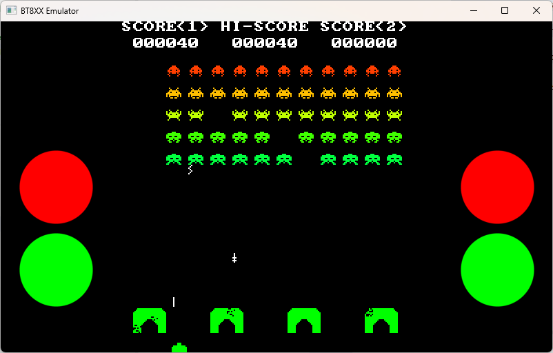
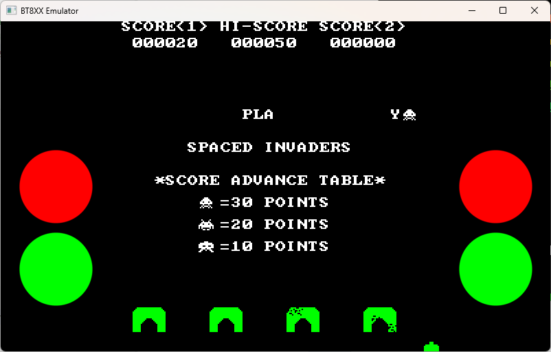

# EVE-MCU-Dev Spaced Invaders Example

[Back](../README.md)

## Spaced Invaders Example

The `spaced_invaders` example demonstrates drawing sprites, scaling images, accessing fonts, timing displayed frames, accessing touchscreen presses.

The example code uses `touch` and`fonts` from the [snippets](../snippets) directory to access the touchscreen.

The example is intended to show a simple implementation of an invaders game in the style of a classic 8-bit game.

Press **RED** to start. During the game press **GREEN** buttons to move left and right, and **RED** to fire.

## Screenshot

The following is an screenshot of the `spaced_invaders` example:



## EVE API Support

Supported EVE APIs in this example:

| EVE API 1 | EVE API 2 | EVE API 3 | EVE API 4 | EVE API 5 |
| --- | --- | --- | --- | --- |
| Yes | Yes | Yes | Yes | Yes |

## Platform Support

This example supports the following platforms:

| Port Name | Port Directory | Supported |
| --- | --- | --- |
| [Raspberry Pi Pico](pico/README.md) | [pico](pico/) | Yes |
| [Generic using EVE Emulator](emulator/README.md) | [emulator](emulator/) | Yes |
| [Generic using libFT4222](libft4222/README.md) | [libft4222](libft4222/) | Yes |

Platform specific build instructions and setup requirements are shown in the `README.md` file in the platform build directory.

## Platform Files and Folders

### `main.c`

The application starts up in the file `main.c` which provides initial MCU configuration and then calls `eve_example.c` where the remainder of the application will be carried out. 

The `main.c` code is platform specific. It must provide any functions that rely on a platform's operating system, or built-in non-volatile storage mechanism. The required functions store and recall previous touch screen calibration settings:
- **platform_calib_init** initialise a platform's non-volatile storage system.
- **platform_calib_read** read a previous touch screen calibration or return a value indicating that there are no stored calibration setting.
- **platform_calib_write** write a touch screen calibration to the platform's non-volatile storage.
- **platform_get_time** get a millisecond count from the platform.

The example program in the common code is then called.

## Common Files and Folders

The example contains a common directory with several files which comprises all the demo functionality.

| File/Folder | Description |
| --- | --- |
| [common/eve_example.c](common/eve_example.c) | Example source code file |
| [common/eve_example.h](common/eve_example.h) | Example header file |
| [common/invaders_data.c](common/invaders_data.c) | Example source code for loaded images |
| [common/invaders_demo.c](common/invaders_demo.c) | Example source code for demo screen |
| [common/invaders_game.c](common/invaders_game.c) | Example source code for gameplay |
| [common/scaling.c](common/scaling.c) | Helper functions to scale graphics primatives, fonts, and bitmaps |
| [docs](docs) | Documentation support files |

### `eve_example.c`

This is the main control program of the example and also holds the functions and variables common to the demo and game files below.

In the function `eve_example` the basic format is as follows:

```c
void eve_example(void)
{
    // Initialise the display
    EVE_DEBUG_PRINTF("Initialising display...\n");
    if (EVE_Init() != 0)
    {
        EVE_DEBUG_ERROR("ERROR: EVE_Init() failed.\n");
        return;
    }
    
    // Calibrate the display
    EVE_DEBUG_PRINTF("Calibrating display...\n");
    if (eve_calibrate() != 0)
    {
        EVE_DEBUG_ERROR("ERROR: Exception in eve_calibrate() failed.\n");
        return;
    }

    // Start example code
    EVE_DEBUG_PRINTF("Starting demo:\n");
    eve_display();          // Run Application
}
```
The call to `EVE_Init()` is made which sets up the EVE environment on the platform. This will initialise the SPI communications to the EVE device and set-up the device ready to receive communication from the host.

Next, the function `eve_calibrate()` is then called which uses the calibration co-processor command to display the calibration screen and asks the user to tap the three dots (see `touch.c` below).

Once calibration is complete, the main loop is called which sits in a continuous loop within `eve_display()`. Each time round the loop, a screen is created using a co-processor list. 

### `invaders_data.c`

In this file are fixed arrays containing bitmap images used in the example.

The `InvaderImageData` array holds multi-cell images of the invaders:


The `ShieldsImageData` array holds images of the base shields in various state of repair:


The different cells in these bitmaps can be drawn individually with an `EVE_CELL` or `EVE_VERTEX2II` display list command.

There is code to load the bitmaps into RAM_G and scale the images as required to fit on the screen.

### `invaders_game.c`

This file has the logic required to control the game in progress.

### `invaders_demo.c`

The demo screen is shown before and after the invaders game has been played. It demonstrates timed animation with a simple state machine.

### `scaling.c`

Provides helper functions for scaling vertex commands, bitmaps, fonts, and graphics primitives such as points and lines.

### `touch.c`

This function is used to show the touchscreen calibration screen and prompt the user to touch the screen at the required positions to generate an accurate transformation matrix. This matrix is used to translate the raw touch input into precise points on the screen.

The platform specific functions in `main.c` are called from this routine to store and read touchscreen calibration settings so that the user only needs to perform the action once.

### `fonts.c`

To scale a ROM font it is necessary to get certain information about the font from ROM and map the font to another bitmap handle. This snippet provides the structure needed to complete that task. Font 16 (fixed width 8x8) is used and this is scaled to provide authentic 8-bit style text.


