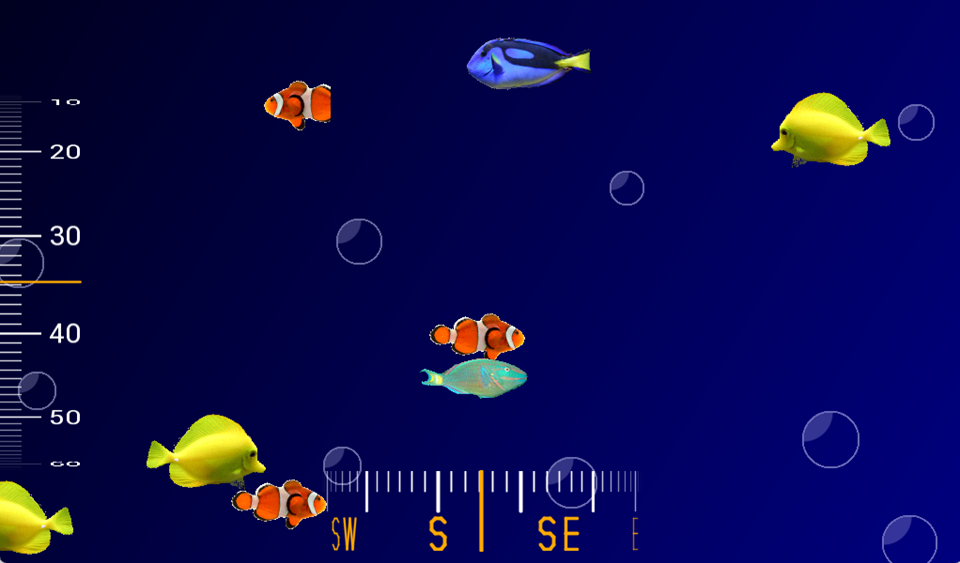

# EVE-MCU-Dev Submarine Controls Example

[Back](../README.md)

## Submarine Controls Example

The `submarine` example demonstrates drawing multiple scissored areas, handling overlapped drawing, and gradients for skeuomorphism. 

The example code uses the `sub_controls` and `compass_controls` from the [snippets](../snippets) directory to draw the indicators

The example is intended to show an submarine depth and compass. The example shows a bulkhead compass.

A helper application called `trig_furman` also from the [snippets](../snippets) directory is used to perform trigonometry using furman angles.

## Screenshot

The following is an screenshot of the `submarine` example:



## EVE API Support

Supported EVE APIs in this example:

| EVE API 1 | EVE API 2 | EVE API 3 | EVE API 4 | EVE API 5 |
| --- | --- | --- | --- | --- |
| Yes | Yes | Yes | Yes | Yes |

## Platform Support

This example supports the following platforms:

| Port Name | Port Directory | Supported |
| --- | --- | --- |
| [Generic using EVE Emulator](emulator/README.md) | [emulator](emulator/) | Yes |
| [Generic using libFT4222](libft4222/README.md) | [libft4222](libft4222/) | Yes |

Platform specific build instructions and setup requirements are shown in the `README.md` file in the platform build directory.

## Platform Files and Folders

### `main.c`

The application starts up in the file `main.c` which provides initial MCU configuration and then calls `eve_example.c` where the remainder of the application will be carried out. 

The `main.c` code is platform specific. It must provide any functions that rely on a platform's operating system, or built-in non-volatile storage mechanism. The required functions store and recall previous touch screen calibration settings:
- **platform_calib_init** initialise a platform's non-volatile storage system.
- **platform_calib_read** read a previous touch screen calibration or return a value indicating that there are no stored calibration setting.
- **platform_calib_write** write a touch screen calibration to the platform's non-volatile storage.

The example program in the common code is then called.

## Common Files and Folders

The example contains a common directory with several files which comprises all the demo functionality.

| File/Folder | Description |
| --- | --- |
| [common/eve_example.c](common/eve_example.c) | Example source code file |
| [snippets/touch.c](../snippets/touch.c) | Calibration and touch detection routines |
| [snippets/dials/sub_controls.h](../snippets/dials/sub_controls.h) | Header file for submarine control widgets |
| [snippets/dials/sub_depth.c](../snippets/dials/sub_depth.c) | Implementation file for submarine depth widget |
| [snippets/dials/compass_controls.h](../snippets/dials/compass_controls.h) | Header file for compass widgets |
| [snippets/dials/compass_bulkhead.c](../snippets/dials/compass_bulkhead.c) | Implementation file for bulkhead compass widget |
| [snippets/maths/trig_furman.c](../snippets/controls/arcs.c) | Trigonometric maths routines |
| [docs](docs) | Documentation support files |

### `eve_example.c`

In the function `eve_example` the basic format is as follows:

```
void eve_example(void)
{
    // Initialise the display
    EVE_DEBUG_PRINTF("Initialising display...\n");
    if (EVE_Init() != 0)
    {
        EVE_DEBUG_ERROR("ERROR: EVE_Init() failed.\n");
        while(1);
    }
    
    // Calibrate the display
    EVE_DEBUG_PRINTF("Calibrating display...\n");
    if (eve_calibrate() != 0)
    {
        EVE_DEBUG_ERROR("ERROR: Exception in eve_calibrate() failed.\n");
        while(1);
    }

    // Start example code
    EVE_DEBUG_PRINTF("Starting demo:\n");
    eve_display();          // Run Application
}
```
The call to `EVE_Init()` is made which sets up the EVE environment on the platform. This will initialise the SPI communications to the EVE device and set-up the device ready to receive communication from the host.

Next, the function `eve_calibrate()` is then called which uses the calibration co-processor command to display the calibration screen and asks the user to tap the three dots (see `touch.c` below).

Once calibration is complete, the main loop is called which sits in a continuous loop within `eve_display()`. Each time round the loop, a screen is created using a co-processor list. 

### `touch.c`

This function is used to show the touchscreen calibration screen and prompt the user to touch the screen at the required positions to generate an accurate transformation matrix. This matrix is used to translate the raw touch input into precise points on the screen.

The platform specific functions in `main.c` are called from this routine to store and read touchscreen calibration settings so that the user only needs to perform the action once.

### `sub_depth.c`

This snippet provides a function whichs renders a simulation of a depth indicator. It reads from zero showing an indicator pointing at a scaled depth.

The depth and the viewing window can be specified and a scaling factor is used for both the depth and the viewing window.

### `compass_bulkhead.c`

This snippet provides a function whichs renders a simulation of a binnacle mounted compass. It portrays a side-on view of a roating compass.

### `trig_fruman.c`

This snippept provides fucntions to perform trigonometry using angles in furmans rather than degrees or radians. Furman angles are an implementation of angles using only integer values to enable demos to run on hardware which does not support floating point values. Refer to the BridgeTek Programming Guides for the EVE device for a full explanation of this method. Macros are provided to turn degrees into furmans and vice versa, and to turn a radius and degrees/furmans into components for X and Y vector.
