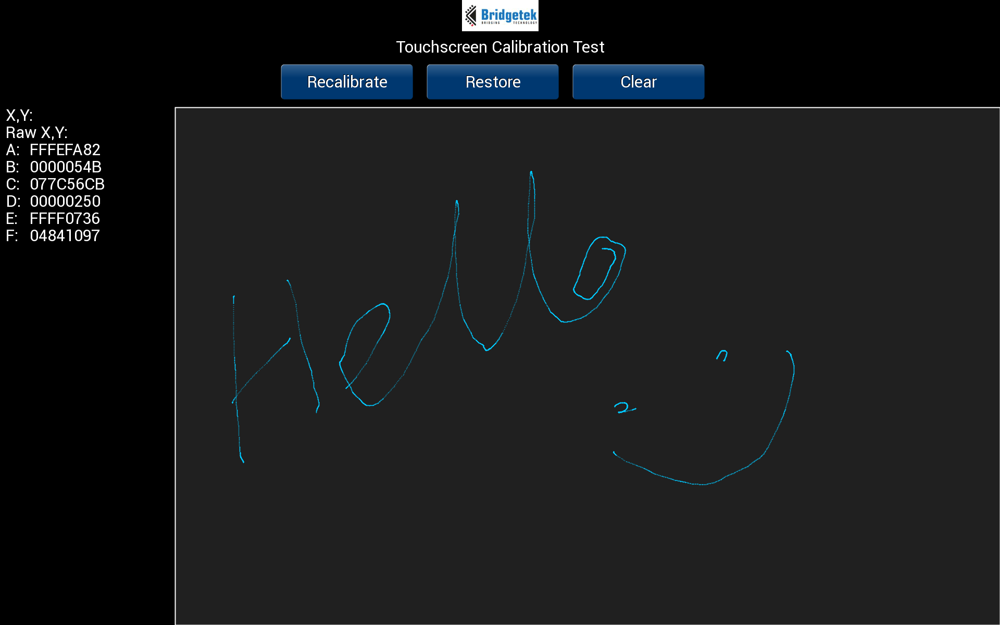

# EVE-MCU-Dev Touch Screen Test Example

[Back](../README.md)

## Touch Screen Test Example

The `touchscreentest` example demonstrates detection of a touch event on a display, displays the raw x,y touch location and the transformed x,y touch location used for tag generation.

A printout of the touchscreen calibration matrix is also shown for reference. There are two buttons "Recalibrate" and "Restore". The recalibrate button will perform a 3 point auto-calibration and update the touchscreen calibration matrix; the restore button will reload the original calibration matrix.

When a touch on the screen is detected then a pair of crosshairs are drawn showing the transformed x,y touch location clearly.

Multiple touch is not supported as this function depends on the same touchscreen calibration matrix transformation as a single touch.

This example supports the following platforms:

| Port Name | Port Directory | 
| --- | --- | 
|Generic using libFT4222 CMake | [libmpsse](libmpsse/README.md) | 
|Generic using libFT4222 Visual Studio | [libmpsse](libmpsse/README.md) | 

- (1) Hardware testing ongoing.
- (2) Build environment incomplete.
 
Supported EVE APIs in this example:

| EVE API 1 | EVE API 2 | EVE API 3 | EVE API 4 | EVE API 5 |
| --- | --- | --- | --- | --- |
| Yes | Yes | Yes | Yes | Yes |

The following is an screenshot of the touchscreentest example.



### `main.c`

The application starts up in the file `main.c` which provides initial MCU configuration and then calls `eve_example.c` where the remainder of the application will be carried out. 

The `main.c` code is platform specific. It must provide any functions that rely on a platform's operating system, or built-in non-volatile storage mechanism. The required functions store and recall previous touch screen calibration settings:
- **platform_calib_init** initialise a platform's non-volatile storage system.
- **platform_calib_read** read a previous touch screen calibration or return a value indicating that there are no stored calibration setting.
- **platform_calib_write** write a touch screen calibration to the platform's non-volatile storage.

The example program in the common code is then called.

### `eve_example.c`

In the function `eve_example` the basic format is as follows:

```
void eve_example(void)
{
    uint32_t font_end;
    // Initialise the display
    EVE_Init();
    // Load images
    eve_load_images(font_end);
    // Calibrate the display
    eve_calibrate();
    // Start example code
    eve_display();
 }
```
The call to `EVE_Init()` is made which sets up the EVE environment on the platform. This will initialise the SPI communications to the EVE device and set-up the device ready to receive communication from the host.

Next, the function `eve_calibrate()` is then called which uses the calibration co-processor command to display the calibration screen and asks the user to tap the three dots (see `eve_calibrate.c` below).

Once calibration is complete, the font for the counter and the image for the logo are both loaded  (see `eve_fonts.c` and `eve_images.c` below).
Finally, the main program sits in a continuous loop within `eve_display()`. Each time round the loop, a screen is created using a co-processor list. 

### `eve_calibrate.c`

This function is used to show the touchscreen calibration screen and prompt the user to touch the screen at the required positions to generate an accurate transformation matrix. This matrix is used to translate the raw touch input into precise points on the screen.

The platform specific functions in `main.c` are called from this routine to store and read touchscreen calibration settings so that the user only needs to perform the action once.

### `eve_images.c`

The BridgeTek logo is stored in an array in this file as a JPEG image. The data from the array is sent to the
co-processor which converts it into a bitmap image suitable for use by the EVE device.

To convert the JPG to bitmap format the `EVE_CMD_LOADIMAGE` command is sent followed by the JPG file data.
Note that the JPG file data must be padded to the next 32-bit boundary. The bitmap image is written into the 
RAM_G address specified in the command.

In the following code snippet from the example the `while` loop will look for the end marker of the JPG
data (0xff 0xd9) and finish the transmission of the data to the co-processor.

```
    EVE_CMD_LOADIMAGE(start_addr, 0);
    while (flag != 2) {
        for (i = 0; i < sizeof(buf); i++) {
            buf[i] = *img++;
            if (buf[i] == 0xff) {
                flag = 1;
            } else {
                if (flag == 1) {
                    if (buf[i] == 0xd9) {
                        flag = 2;
                        i++;
                        break;
                    }
                }
                flag = 0;
            }
        }
        EVE_LIB_WriteDataToCMD(buf, (i + 3) & (~3));
    }
```

Once loaded into RAM_G the `EVE_CMD_GETPROPS` command can find the size of the image.

```
    EVE_LIB_GetProps(&eve_addr, &img_width, &img_height);
```

Using the information returned from `EVE_CMD_GETPROPS` the bitmap is intialised.
The code will select bitmap mode with the `EVE_BEGIN`, this tells the device that it is going to be processing bitmap instructions.
Then it will set the source address of the bitmap in RAM_G with `EVE_BITMAP_SOURCE`. 
Next `EVE_BITMAP_LAYOUT` and `EVE_BITMAP_SIZE` commands tell the graphics device how to render the bitmaps included in the font.

```
    EVE_CMD_DLSTART();
    EVE_BEGIN(EVE_BEGIN_BITMAPS);
    EVE_BITMAP_HANDLE(FONT_CUSTOM);
    EVE_BITMAP_SOURCE(start_addr & 0x3FFFFF);
    EVE_BITMAP_LAYOUT(EVE_FORMAT_RGB565, img_width * 2, img_height);
    EVE_BITMAP_SIZE(EVE_FILTER_NEAREST, EVE_WRAP_BORDER, EVE_WRAP_BORDER,
                    img_width, img_height);
    EVE_END();
    EVE_DISPLAY();
    EVE_CMD_SWAP();
```

Some EVE devices have a larger address space and also have an `EVE_BITMAP_SOURCE_H` command for the higher address bits.
Other EVE devices have `EVE_BITMAP_LAYOUT_H` and `EVE_BITMAP_SIZE_H` to cope with larger supported bitmap sizes.

A call to the `eve.CMD_SWAP()` command **must** be made within the same co-processor list to register 
the bitmap handle on the device so that it can be used by subsequent display lists.

### `eve_helper.c`

Currently the only function of this file is to read a single touch tag from the screen.

```
    Read_tag = EVE_LIB_MemRead32(EVE_REG_TOUCH_TAG);
    if ((EVE_LIB_MemRead32(EVE_REG_TOUCH_RAW_XY) & 0xffff) != 0xffff)
    {
        key_detect = 1;
        *key = Read_tag;
    }
```

A TAG event is read from the EVE_REG_TOUCH_TAG register. This is verified by reading the EVE_REG_TOUCH_RAW_XY register. 
If that register indicates a valid touch then this is flagged to the calling program.

## Files and Folders

The example contains a common directory with several files which comprises all the demo functionality.

| File/Folder | Description |
| --- | --- |
| [common/eve_example.c](common/eve_example.c) | Example source code file |
| [common/eve_calibrate.c](common/eve_calibrate.c) | Calibrations routines |
| [common/eve_helper.c](common/eve_helper.c) | General helper routines (touch detection) |
| [common/eve_images.c](common/eve_images.c) | Image helper routines |
| [docs](docs) | Documentation support files |
