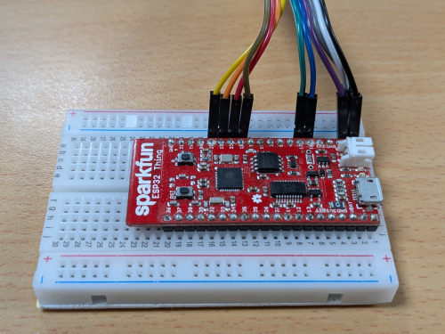
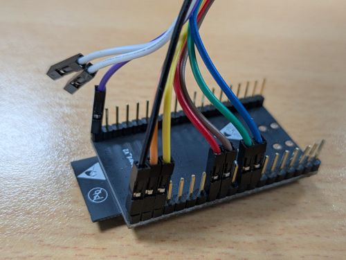
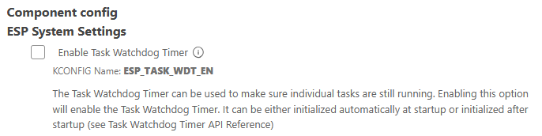

# EVE-MCU-Dev Ports for ESP32

[Back](../README.md)

The port for ESP32 comprises the MCU connected to the EVE device via the SPI bus. The ESP32 device manages the EVE device SPI bus. 

## Hardware

The ESP32 port was developed using a [ESP32 Thing](https://www.sparkfun.com/products/13907) from SparkFun and a [ESP32-DevKitC](https://docs.espressif.com/projects/esp-dev-kits/en/latest/esp32/esp32-devkitc/index.html) from Espressif.

Other ESP32 variations may required different pin numbers and SPI busses to be used. 
These settings and the example workspaces for ESP-IDF are for the ESP32 (Tensilica LX6 microprocessor). 

If other variants of the ESP32 are to be used then the differences can be added in the top of the `EVE_MCU_ESP32.c` file or additional files for different types created.

### ESP32 Thing

The ESP32 Thing module can be connected via short wires to the corresponding signals of an EVE module. 
Please reference the [ESP32 Hookup Guide](https://learn.sparkfun.com/tutorials/esp32-thing-hookup-guide).

The following picture is of a ESP32 Thing module connected using the wire colours in [Module Connections](../../README.md#module-connections).

The pin connections for ESP32 Thing modules is as follows for the 2x8 and 1x10 connectors:

| ESP32 Thing J2 Pin | ESP32 Thing Pin Name | 2x8 Pin | 1x10 Pin | EVE Signal | Colour in Figure |
| --- | --- | --- | --- | --- | --- | 
| 16 | GPIO18 | 1 | 1 | SCK  | Brown &#9724; |
| 15 | GPIO19 | 4 | 2 | MOSI | Red &#9724; | 
| 14 | GPIO23 | 3 | 3 | MISO | Orange &#9724; | 
| 13 | GPIO22 | 2 | 4 | CS# | Yellow &#9724; | 
| 5 | GPIO17 | 14 | 5 | INT# _(1)_ | Green &#9724; | 
| 6 | GPIO16 | 13 | 6 | PD# | Blue &#9724; |
| 2 | VUSB | 10 | 7 | 5V | Purple &#9724; |
| 1 | GND |  11/12 | 9/10 | GND | Black &#9724; |

- (1) The INT# line is not required for operation unless `EVE_COPRO_METHOD` macro is set with `EVE_COPRO_INT` in the configuration for EVE-MCU-Dev.

Ensure that the power supply from the ESP32 Thing module is capable of also powering the EVE board. If using third-party modules which may consume more current, a separate power connection to the EVE module could be used, with the grounds of the ESP32 Thing and EVE modules common to both power sources.

### ESP32-DevKitC

The ESP32-DevKitC module can be connected via short wires to the corresponding signals of an EVE module. 
Please reference the [ESP32-DevKitC User Guide](https://docs.espressif.com/projects/esp-dev-kits/en/latest/esp32/esp32-devkitc/user_guide.html).

The following picture is of a ESP32-DevKitC module connected using the wire colours in [Module Connections](../../README.md#module-connections).

The pin connections for ESP32-DevKitC modules is as follows for the 2x8 and 1x10 connectors:

| ESP32-DevKitC Pin | ESP32-DevKitC Pin Name | 2x8 Pin | 1x10 Pin | EVE Signal | Colour in Figure |
| --- | --- | --- | --- | --- | --- | 
| J3 9 | GPIO18 | 1 | 1 | SCK  | Brown &#9724; |
| J3 8 | GPIO19 | 4 | 2 | MOSI | Red &#9724; | 
| J3 2 | GPIO23 | 3 | 3 | MISO | Orange &#9724; | 
| J3 3 | GPIO22 | 2 | 4 | CS# | Yellow &#9724; | 
| J3 11 | GPIO17 | 14 | 5 | INT# _(1)_ | Green &#9724; | 
| J3 12 | GPIO16 | 13 | 6 | PD# | Blue &#9724; |
| J2 19 | VUSB | 10 | 7 | 5V | Purple &#9724; |
| J3 1 | GND |  11/12 | 9/10 | GND | Black &#9724; |

- (1) The INT# line is not required for operation unless `EVE_COPRO_METHOD` macro is set with `EVE_COPRO_INT` in the configuration for EVE-MCU-Dev.

Ensure that the power supply from the ESP32-DevKitC module is capable of also powering the EVE board. If using third-party modules which may consume more current, a separate power connection to the EVE module could be used, with the grounds of the ESP32-DevKitC and EVE modules common to both power sources.

## SPI Transfer Frequency

The following table shows the SPI transfer frequencies for the ESP32:

| Initialisation Phase | Runtime |
| --- | --- |
| 1 MHz | 20 MHz |

The ESP32 Thing has a (deprecated) 26 MHz crystal. 
If this device is used then the default monitor baud rate is 74880 baud rather than 115200 baud with an ESP32 with the currently supported 40 MHz crystal.

## Sotfware (ESP-IDF)

The example code is not written to support the multi-tasking environment in the FreeRTOS environment on which the ESP32 code is run.
If the Task Watchdog Timer is enabled in the configuration then the watchdog may cause the application to reset. 
Ensure that this is turned off.
- In the `sdkconfig` file by setting the line containing `CONFIG_ESP_TASK_WDT_EN` to `# CONFIG_ESP_TASK_WDT_EN is not set`.
- Using the "SDK Configuration editor" page in Visual Studio Code locate "Component config" and "ESP System Settings". Uncheck the box for Enable Task Watchdog Timer.
  
