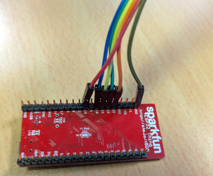

# EVE-MCU-Dev Ports for ESP32

[Back](../README.md)

The port for ESP32 comprises the MCU connected to the EVE device via the SPI bus. The ESP32 device manages the EVE device SPI bus. 

## Hardware

The ESP32 port was developed using a [ESP32 Thing](https://www.sparkfun.com/products/13907) from SparkFun. The ESP32 module can be connected via short wires to the corresponding signals of an EVE module. Please reference the [ESP32 Hookup Guide](https://learn.sparkfun.com/tutorials/esp32-thing-hookup-guide).

| ESP32 Thing Pin Label | EVE Signal |
| --- | --- |
| 18 | SCK |
| 19 | MISO |
| 23 | MOSI |
| 22 | CS# |
| 15 | PD# |
| VUSB | 5V |
| GND | GND |

Ensure that the power supply from the ESP32 Thing module is capable of also powering the EVE board. If using third-party modules which may consume more current, a separate power connection to the EVE module could be used, with the grounds of the ESP32 Thing and EVE modules common to both power sources.

An ESP32 Thing board can be connected to an EVE board as in the following picture.

__NOTE:__ The ESP32 Thing has a (deprecated) 26 MHz crystal. If this device is used then the default monitor baud rate is 74880 baud rather than 115200 baud with an ESP32 with the currently supported 40 MHz crystal.
