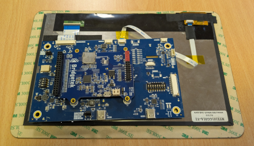

# EVE-MCU-Dev Ports for Bridgetek FT9XX

[Back](../README.md)

The port for FT9XX comprises the MCU connected to the EVE device via the SPI bus. The FT9XX device manages the EVE device SPI bus. Both the FT90X and FT93X range of devices are supported.

## Hardware

The FT9XX port was developed using a board from the MM900EV1B series along with the UMFTPD2A debug and programming module. The MM900EVxB modules can be attached directly to the rear of some modules (such as ME812A-WH50R, ME813A-WH50C, ME817EV modules and MM930Lite) or be connected via short wires to the corresponding signals if using a different EVE module.

| FT90X Pin | FT93X Pin | MM900EVxB Name | MM900EVxB Pin | EVE Signal |
| --- | --- | --- | --- | --- |
| 27 | 34 | SPIM_SCK | J2 Pin 1 / CN12 Pin 3 | SCK |
| 29 | 36 | SPIM_MOSI | J2 Pin 4 / CN12 Pin 7 | MOSI |
| 30 | 35 | SPIM_MISO | J2 Pin 3 / CN12 Pin 6 | MISO |
| 28 | 30 | SPIM_SS0 | J2 Pin 2 / CN12 Pin 8 | CS# |
| 43 | 15 | PWD# | J2 Pin 13 / CN12 Pin 10 | PD# |
| - | - | VDD_5V | J2 Pin 10 | 5V |
| - | - | GND | J2 Pin 12 / CN12 Pin 11 | GND |

Ensure that the power supply from the FT9XX module is capable of also powering the EVE board. If using third-party modules which may consume more current, a separate power connection to the EVE module could be used, with the grounds of the FT9XX and EVE modules common to both power sources.

An MM930Lite board can be connected to an EVE board using the through board connector as in the following picture.

