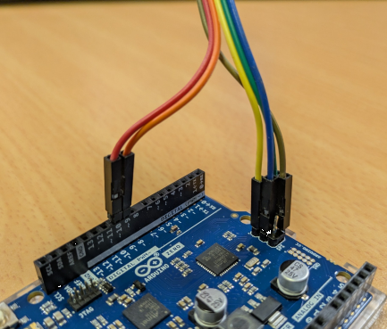

# EVE-MCU-Dev Ports for PlatformIO

[Back](../README.md)

The port for PlatformIO allows the selection of a range of hardware to control the EVE device. Only the "Arduino" framework is supported at present.
The PlatformIO device manages the EVE device SPI bus. 

## Arduino Hardware

The PlatformIO Arduino framework port was developed using Arduino UNO, Arduino Zero and Arduino Leonardo Arduino modules; and also Raspberry Pi pico and Sparkfun ESP32 Thing modules. 
The modules can be connected via short wires to the corresponding signals of an EVE module. 

### Arduino Modules

For Arduino modules the standard Arduino pinout is assumed. Default pin selections are used for these modules.
Please reference the Arduino Datasheet for more information.

| Arduino Name | Arduino Pin | EVE Signal |
| --- | --- | --- |
| SCLK | ISCP 3 | SCK |
| COPI | ISCP 4 | MOSI |
| CIPO | ISCP 1 | MISO |
| D10 | - | CS# |
| D9 | - | PD# |
| D8 | - | INT# _(1)_ |
| - | ISCP 2 | 5V |
| - | ISCP 6 / GND | GND |

- (1) The INT# line is not required for operation unless `EVE_COPRO_METHOD` macro is set with `EVE_COPRO_INT` in the configuration for EVE-MCU-Dev.

Ensure that the power supply from the Arduino module is capable of also powering the EVE board. If using third-party modules which may consume more current, a separate power connection to the EVE module could be used, with the grounds of the BeagleBone Black and EVE modules common to both power sources.

An Arduino board can be connected to an EVE board as in the following picture (the INT# line is not shown).



**NOTE:** The INT# line is not shown connected.

### Other Modules

For other modules the standard Arduino pinout should be overridden to match the module.
In the `platformio.ini` file for the project the pins for the module can be changed by setting compiler definitions in the `build_flags` section of an environment.

If the `PIN_REDEFINE=` macro is defined (it can be defined to any value) then the 
`PIN_SPICLOCK`, `PIN_DATAOUT`, `PIN_DATAIN`, `PIN_CHIPSELECT`, `PIN_POWERDOWN` and `PIN_INTERRUPT`
 **must** all be defined for the environment.

```
[env:custom_board]
build_flags =
    ${env.build_flags}
    -D PIN_REDEFINE=1
    -D PIN_SPICLOCK=18
    -D PIN_DATAOUT=23
    -D PIN_DATAIN=19
    -D PIN_CHIPSELECT=22
    -D PIN_POWERDOWN=15
    -D PIN_INTERRUPT=2
```

There is support for overridding the default pinout according to this list:
- ARDUINO_ARCH_SAMD (SAMD) cannot override due to fixed I/O pins. This is boards such as the Arduino UNO, Zero, Mega.
- ARDUINO_ARCH_MBED (ARM Cortex) can override. This is platforms such as the Raspberry Pi pico.
- ARDUINO_ARCH_ESP32 (ESP32) can override. For example, the Sparkfun ESP32 Thing.

To use the same wiring connections as other ports refer to the README.md files for that port and update the `platformio.ini` file with the required pin numbers.

## Software

Please refer to the [PlatformIO Arduino Simple example](../../examples/simple/platformio_arduino/README.md) for instructions on using PlatformIO in an EVE-MCU-Dev project.

Reference [PlatformIO Project](https://platformio.org/)
