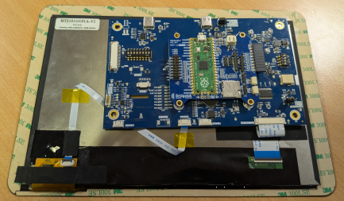
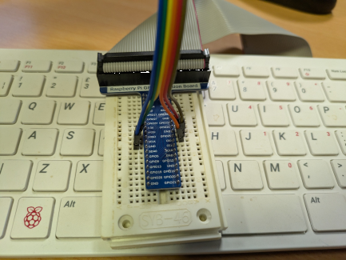
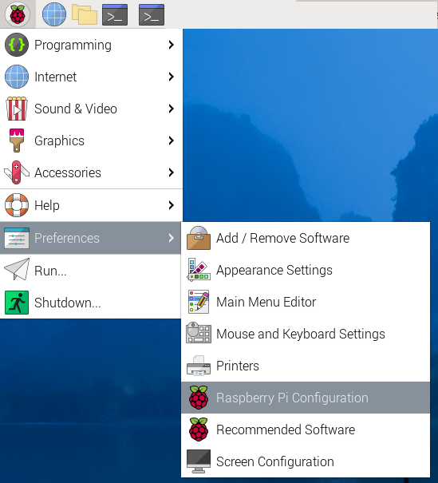
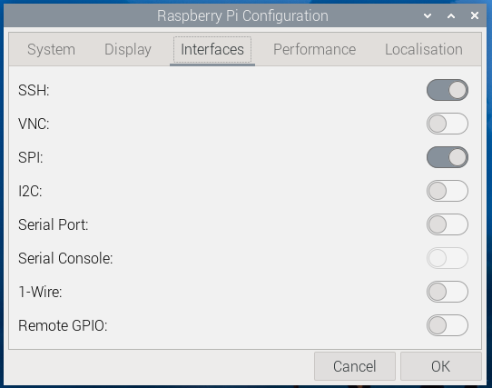
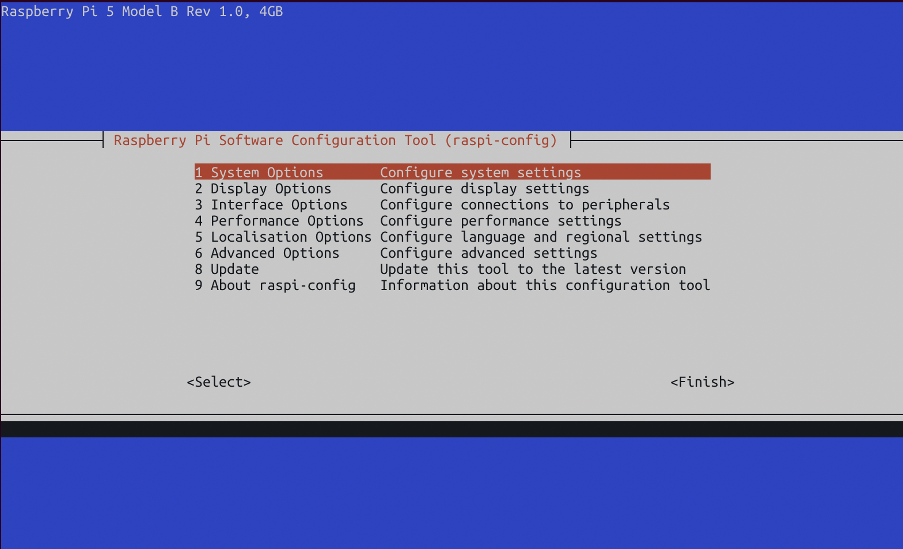

# EVE-MCU-Dev Ports for Raspberry Pi

[Back](../README.md)

There are two separate ports for Raspberry Pi products:

| Port | PLATFORM macro | 
| --- | --- | 
| [RP2040](#hardware-rp2040) | `PLATFORM_RP2040` | 
| [Raspberry Pi](#hardware-raspberry-pi) | `PLATFORM_RASPBERRYPI` | 

## Hardware RP2040

The RP2040 port was developed using an Raspberry Pi pico. The RP2040 module can be connected via short wires to the corresponding signals of an EVE module. Please reference the Raspberry Pi pico Datasheet for more information.

| RP2040 Pin| RP2040 Pin Name | pico Pin | pico Pin Name | MM2040EV J1 Pin | EVE Signal |
| --- | --- | --- | --- | --- | --- |
| 4 | GPIO2 | 4 | GP2 | 1 | SCK |
| 5 | GPIO3 | 5 | GP3 | 4 | MOSI |
| 6 | GPIO4 | 6 | GP4 | 3 | MISO |
| 7 | GPIO5 | 7 | GP5 | 2 | CS# |
| 8 | GPIO6 | 9 | GP6 | 14 | INT# _(1)_ |
| 9 | GPIO7 | 10 | GP7 | 13 | PD# |
| - | - | 40 | - | 10 | 5V |
| - | - | 8 | - | 11/12 | GND |

- (1) The INT# line is not required for operation unless `EVE_COPRO_METHOD` macro is set with `EVE_COPRO_INT` in the configuration for EVE-MCU-Dev.

Ensure that the power supply from the Raspberry Pi pico module is capable of also powering the EVE board. If using third-party modules which may consume more current, a separate power connection to the EVE module could be used, with the grounds of theRaspberry Pi pico and EVE modules common to both power sources.

A Bridgetek board with a Raspberry Pi RP2040 and a through-board connector (MM2040EV) can be connected to an EVE board as in the following picture.



**NOTE:** The INT# line is not shown connected.

## Files

| File | Function |
| --- | --- |
|[EVE_MCU_RP2040.c](EVE_MCU_RP2040.c) | Common file for Raspberry Pi RP2040, higher level read/writes, endian conversions, SPI peripheral setup and control, CS and PD pin control. |

### IDM2040-7A Module

The IDM2040-7A from Bridgetek has an integrated Raspberry Pi RP2040 pico and a BT817Q. The screen resolution is 800x480.

The settings required in `EVE_config.h` are:
```
#define EVE_DEVICE EVE_BT817
#define EVE_DISPLAY_RES IDM20407A
```

### IDM2040-43A Module

The IDM2040-43A from Bridgetek has an integrated Raspberry Pi RP2040 pico and a BT883. The screen resolution is 480x272.

The settings required in `EVE_config.h` are:
```
#define EVE_DEVICE EVE_BT883
#define EVE_DISPLAY_RES IDM204043A
```

### IDM2040-21R Module

The IDM2040-21R from Bridgetek has an integrated Raspberry Pi RP2040 pico and a FT800Q. The screen resolution is 480x480.

The settings required in `EVE_config.h` are:
```
#define EVE_DEVICE EVE_FT800
#define EVE_DISPLAY_RES IDM204021R
```

## Hardware Raspberry Pi

The Raspberry Pi port was developed using an Raspberry Pi Model B+ SBC. However it is compatible with all of the Raspberry Pi SBCs sharing the same 40-pin GPIO header. Please reference the Raspberry Pi documentation for more information.

| GPIO Header Name | GPIO Header Pin | EVE Signal |
| --- | --- | --- |
| GPIO11(SCLK) | 23 | SCK |
| GPIO10(MOSI) | 19 | MOSI |
| GPIO9(MISO) | 21 | MISO |
| GPIO25 | 22 | CS# |
| GPIO24 | 18 | PD# |
| GPIO23 | 16 | INT# _(1)_ |
| 5v Power | 2 | 5V |
| Ground | 20 | GND |

- (1) The INT# line is not required for operation unless `EVE_COPRO_METHOD` macro is set with `EVE_COPRO_CMD_WRITE|EVE_COPRO_INT` in the configuration for EVE-MCU-Dev. **NOTE:** This has not been tested on hardware.

Ensure that the power supply from the Raspberry Pi SBC is capable of also powering the EVE board. If using third-party modules which may consume more current, a separate power connection to the EVE module could be used, with the grounds of the Raspberry Pi SBC and EVE modules common to both power sources.

A Raspberry Pi can be connected to an EVE board as in the following picture.



## Files

| File | Function |
| --- | --- |
| [EVE_Linux_RPi.c](EVE_Linux_RPi.c) | Common file for Raspberry Pi Linux, higher level read/writes, endian conversions, SPI peripheral setup and control, CS and PD pin control. |

### Raspberry Pi SPI Setup

The SPI interface needs to be enabled in the "Raspberry Pi Configuration" settings. 

Open the start menu and select "Preferences" then "Raspberry Pi Configuration". 



Then select the "Interfaces" tab. The "SPI" interface can be enabled with the switch.



It is possible to enable the SPI using the `raspi-config` command line program.



Select "3" to configure the interfaces then enable the SPI interface in the next page.

### Raspberry Pi Link Library Setup

The `libgpiod` library will need to be installed on the Raspberry Pi to access the GPIO pins.

```
sudo apt install libgpiod-dev
```
