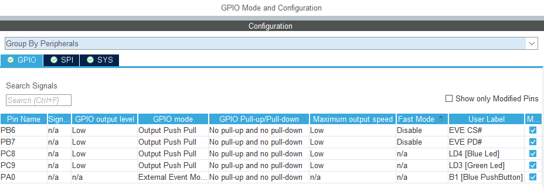
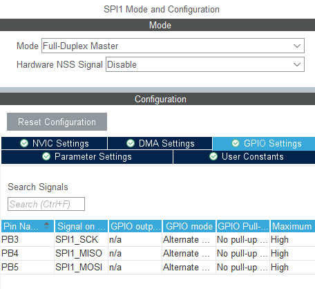
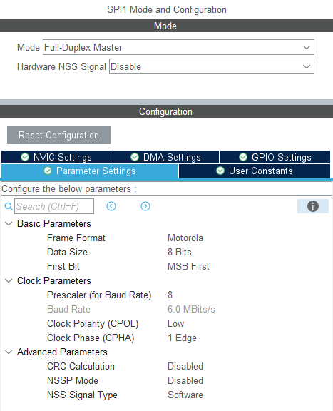
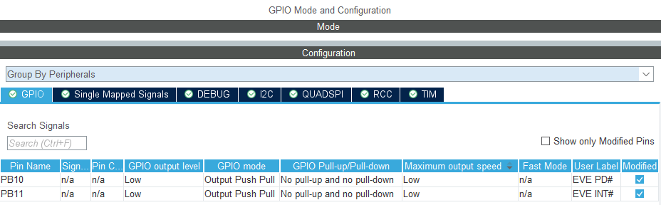
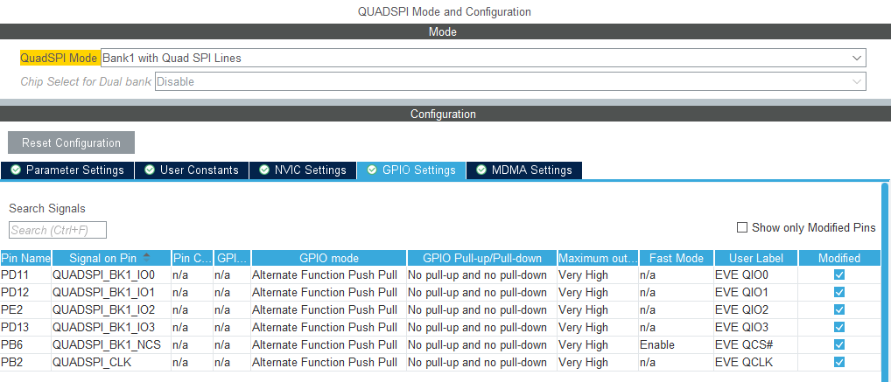
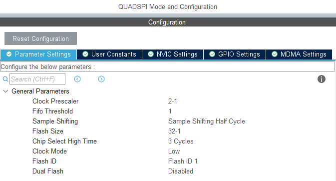

# EVE-MCU-Dev Port for STM32

[Back](../README.md)

There are two separate ports for the STM32:

| Port | PLATFORM macro |
| --- | --- |
| [Keil uVision](#keil-uvision) | `PLATFORM_STM32` |
| [STM32Cube](#stm32cube) | `PLATFORM_STM32_CUBE` |

The STM32F0 Discovery is supported by the [Keil uVision](https://developer.arm.com/Tools%20and%20Software/Keil%20MDK) compiler using the `PLATFORM_STM32` macro and the [STM32Cube](https://www.st.com/content/st_com/en/ecosystems/stm32cube-ecosystem.html) ecosystem with the `PLATFORM_STM32CUBE` macro.

## STM32Cube

The port for STM32 comprises the MCU connected to the EVE device via the SPI bus. The STM32 device manages the EVE device SPI bus. The SPI and QUADSPI bus formats are supported.

On STM32Cube a HAL driver and a device driver is required for each varient of MCU.

The STM32 port directly supports the following STM32 modules:
- [STM32F0308-DISCO](https://www.st.com/en/evaluation-tools/32f0308discovery.html) (**EOL**)
- [STM32F0DISCOVERY](https://www.st.com/en/evaluation-tools/stm32f0discovery.html)
- [MiniSTM32H7xx](https://github.com/WeActStudio/MiniSTM32H7xx)

**NOTE:** There are no drivers included in the `ports/eve_arch_stm32` library. The project using the EVE-MCU-Dev library **must** include the STM32 HAL and device drivers which are linked to the port during compilation. Therefore, the `examples` which support STM32 will include the STM32 HAL and device code. The `Core` and `Driver` directories in the examples include the files to support the listed boards. 

## Files

| File | Function |
| --- | --- |
| [EVE_MCU_STM32CUBE.c](EVE_MCU_STM32CUBE.c) | Common file for STM32Cube, higher level read/writes, endian conversions, PD pin control. |
| [EVE_MCU_STM32CUBE_SPI.c](EVE_MCU_STM32CUBE_SPI.c) | SPI hardware peripheral setup and control, CS pin control. |
| [EVE_MCU_STM32CUBE_QUADSPI.c](EVE_MCU_STM32CUBE_QUADSPI.c) | QUADSPI peripheral setup and control, buffering for bursts. |

## Hardware Interfaces

The port will support both SPI and QUADSPI hardware drivers in STM32 devices. The HAL calls for these are incompatible and so there are seperate C files in the port for SPI and QUADSPI.

The EVE PD# pin is controlled by software using GPIOs.

### SPI Interface

The common SPI hardware interface on the STM32 is a single channel SPI. There are often multiple of these interfaces, the port will use the one called "SPI1" in STM32CubeMX. It is selected with the following line in the `EVE_MCU_STM32CUBE_SPI.c` file:
```
extern SPI_HandleTypeDef hspi1;
```
The handle is defined in the generated HAL code and drivers.

The chip select (called NSS on STM32, CS# on EVE) pin is controlled by software using GPIO rather than the SPI hardware interface.

### QUADSPI Interface

Some STM32 devices have a QUADSPI hardware interface. This can be used as a single, dual or quad channel SPI. The port will use the one called "QUADSPI" in STM32CubeMX. It is selected with the following line in the `EVE_MCU_STM32CUBE_QUADSPI.c` file:
```
extern QSPI_HandleTypeDef hqspi;
```
The handle is defined in the generated HAL code and drivers.

The chip select (called NSS on STM32, CS# on EVE) pin is controlled by the QUADSPI hardware interface.

## STM32CubeMX Settings

The `ioc` file in STM32CubeMX configures the hardware interface of the MCU. This is required to be configured for new projects to connect the MCU pins to the module header which connects to the EVE hardware interface. 

**Examples of pin mappings are given here.** The project can reconfigure the pin mappings as required. The port code will take the configuration from the HAL and driver files generated by STM32CubeMX.

### SPI Interface

The GPIO and SPI1 peripherals configurations are described for STM32CubeMX. 

#### GPIO Pinout and Configuration

The CS# and PD# pins are setup as GPIO pins with a "Low" output and no pull ups or pull downs, as they are controlled by software.

Once configured they should resemble the following screenshot from STM32CubeMX. The pin configuration is for a STM32F080DISCOVERY.



The above configuration will result in the `Core\Inc\main.h` file being generated with macros similar to the following. Note that the pins are named `EVE CS#` and `EVE PD#` in the STM32CubeMX configuration. 

```
#define EVE_CS__Pin GPIO_PIN_6
#define EVE_CS__GPIO_Port GPIOB
#define EVE_PD__Pin GPIO_PIN_7
#define EVE_PD__GPIO_Port GPIOB
```
The macros can then be used directly in `HAL_GPIO_WritePin` calls in the C code for the port. For example:
```
HAL_GPIO_WritePin(EVE_CS__GPIO_Port, EVE_CS__Pin, GPIO_PIN_RESET);
```

#### SPI Pinout and Configuration

In STM32CubeMX the SPI SCK, MISO, MOSI pins will be setup to their GPIO "Alternate Function", with no pull ups or pull downs, as they are controlled by the SPI master. The SPI master (on SPI1) will be reflected as follows for a STM32F080DISCOVERY.



Note that the default SPI1 pins are changed to SCK on PB3, MOSI on PB5 and MISO on PB4 to generate the above configuration.

The parameters for the SPI master are set as follows. Mode-0 (i.e. CPOL low and CPHA 1-Edge) SPI is used and the transfers are 8-bit with the MSB first. NSSP mode is "Disabled" with NSS Signal Type as "Software" to allow the library control of the CS# pin.



### QUADSPI Interface

The GPIO and QUADSPI peripherals configurations are described for STM32CubeMX. 

#### GPIO Pinout and Configuration

The PD# pins is setup as a GPIO pin with a "Low" output and no pull ups or pull downs, as it is controlled by software.

Once configured they should resemble the following screenshot from STM32CubeMX.



The above configuration will result in the `Core\Inc\main.h` file being generated with the following macros. Note that the pins are named `EVE CS#` and `EVE PD#` in the STM32CubeMX configuration.

```
#define EVE_PD__Pin GPIO_PIN_7
#define EVE_PD__GPIO_Port GPIOB
```
The macros can then be used directly in `HAL_GPIO_WritePin` calls in the C code for the port. For example:
```
HAL_GPIO_WritePin(EVE_PD__GPIO_Port, EVE_PD__Pin, GPIO_PIN_RESET);
```

#### SPI Pinout and Configuration

The QUADSPI peripheral will match the GPIO settings above and be reflected as follows.
In STM32CubeMX the QUADSPI CLK, IO0, IO1, IO2, IO3, NCS pins will be setup to their GPIO "Alternate Function", with no pull ups or pull downs, as they are controlled by the QUADSPI. The QUADSPI will be reflected as follows for a MiniSTM32H7xx.



The parameters for the SPI master are set as follows. Clock mode "Low", Flash Size 32 (written as 32-1 as the address width is n-1), Clock Prescaler is 2 (written as 2-1 as prescaler is n-1). This would give a 60 MHz QUADSPI bus when the QUADSPI input clock is 120 MHz. This can be configured in the "Clock Configuration" tab in STM32CubeMX.



Please note the various methods of setting the SPI clock speed across different STM32 devices. To set up the QUADSPI clock and prescalers to the desired:
https://www.st.com/resource/en/application_note/an4760-introduction-to-quadspi-interface-for-stm32-mcus-and-mpus-stmicroelectronics.pdf

## Test Hardware

Due to the wide range of STM32 hardware available a few common boards have been used to test.

### SPI Interface

Testing has been performed on the STM32F0308-DISCO and STM32F0DISCOVERY STM32F0 Discovery boards. These are very similar although the MCU is different. The STM32F0308-DISCO is now end-of-life with the STM32F0DISCOVERY listed as the successor. The STM32F0308-DISCO board contains the STM32F030x8 MCU. The STM32F0DISCOVERY board contains the STM32F051R8 MCU.

Both MCUs have two SPI master interface. These are a single channel SPI interface. The port and examples use the "SPI1" device.

Both STM32F0 Discovery modules can be connected via short wires to the corresponding signals of an EVE module. Please reference the Datasheet for more information.

| STM32F0 Discovery Label | I/O Pin | EVE Signal |
| --- | --- | --- |
| PB3 | P2 11 | SCK |
| PB5 | P2 9 | MOSI |
| PB4 | P2 10 | MISO |
| PB6 | P2 8 | CS# |
| PB7 | P2 7 | PD# |
| 5V | P2 1 | 5V |
| GND | P2 2 | GND |

Ensure that the power supply from the STM32F0 Discovery module is capable of also powering the EVE board. If using third-party modules which may consume more current, a separate power connection to the EVE module could be used, with the grounds of the STM32F0 Discovery and EVE modules common to both power sources.

The STM32F0 Discovery is supported by the [Keil uVision](https://developer.arm.com/Tools%20and%20Software/Keil%20MDK) compiler using the `PLATFORM_STM32` macro and the [STM32Cube](https://www.st.com/content/st_com/en/ecosystems/stm32cube-ecosystem.html) ecosystem with the `PLATFORM_STM32CUBE` macro.

### QUADSPI Interface

The MiniSTM32H7xx board from WeActStudio has been tested. This contains the STM32H743VIT6 MCU. This can support multiple channel SPI masters and one quad channel SPI (QUADSPI) master interface. Only the QUADSPI interface was used for testing. It has been tested in 4 channel and single channel mode.

The MiniSTM32H7xx module can be connected to an EVE module using either short wires or the [MM4222-QSPI module](https://brtchip.com/product/mm4222-qspi/) from Bridgetek. The MM4222-QSPI module can connect a MiniSTM32H7xx to the 1x10 or 2x8 EVE connector on EVE modules.

If that board is not available then jumper wires can be used. Please reference the MiniSTM32H7xx Datasheet for more information.

| MiniSTM32H7xx Label | I/O Pin | EVE Signal |
| --- | --- | --- |
| PB3 | P1 11 | SCK |
| PB5 | P1 9 | MOSI |
| PB4 | P1 10 | MISO |
| PB6 | P1 8 | CS# |
| PB7 | P1 12 | PD# |
| 5V | P1 2 | 5V |
| GND | P1 1 | GND |

Ensure that the power supply from the MiniSTM32H7xx module is capable of also powering the EVE board. If using third-party modules which may consume more current, a separate power connection to the EVE module could be used, with the grounds of the MiniSTM32H7xx and EVE modules common to both power sources.

## Keil uVision

The port for STM32 comprises the MCU connected to the EVE device via the SPI bus. The STM32 device manages the EVE device SPI bus. The SPI peripheral only is supported.

On STM32Cube a HAL driver and a device driver is required for each varient of MCU. This was fixed when the project was generated.

The STM32 port directly supports the following STM32 modules:
- [STM32F0308-DISCO](https://www.st.com/en/evaluation-tools/32f0308discovery.html) (**EOL**)

## Files

| File | Function |
| --- | --- |
| [EVE_MCU_STM32.c](EVE_MCU_STM32.c) | Common file for STM32 Keil, higher level read/writes, endian conversions, SPI peripheral setup and control, CS and PD pin control. |

## Hardware Interfaces

The port will support both SPI and QUADSPI hardware drivers in STM32 devices. The HAL calls for these are incompatible and so there are seperate C files in the port for SPI and QUADSPI.

The EVE PD# pin is controlled by software using GPIOs.

### SPI Interface

The common SPI hardware interface on the STM32 is a single channel SPI. There are often multiple of these interfaces, the port will use the one called "SPI1" in STM32CubeMX. It is selected with the following line in the `EVE_MCU_STM32.c` file:
```
extern SPI_HandleTypeDef hspi1;
```
The handle is defined in the HAL code and drivers.

The chip select (called NSS on STM32, CS# on EVE) pin is controlled by software using GPIO rather than the SPI hardware interface.

#### GPIO Pinout and Configuration

The CS# and PD# pins are setup as GPIO pins with a "Low" output and no pull ups or pull downs, as they are controlled by software.

The pins are defined in `main.c` where the values of the pins are set in global variable. These are imported into the port using these lines:

```
extern GPIO_TypeDef *config_gpio;
extern uint16_t config_pin_pd;
extern uint16_t config_pin_cs;
```
The `HAL_GPIO_WritePin` calls in the C code manipulate the pin output. For example:
```
HAL_GPIO_WritePin(config_gpio, config_pin_cs, GPIO_PIN_RESET);
```

## Test Hardware

Testing has been performed on the STM32F0308-DISCO board. The STM32F0308-DISCO is now end-of-life with the STM32F0DISCOVERY listed as the successor. The STM32F0308-DISCO board contains the STM32F030x8 MCU.

The MCU has two SPI master interface. These are a single channel SPI interface. The port and examples use the "SPI1" device.

The discovery module can be connected via short wires to the corresponding signals of an EVE module. Please reference the Datasheet for more information.

| STM32F0 Discovery Label | I/O Pin | EVE Signal |
| --- | --- | --- |
| PB3 | P2 11 | SCK |
| PB5 | P2 9 | MOSI |
| PB4 | P2 10 | MISO |
| PB6 | P2 8 | CS# |
| PB7 | P2 7 | PD# |
| 5V | P2 1 | 5V |
| GND | P2 2 | GND |

Ensure that the power supply from the STM32F0 Discovery module is capable of also powering the EVE board. If using third-party modules which may consume more current, a separate power connection to the EVE module could be used, with the grounds of the STM32F0 Discovery and EVE modules common to both power sources.

